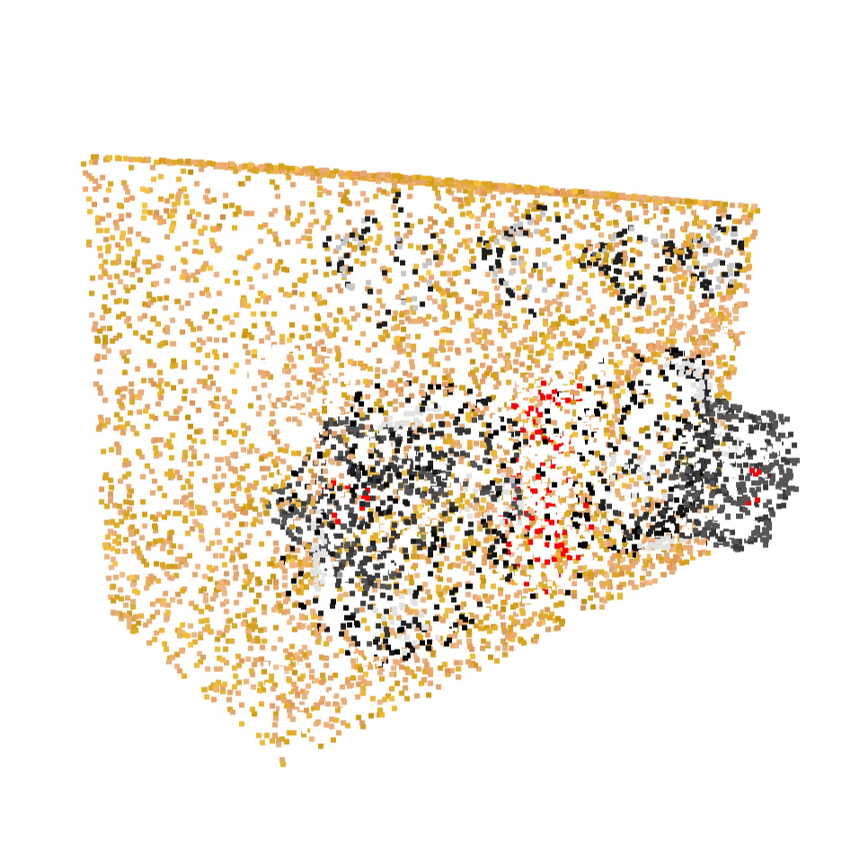

# LLaNA：大型语言与 NeRF 辅助系统

发布时间：2024年06月17日

`LLM应用

这篇论文探讨了将神经辐射场（NeRFs）融入多模态大型语言模型（MLLMs）的方法，并创建了一个名为LLaNA的通用NeRF语言助手，能够执行与NeRF相关的标题生成和问答任务。这种方法直接解析NeRF的MLP权重，提取物体信息，无需图像渲染或3D数据实体化。此外，论文还构建了一个用于NeRF语言任务的文本注释数据集，并设立了评估NeRF理解能力的基准。这些内容表明，该论文主要关注于LLM的实际应用，特别是在多模态理解和处理NeRF数据方面的应用，因此应归类为LLM应用。` `计算机视觉` `人工智能`

> LLaNA: Large Language and NeRF Assistant

# 摘要

> 多模态大型语言模型（MLLMs）虽能出色理解图像与3D数据，但在全面捕捉物体外观与几何上仍有短板。而神经辐射场（NeRFs），通过简单的多层感知机（MLP）权重编码信息，正成为一种新兴且广泛应用的模态，能同时捕捉物体的几何与逼真外观。本文探索了将NeRF融入MLLM的可行性与效果，并创造了首个通用NeRF语言助手LLaNA，能执行NeRF标题生成与问答等新任务。我们的方法直接解析NeRF的MLP权重，提取物体信息，无需图像渲染或3D数据实体化。我们还构建了一个无人干预的NeRF文本注释数据集，用于多种NeRF语言任务，并据此设立了评估NeRF理解能力的基准。结果表明，处理NeRF权重优于从NeRF中提取2D或3D表示。

> Multimodal Large Language Models (MLLMs) have demonstrated an excellent understanding of images and 3D data. However, both modalities have shortcomings in holistically capturing the appearance and geometry of objects. Meanwhile, Neural Radiance Fields (NeRFs), which encode information within the weights of a simple Multi-Layer Perceptron (MLP), have emerged as an increasingly widespread modality that simultaneously encodes the geometry and photorealistic appearance of objects. This paper investigates the feasibility and effectiveness of ingesting NeRF into MLLM. We create LLaNA, the first general-purpose NeRF-language assistant capable of performing new tasks such as NeRF captioning and Q\&A. Notably, our method directly processes the weights of the NeRF's MLP to extract information about the represented objects without the need to render images or materialize 3D data structures. Moreover, we build a dataset of NeRFs with text annotations for various NeRF-language tasks with no human intervention. Based on this dataset, we develop a benchmark to evaluate the NeRF understanding capability of our method. Results show that processing NeRF weights performs favourably against extracting 2D or 3D representations from NeRFs.

[Arxiv](https://arxiv.org/abs/2406.11840)