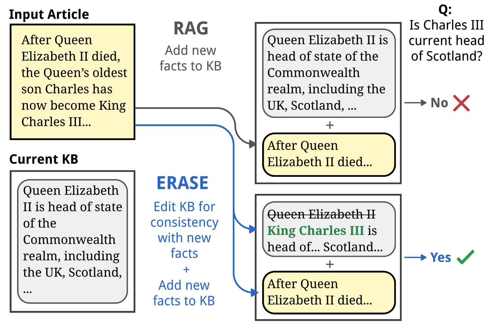
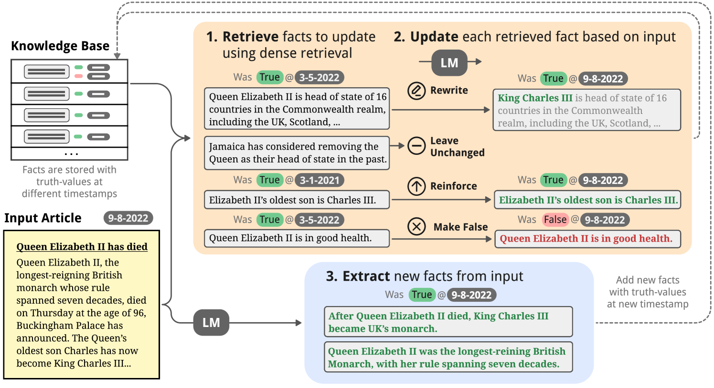
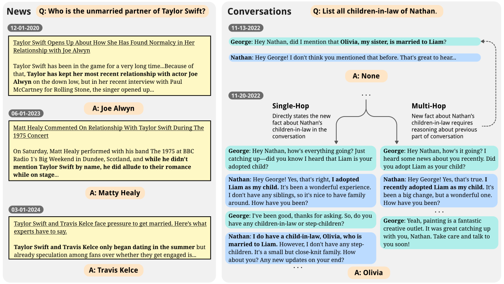
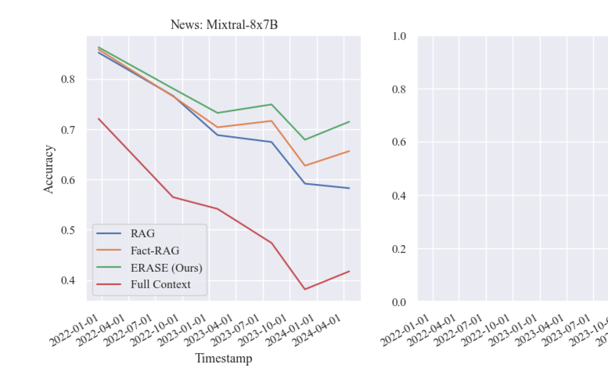
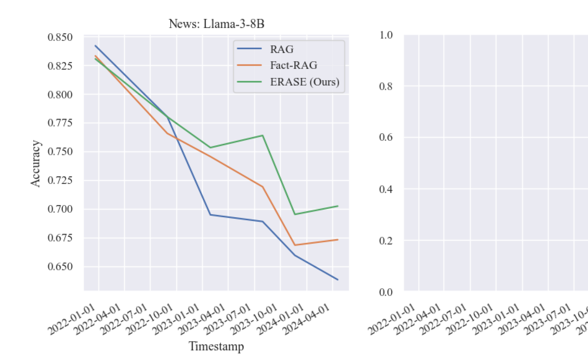
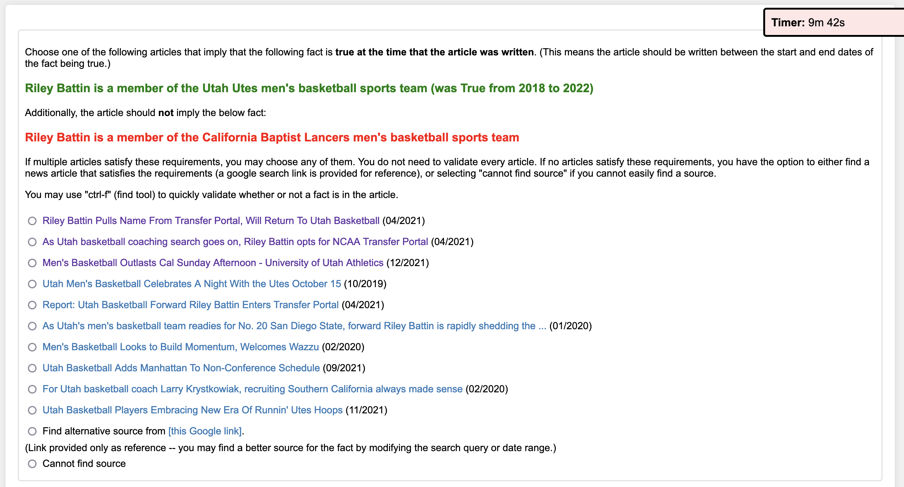
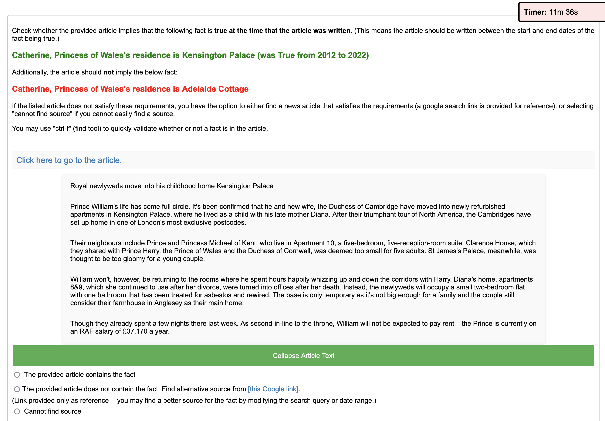
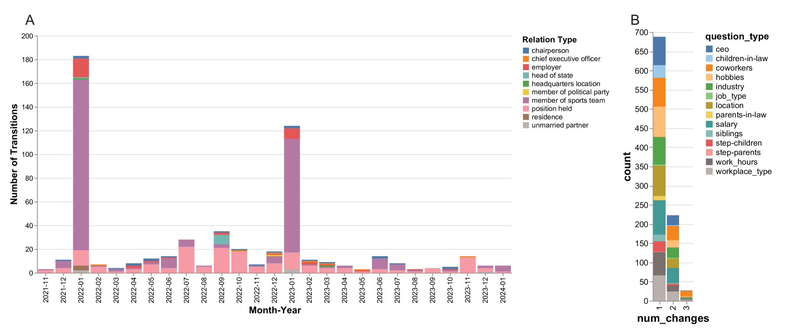

# 借助可编辑的外部知识，语言建模得以优化。

发布时间：2024年06月17日

`RAG

这篇论文介绍了一种名为 ERASE 的新方法，该方法通过动态调整知识库内容来适应新加入的文档，从而提升语义模型的性能。这种方法特别关注于检索增强生成（RAG）的框架内，通过优化知识库的内容管理来提高预测的准确性。因此，这篇论文属于RAG分类。` `对话系统`

> Language Modeling with Editable External Knowledge

# 摘要

> 世界变迁，文本随之更新。我们如何打造能灵活适应这些变化的语义模型？检索增强生成是一种流行方法，它将新文档纳入知识库，并在预测时进行检索。以往研究多聚焦于通过优化检索或推理提升预测性能。本文推出的 ERASE 另辟蹊径，每当新文档加入时，它便动态调整知识库内容，删除或重写旧条目。在两个新基准测试中，ERASE 在回答新闻流或对话相关问题时，相比传统方法，准确率分别提升了 7-13%（Mixtral-8x7B）和 6-10%（Llama-3-8B）。相关代码和数据已公开于 https://github.com/belindal/ERASE。

> When the world changes, so does the text that humans write about it. How do we build language models that can be easily updated to reflect these changes? One popular approach is retrieval-augmented generation, in which new documents are inserted into a knowledge base and retrieved during prediction for downstream tasks. Most prior work on these systems have focused on improving behavior during prediction through better retrieval or reasoning. This paper introduces ERASE, which instead improves model behavior when new documents are acquired, by incrementally deleting or rewriting other entries in the knowledge base each time a document is added. In two new benchmark datasets evaluating models' ability to answer questions about a stream of news articles or conversations, ERASE improves accuracy relative to conventional retrieval-augmented generation by 7-13% (Mixtral-8x7B) and 6-10% (Llama-3-8B) absolute. Code and data are available at https://github.com/belindal/ERASE

[Arxiv](https://arxiv.org/abs/2406.11830)