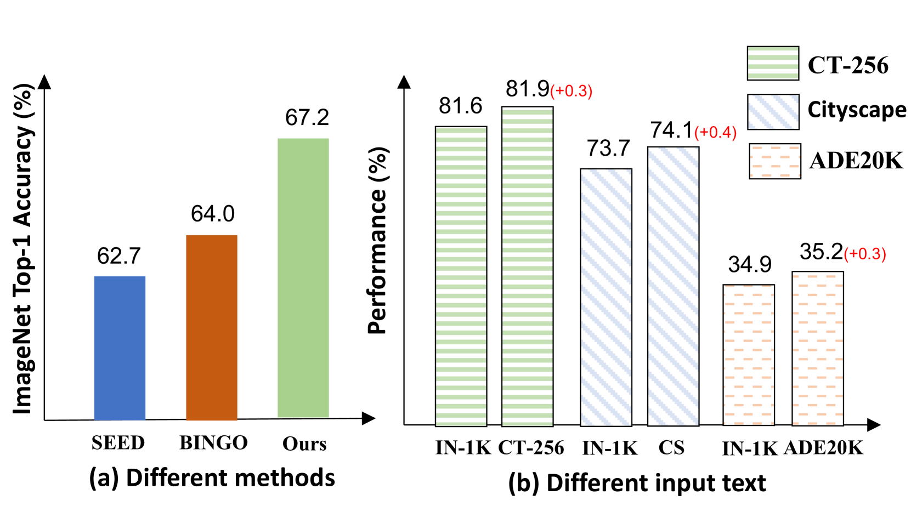
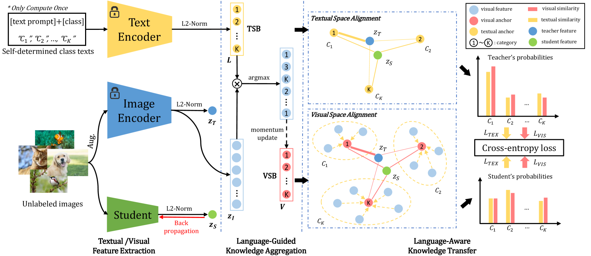
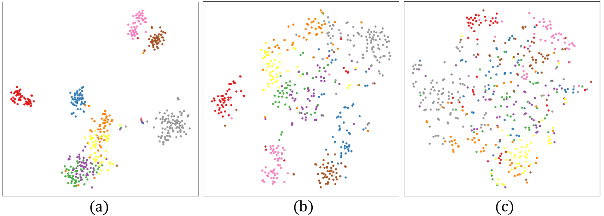
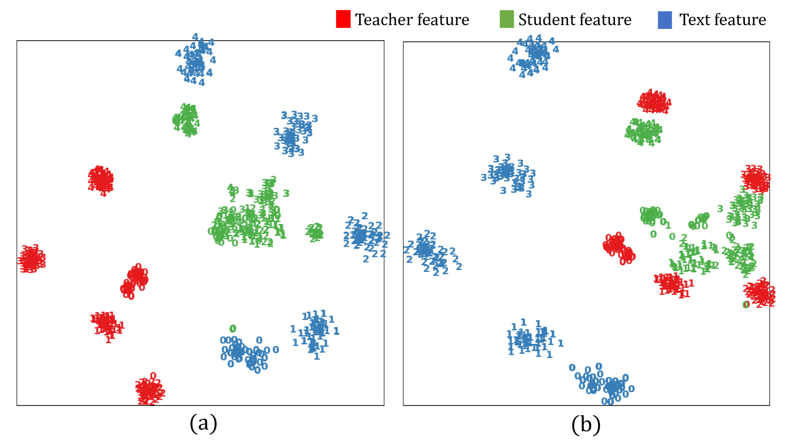

# 语言引导知识蒸馏下的轻量级模型预训练

发布时间：2024年06月17日

`LLM应用

这篇论文探讨了小型模型的预训练问题，特别是在移动设备上的应用。通过引入语言引导蒸馏（LGD）系统，该研究利用目标任务的类别名称来优化知识转移，从而提升小型模型在下游任务的表现。这种方法涉及构建文本语义库（TSB）和视觉语义库（VSB），并通过模仿教师在这些库上的相似性得分分布来实现知识的有效传递。由于这项工作主要关注于利用语言模型（LLM）的技术来改进小型模型的性能，特别是在应用层面，因此将其归类为LLM应用。` `移动设备` `模型优化`

> Lightweight Model Pre-training via Language Guided Knowledge Distillation

# 摘要

> 本文探讨了小型模型的预训练问题，这对移动设备至关重要。现有技术通过自监督蒸馏将大型网络的知识传授给小型模型，提升其在下游任务的表现。但现有方法在提取关键知识以区分下游任务中的类别方面尚显不足。为此，我们首次引入语言指导，提出语言引导蒸馏（LGD）系统，利用目标任务的类别名称优化知识转移。我们构建了文本语义库（TSB）和视觉语义库（VSB），通过模仿教师在TSB和VSB上的相似性得分分布，实现知识的有效传递。实验证明，采用LGD方法的轻量级模型在多个下游任务中表现卓越，代码已公开于https://github.com/mZhenz/LGD。

> This paper studies the problem of pre-training for small models, which is essential for many mobile devices. Current state-of-the-art methods on this problem transfer the representational knowledge of a large network (as a Teacher) into a smaller model (as a Student) using self-supervised distillation, improving the performance of the small model on downstream tasks. However, existing approaches are insufficient in extracting the crucial knowledge that is useful for discerning categories in downstream tasks during the distillation process. In this paper, for the first time, we introduce language guidance to the distillation process and propose a new method named Language-Guided Distillation (LGD) system, which uses category names of the target downstream task to help refine the knowledge transferred between the teacher and student. To this end, we utilize a pre-trained text encoder to extract semantic embeddings from language and construct a textual semantic space called Textual Semantics Bank (TSB). Furthermore, we design a Language-Guided Knowledge Aggregation (LGKA) module to construct the visual semantic space, also named Visual Semantics Bank (VSB). The task-related knowledge is transferred by driving a student encoder to mimic the similarity score distribution inferred by a teacher over TSB and VSB. Compared with other small models obtained by either ImageNet pre-training or self-supervised distillation, experiment results show that the distilled lightweight model using the proposed LGD method presents state-of-the-art performance and is validated on various downstream tasks, including classification, detection, and segmentation. We have made the code available at https://github.com/mZhenz/LGD.

[Arxiv](https://arxiv.org/abs/2406.11689)