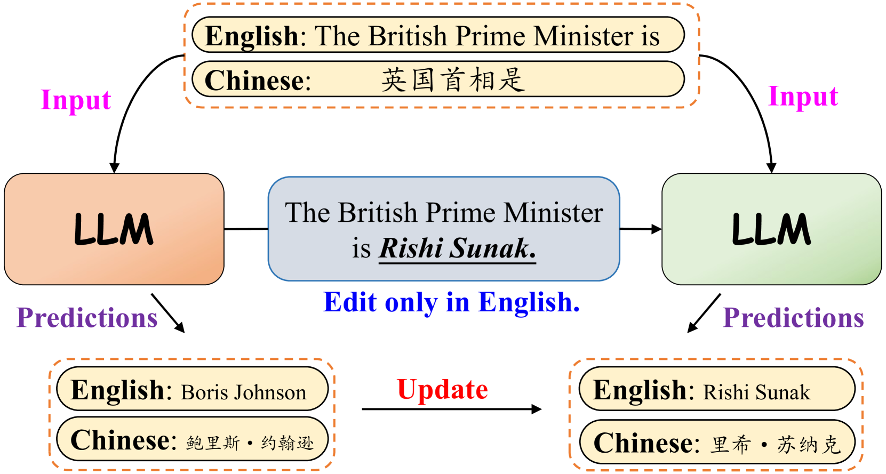
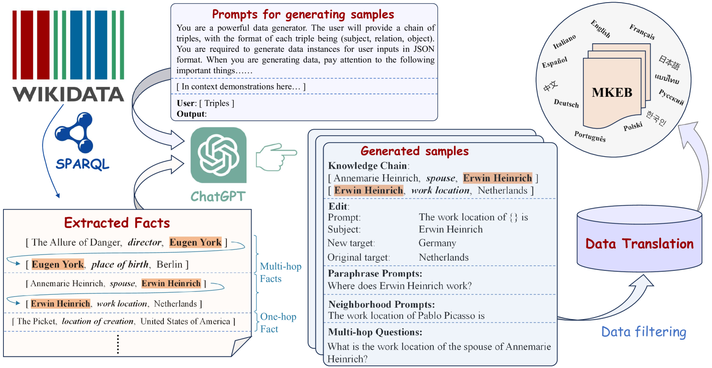
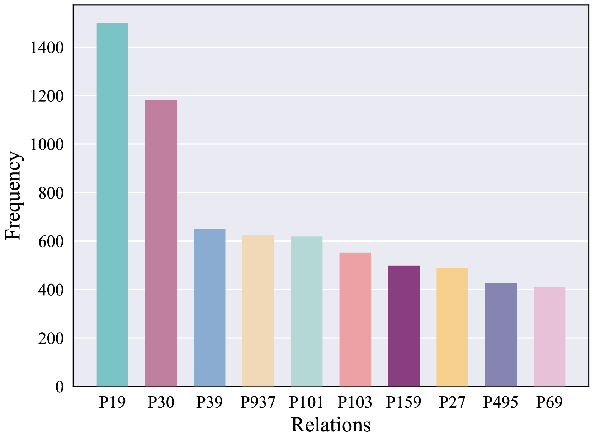
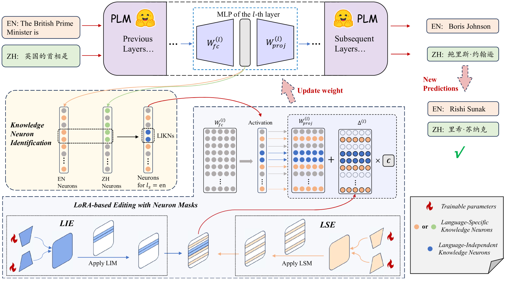
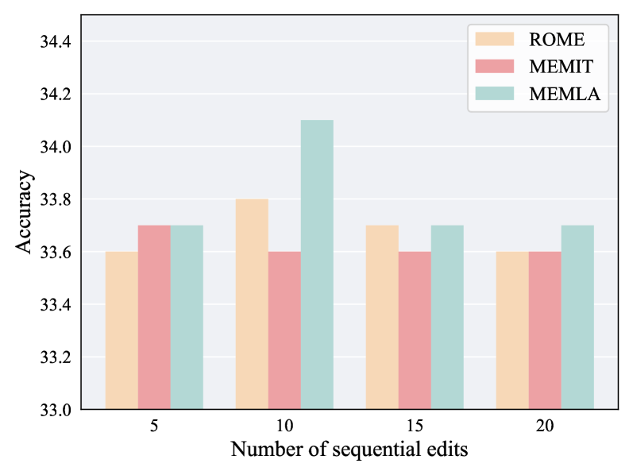
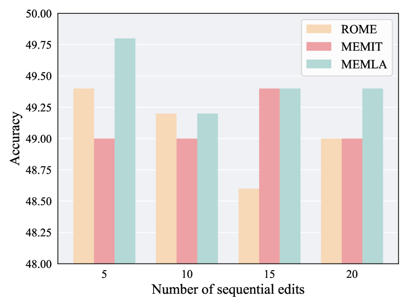

# MEMLA：利用神经元掩蔽的低秩适应技术，提升多语言知识编辑能力

发布时间：2024年06月17日

`LLM应用

这篇论文主要探讨了多语言知识编辑（MKE）的问题，并提出了一种新的方法——神经元掩蔽的低秩适应（MEMLA），以提升多语言知识编辑的精度。此外，论文还推出了多语言知识编辑基准（MKEB），这是一个涵盖12种语言的评估体系。这些内容都是关于如何应用大型语言模型（LLMs）来处理多语言知识更新的实际问题，因此属于LLM应用类别。` `多语言技术`

> MEMLA: Enhancing Multilingual Knowledge Editing with Neuron-Masked Low-Rank Adaptation

# 摘要

> 知识编辑旨在更新大型语言模型（LLMs）的知识，避免其回答过时或失准。但现有研究多局限于单一语言，对多语言模型的适用性不足。本文聚焦于多语言知识编辑（MKE），探讨如何在多语种间同步知识更新，这一挑战尤为突出。加之缺乏全面的MKE数据集，进展受阻。为此，我们推出了多语言知识编辑基准（MKEB），涵盖12种语言，提供了一套完整的评估体系。同时，我们提出了一种新方法——神经元掩蔽的低秩适应（MEMLA），以提升多语言知识编辑的精度，通过识别两类关键知识神经元，并利用LoRA技术结合神经元掩蔽，高效调整参数，实现跨语言的知识更新。实验结果显示，该方法不仅超越了现有技术，还大幅提升了模型的多跳推理能力，同时对下游任务的影响微乎其微。相关数据集和代码将对外开放。

> Knowledge editing aims to adjust the knowledge within large language models (LLMs) to prevent their responses from becoming obsolete or inaccurate. However, existing works on knowledge editing are primarily conducted in a single language, which is inadequate for multilingual language models. In this paper, we focus on multilingual knowledge editing (MKE), which requires propagating updates across multiple languages. This necessity poses a significant challenge for the task. Furthermore, the limited availability of a comprehensive dataset for MKE exacerbates this challenge, hindering progress in this area. Hence, we introduce the Multilingual Knowledge Editing Benchmark (MKEB), a novel dataset comprising 12 languages and providing a complete evaluation framework. Additionally, we propose a method that enhances Multilingual knowledge Editing with neuron-Masked Low-Rank Adaptation (MEMLA). Specifically, we identify two categories of knowledge neurons to improve editing precision. Moreover, we perform LoRA-based editing with neuron masks to efficiently modify parameters and facilitate the propagation of updates across multiple languages. Experiments demonstrate that our method outperforms existing baselines and significantly enhances the multi-hop reasoning capability of the edited model, with minimal impact on its downstream task performance. The dataset and code will be made publicly available.

[Arxiv](https://arxiv.org/abs/2406.11566)