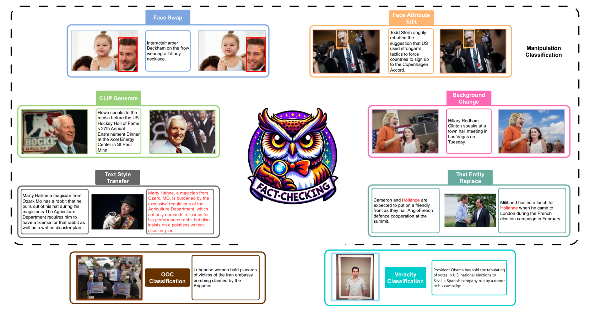
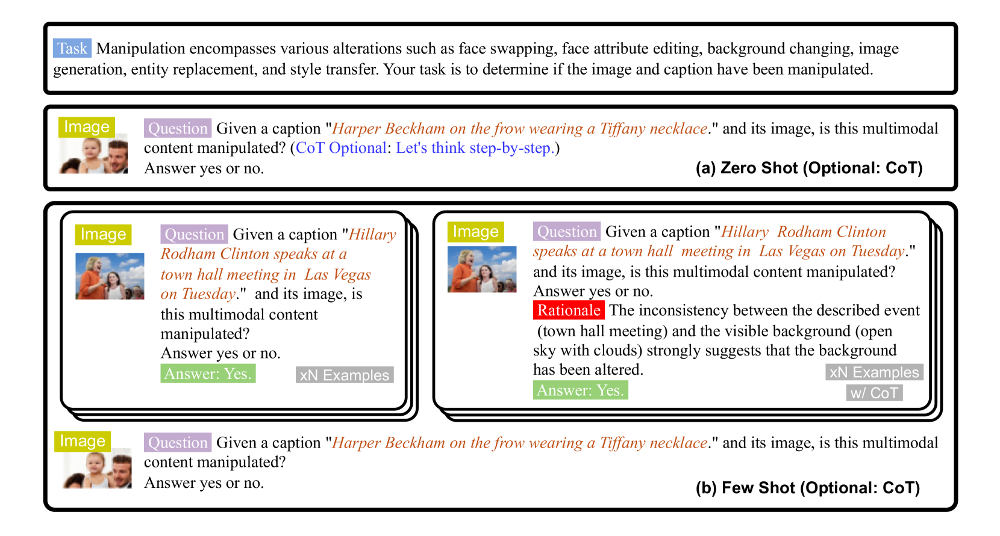
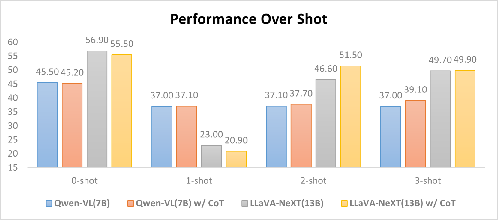
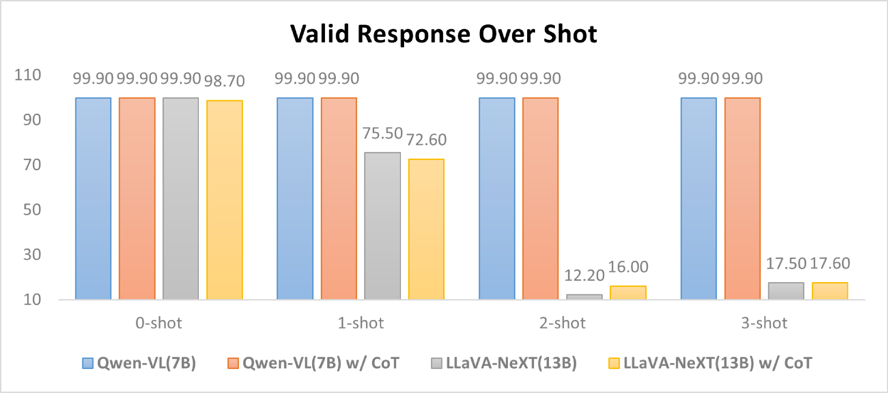
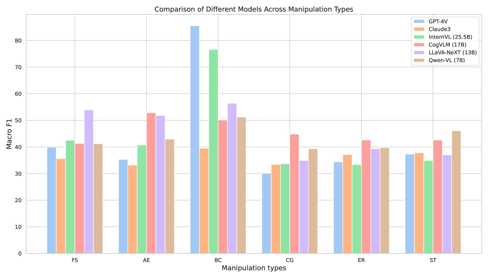
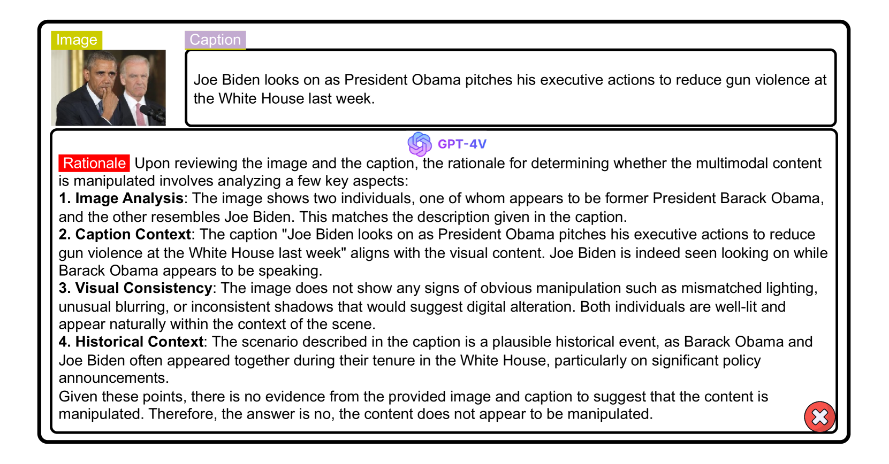
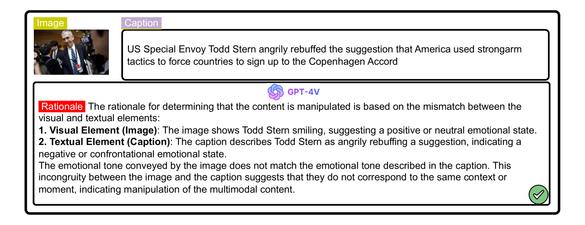

# MFC-Bench：大型视觉-语言模型在多模态事实核查中的基准测试

发布时间：2024年06月17日

`LLM应用

这篇论文主要关注大型视觉-语言模型（LVLMs）在多模态推理任务中的事实准确性问题，并推出了一个基准MFC-Bench来评估这些模型在事实核查方面的表现。虽然涉及模型的评估和改进，但其核心在于应用层面的评估和提升，而非模型的理论研究或Agent的设计与实现。因此，将其归类为LLM应用是合适的。` `人工智能` `多模态推理`

> MFC-Bench: Benchmarking Multimodal Fact-Checking with Large Vision-Language Models

# 摘要

> 大型视觉-语言模型（LVLMs）在视觉问答和图像描述等多模态推理任务上取得了显著进步，它们通过模型参数内部嵌入多模态信息，而非依赖外部知识库。然而，这些模型因固有偏差或推理错误，有时会偏离事实。为此，我们推出了MFC-Bench，一个全面严格的基准，用于评估LVLMs在操纵、上下文外和真实性分类三类任务中的事实准确性。通过MFC-Bench的评估，我们发现尽管有12种多样化的LVLMs参与，但它们在多模态事实核查上仍显不足，对内容操纵不够敏感。我们期望MFC-Bench能提升对LVLMs辅助的可信人工智能的关注，相关资源已在GitHub上公开，以促进多模态事实核查的研究。

> Large vision-language models (LVLMs) have significantly improved multimodal reasoning tasks, such as visual question answering and image captioning. These models embed multimodal facts within their parameters, rather than relying on external knowledge bases to store factual information explicitly. However, the content discerned by LVLMs may deviate from actual facts due to inherent bias or incorrect inference. To address this issue, we introduce MFC-Bench, a rigorous and comprehensive benchmark designed to evaluate the factual accuracy of LVLMs across three tasks: Manipulation, Out-of-Context, and Veracity Classification. Through our evaluation on MFC-Bench, we benchmarked 12 diverse and representative LVLMs, uncovering that current models still fall short in multimodal fact-checking and demonstrate insensitivity to various forms of manipulated content. We hope that MFC-Bench could raise attention to the trustworthy artificial intelligence potentially assisted by LVLMs in the future. The MFC-Bench and accompanying resources are publicly accessible at https://github.com/wskbest/MFC-Bench, contributing to ongoing research in the multimodal fact-checking field.

[Arxiv](https://arxiv.org/abs/2406.11288)