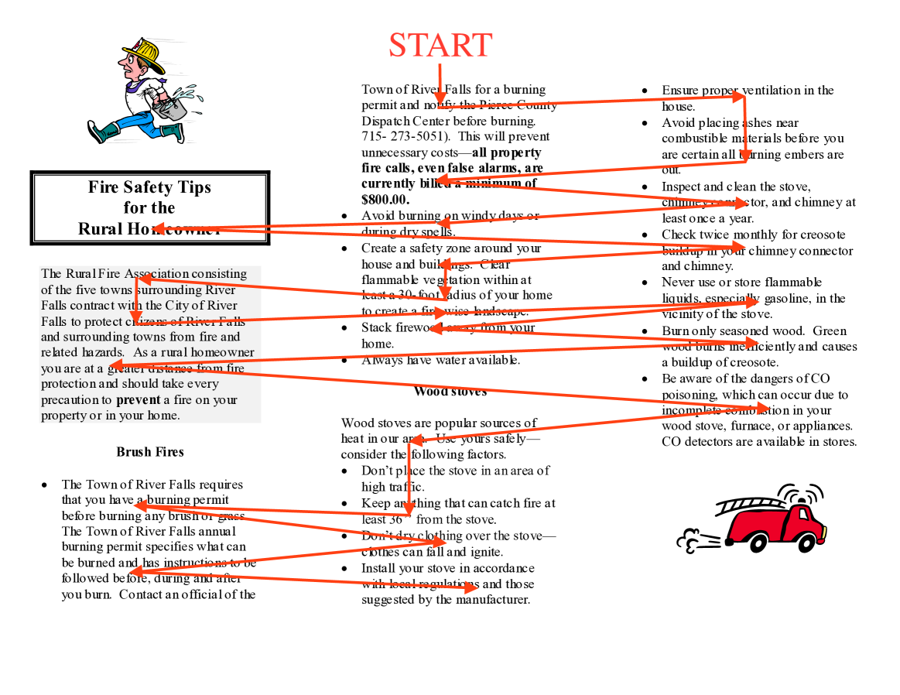

# MINT-1T：扩展开源多模态数据至万亿级——一个包含一万亿标记的多模态数据宝库

发布时间：2024年06月17日

`RAG

理由：这篇论文主要介绍了MINT-1T数据集的创建，这是一个大规模的多模态交错数据集，用于训练大型多模态模型（LMMs）。数据集的构建和公开是为了支持研究和开发多模态模型，这与RAG（Retrieval-Augmented Generation）模型的构建和训练密切相关，因为RAG模型通常需要大量的多模态数据来提高其性能和泛化能力。此外，论文中提到的数据集的多样性和规模，以及其对社区的开放性，都是RAG研究领域的重要贡献。因此，这篇论文最适合归类为RAG。` `数据集` `人工智能`

> MINT-1T: Scaling Open-Source Multimodal Data by 10x: A Multimodal Dataset with One Trillion Tokens

# 摘要

> 为了训练前沿的大型多模态模型（LMMs），我们需要包含自由形式的图像和文本交错序列的多模态交错数据集。尽管开源LMMs发展迅猛，但大规模、多样化的此类数据集依旧稀缺。因此，我们推出了MINT-1T，这是目前最全面、最多样的开源多模态交错数据集，包含一万亿文本和三十亿图像，规模是现有数据集的十倍。我们还首次引入了PDF和ArXiv论文等资源。由于构建这样的数据集需要大量工程投入，我们分享了数据整理过程并公开了数据集，这对社区大有裨益。实验结果显示，基于MINT-1T训练的LMMs性能与OBELICS数据集上的模型不相上下。我们的数据和代码将在https://github.com/mlfoundations/MINT-1T公开。

> Multimodal interleaved datasets featuring free-form interleaved sequences of images and text are crucial for training frontier large multimodal models (LMMs). Despite the rapid progression of open-source LMMs, there remains a pronounced scarcity of large-scale, diverse open-source multimodal interleaved datasets. In response, we introduce MINT-1T, the most extensive and diverse open-source Multimodal INTerleaved dataset to date. MINT-1T comprises one trillion text tokens and three billion images, a 10x scale-up from existing open-source datasets. Additionally, we include previously untapped sources such as PDFs and ArXiv papers. As scaling multimodal interleaved datasets requires substantial engineering effort, sharing the data curation process and releasing the dataset greatly benefits the community. Our experiments show that LMMs trained on MINT-1T rival the performance of models trained on the previous leading dataset, OBELICS. Our data and code will be released at https://github.com/mlfoundations/MINT-1T.

[Arxiv](https://arxiv.org/abs/2406.11271)