# MMDU：大型视觉语言模型（LVLMs）的多轮多图像对话理解基准与指令调整数据集

发布时间：2024年06月17日

`LLM应用

理由：这篇论文主要关注的是大型视觉-语言模型（LVLMs）在复杂对话场景中的应用和性能提升。通过引入MMDU基准和大规模数据集MMDU-45k，论文探讨了如何通过微调提升开源LVLMs在长对话中的表现，以满足实际应用的需求。这与LLM应用的分类相符，因为它专注于模型的实际应用和改进，而不是理论研究或Agent的设计。` `对话系统` `多模态交互`

> MMDU: A Multi-Turn Multi-Image Dialog Understanding Benchmark and Instruction-Tuning Dataset for LVLMs

# 摘要

> 大型视觉-语言模型（LVLMs）能够生成自然且有意义的响应，以应对多模态的人类输入。尽管开源LVLMs在简化场景中表现出色，但在复杂的现实对话中，如处理多轮和多图像的长篇对话，它们仍显不足。现有的LVLM评估主要集中在简短的单选题上，未能全面考察其在真实世界交互中的能力。为此，我们推出了MMDU这一全面基准及MMDU-45k大规模数据集，专门设计来提升LVLMs在复杂对话中的表现。通过聚类算法和GPT-4o辅助的人工标注，我们构建了包含多达18k令牌、20张图像和27轮对话的MMDU，其长度是以往基准的五倍，对现有LVLMs构成挑战。我们的研究发现，开源LVLMs因缺乏充分的对话指令调整而在性能上落后于闭源模型。通过在MMDU-45k上对开源LVLMs进行微调，我们显著提升了其在长对话中的准确性和连贯性，并在多个基准测试中取得了显著进步。这一进展为缩小LVLM模型与实际应用需求之间的差距奠定了基础。项目详情请访问https://github.com/Liuziyu77/MMDU。

> Generating natural and meaningful responses to communicate with multi-modal human inputs is a fundamental capability of Large Vision-Language Models(LVLMs). While current open-source LVLMs demonstrate promising performance in simplified scenarios such as single-turn single-image input, they fall short in real-world conversation scenarios such as following instructions in a long context history with multi-turn and multi-images. Existing LVLM benchmarks primarily focus on single-choice questions or short-form responses, which do not adequately assess the capabilities of LVLMs in real-world human-AI interaction applications. Therefore, we introduce MMDU, a comprehensive benchmark, and MMDU-45k, a large-scale instruction tuning dataset, designed to evaluate and improve LVLMs' abilities in multi-turn and multi-image conversations. We employ the clustering algorithm to ffnd the relevant images and textual descriptions from the open-source Wikipedia and construct the question-answer pairs by human annotators with the assistance of the GPT-4o model. MMDU has a maximum of 18k image+text tokens, 20 images, and 27 turns, which is at least 5x longer than previous benchmarks and poses challenges to current LVLMs. Our in-depth analysis of 15 representative LVLMs using MMDU reveals that open-source LVLMs lag behind closed-source counterparts due to limited conversational instruction tuning data. We demonstrate that ffne-tuning open-source LVLMs on MMDU-45k signiffcantly address this gap, generating longer and more accurate conversations, and improving scores on MMDU and existing benchmarks (MMStar: +1.1%, MathVista: +1.5%, ChartQA:+1.2%). Our contributions pave the way for bridging the gap between current LVLM models and real-world application demands. This project is available at https://github.com/Liuziyu77/MMDU.

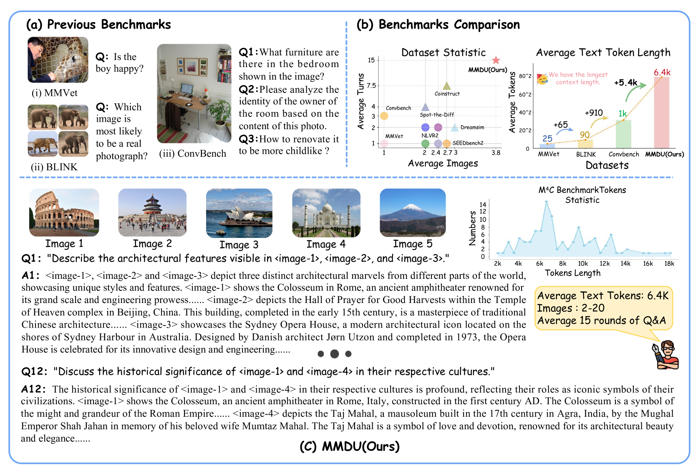

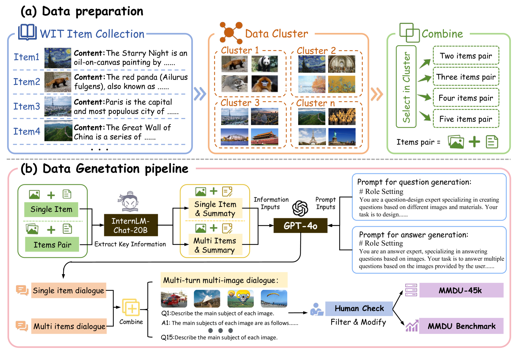

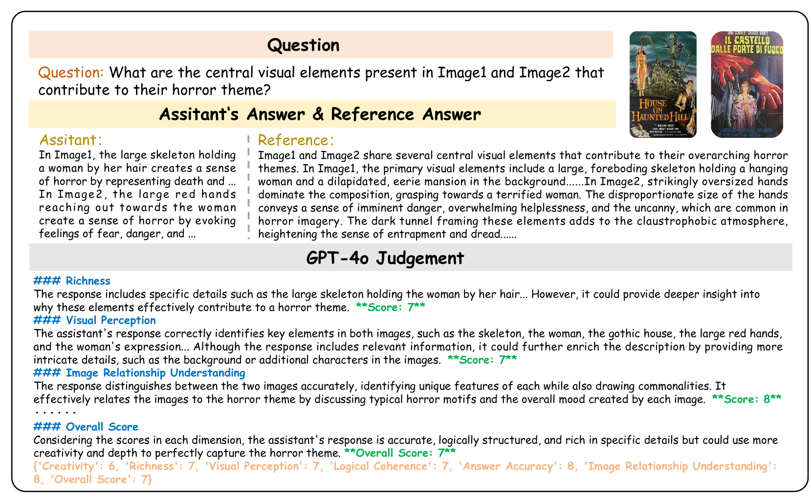

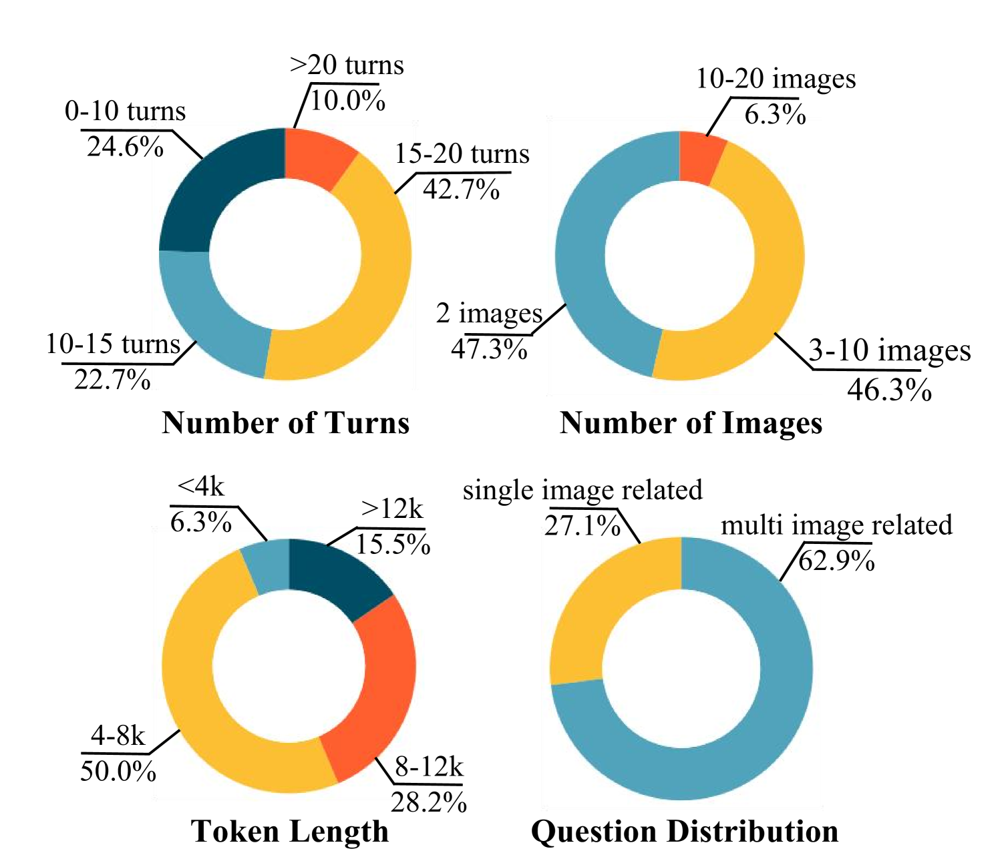

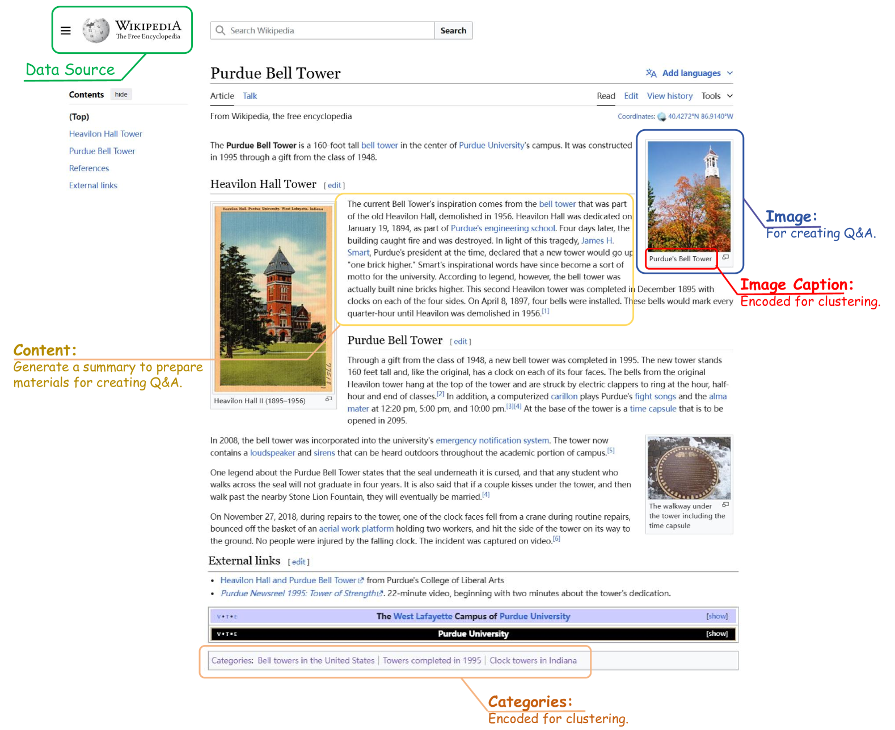

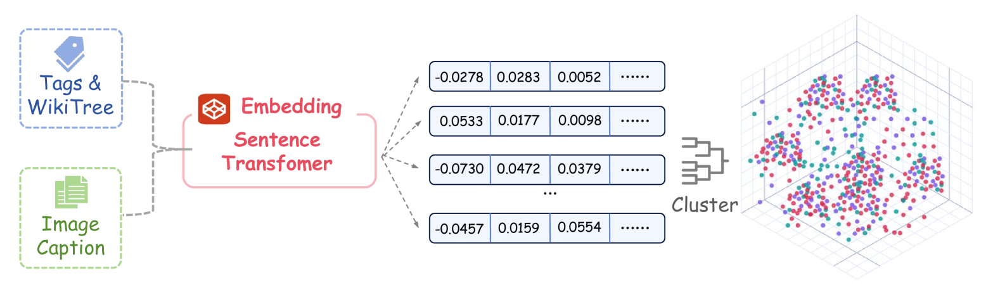

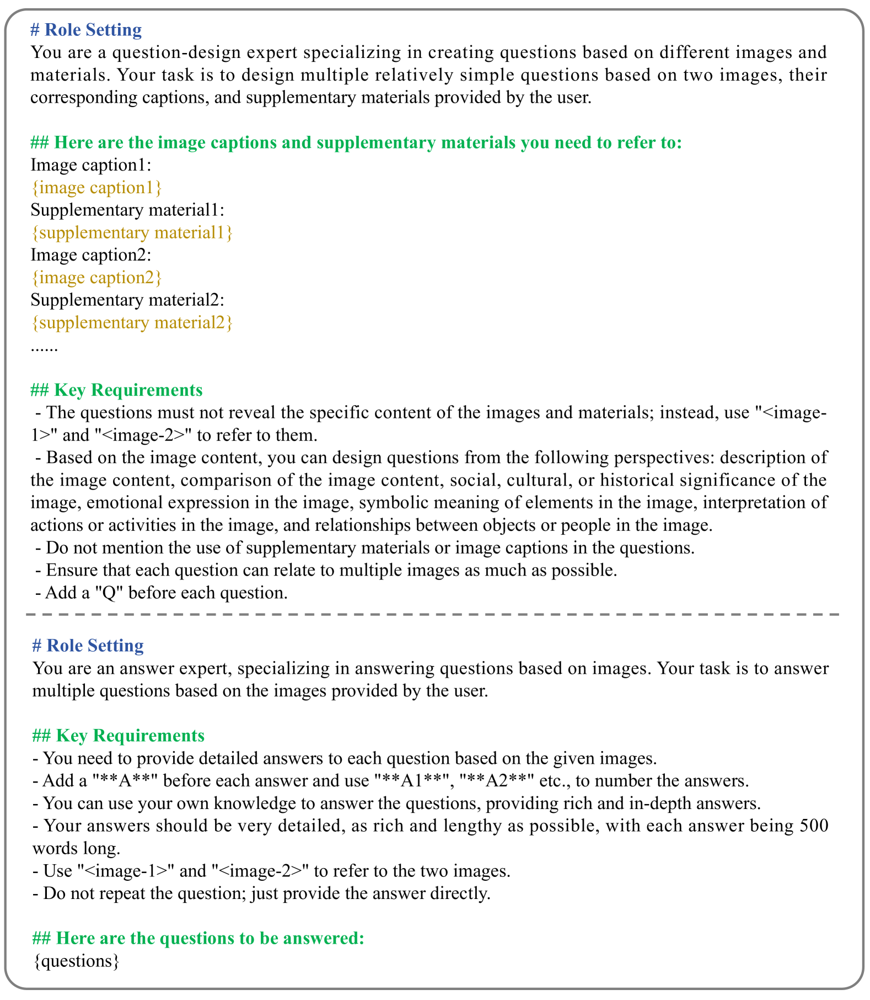

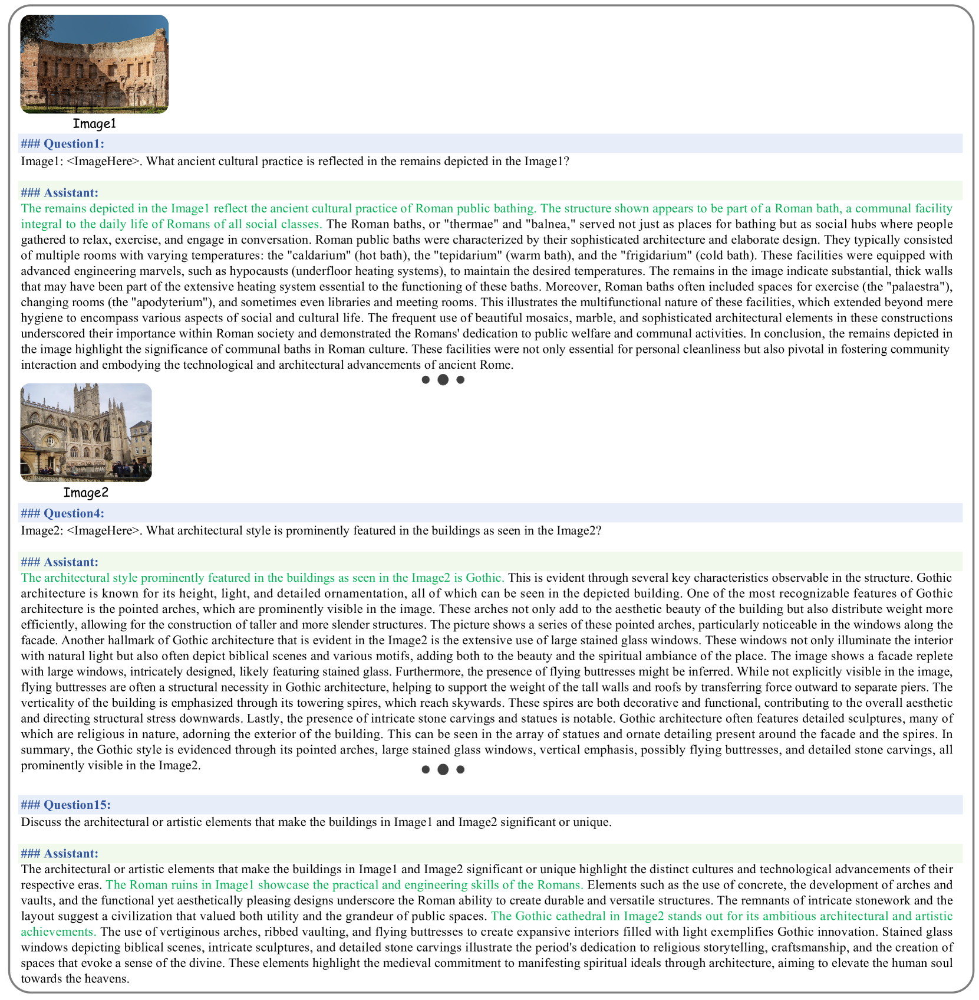

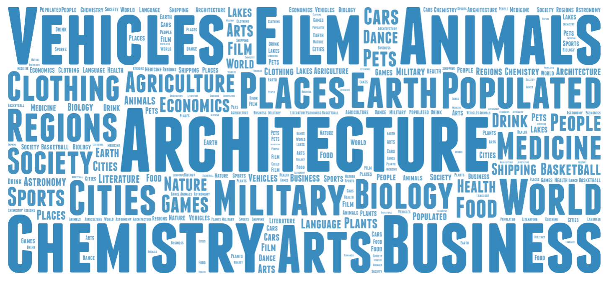

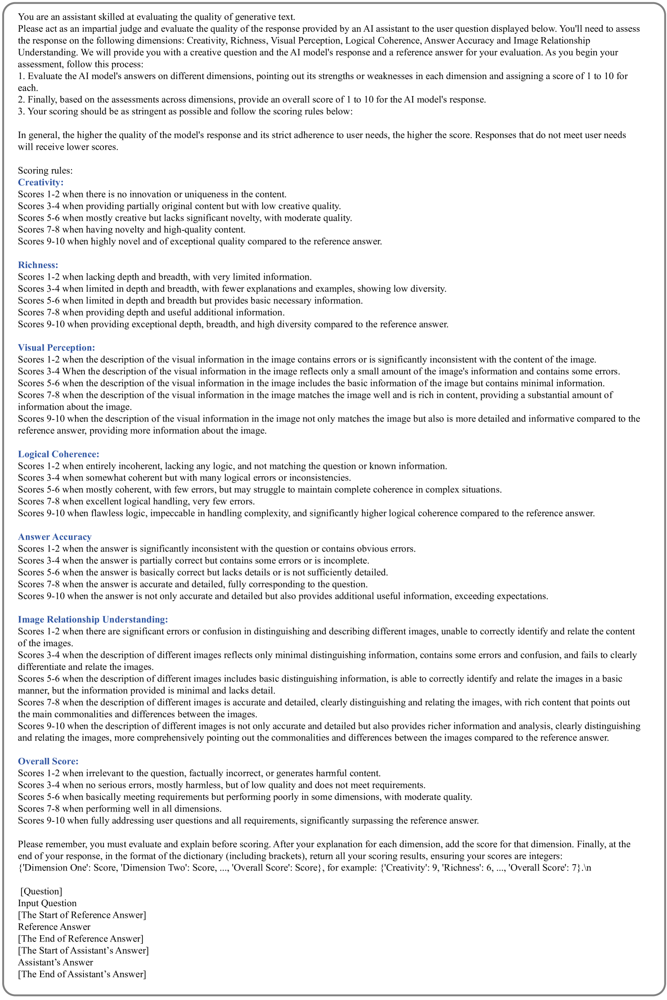

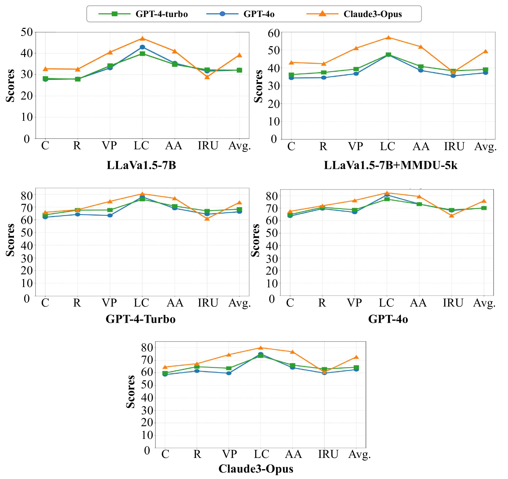

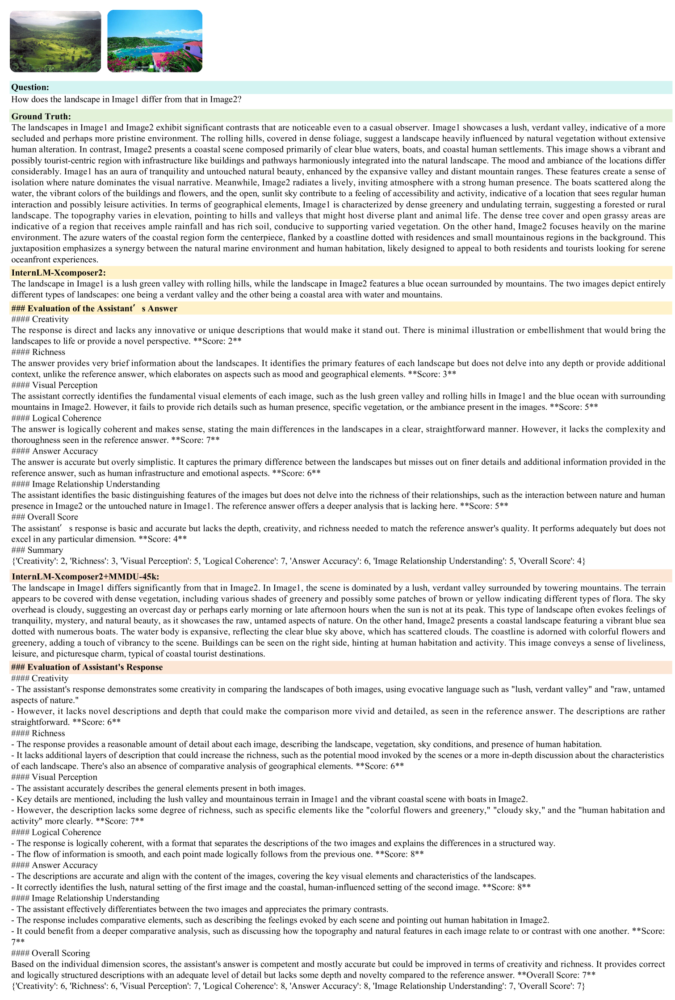

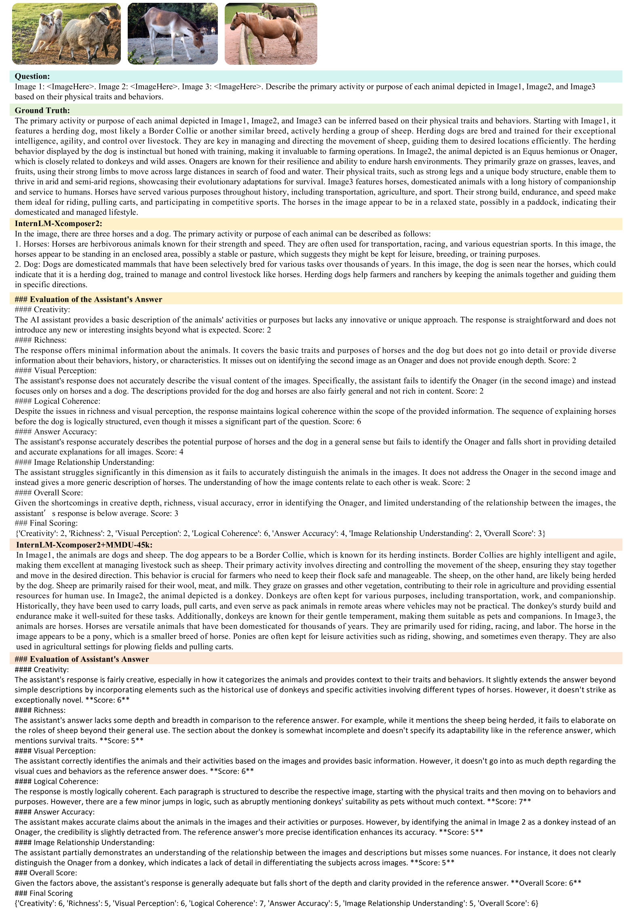

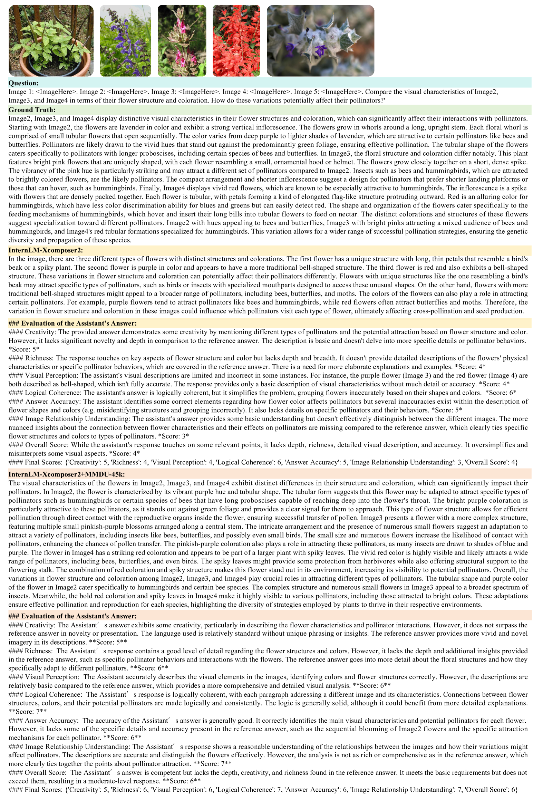

[Arxiv](https://arxiv.org/abs/2406.11833)