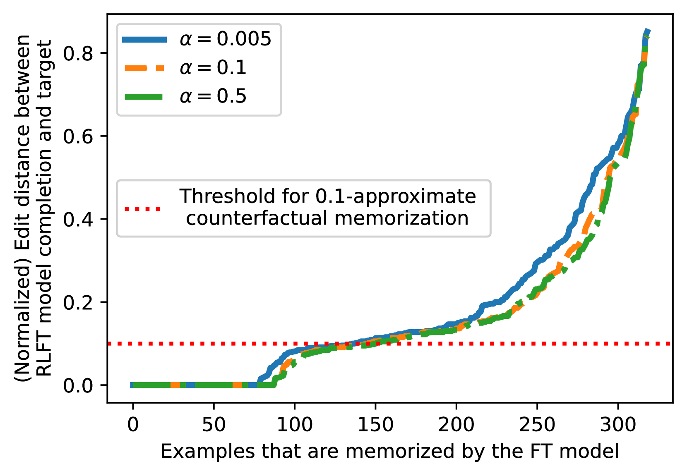
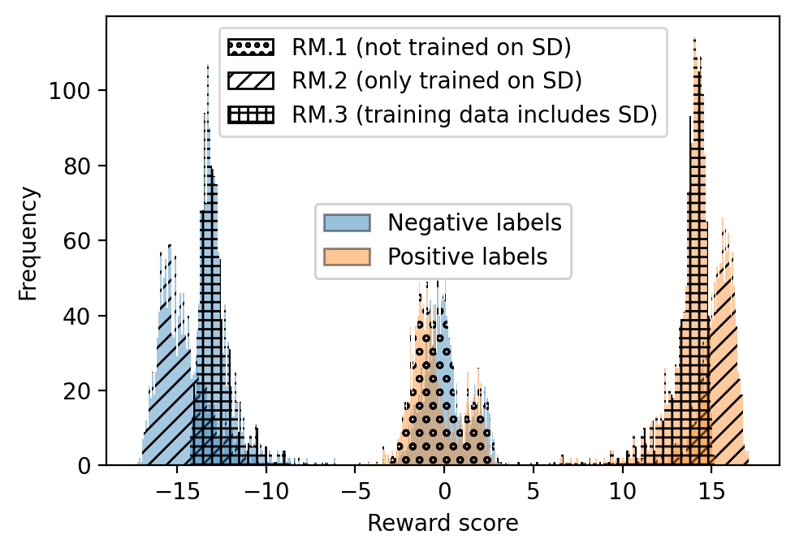
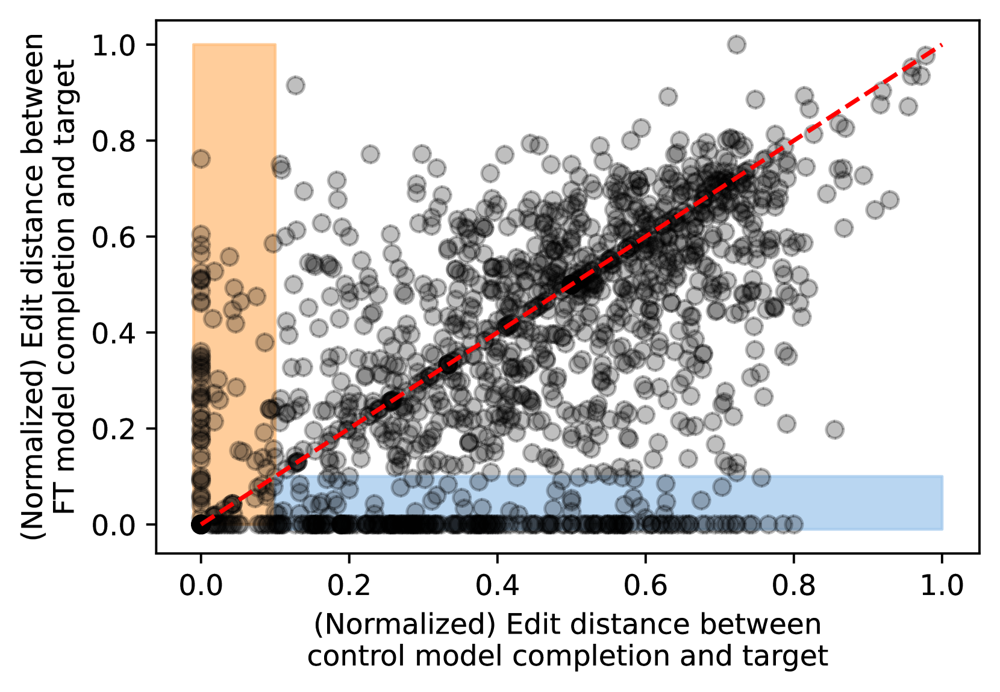
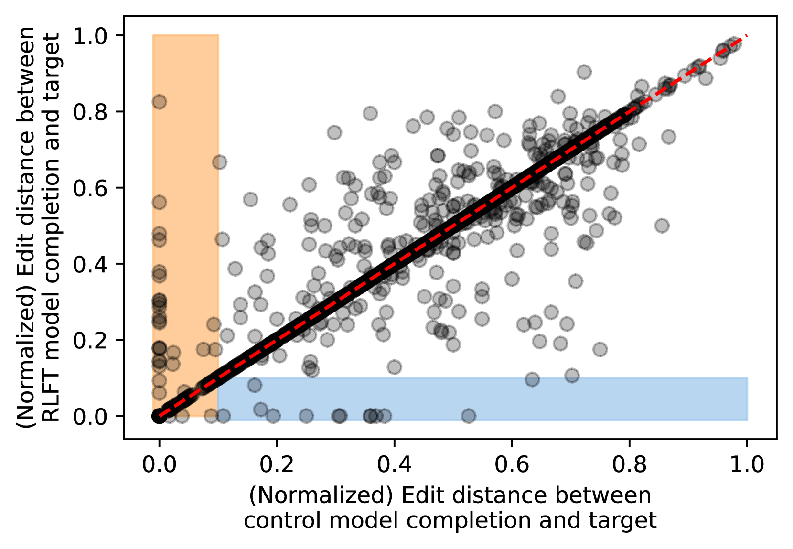
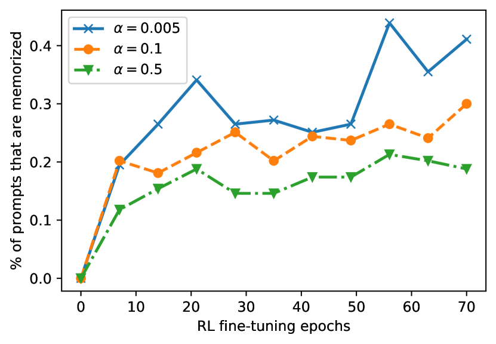
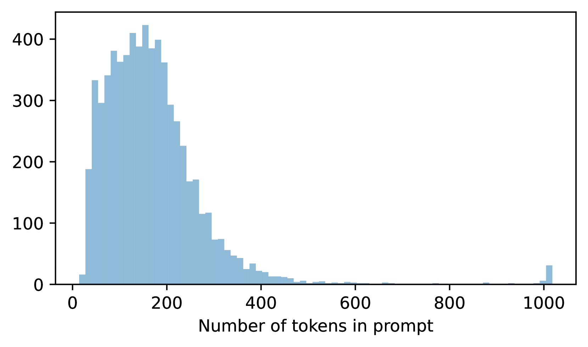
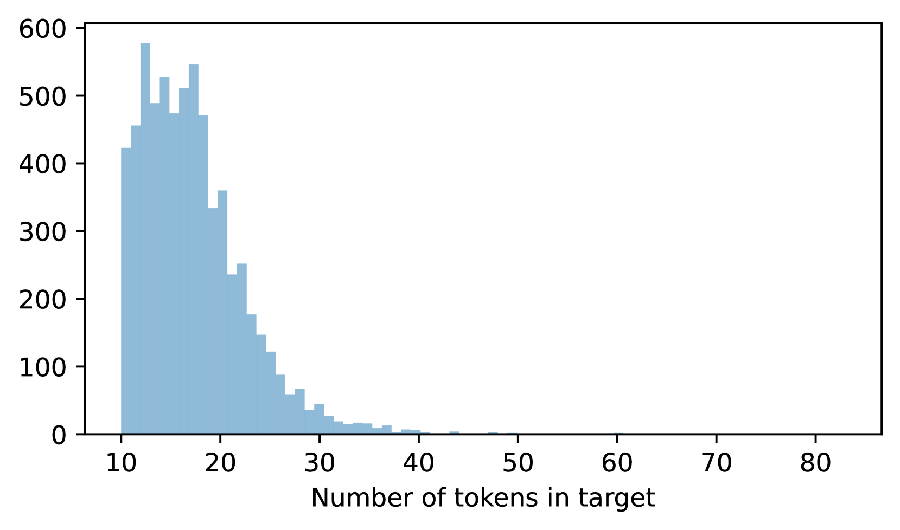

# 评估 RLHF 在代码补全中的记忆能力

发布时间：2024年06月17日

`LLM理论

理由：这篇论文探讨了人类反馈强化学习（RLHF）在大型语言模型中的应用，特别是在模型对齐过程中记忆的形成和影响，以及由此可能带来的隐私风险。虽然论文涉及了大型语言模型的应用（如代码完成模型），但其主要关注点是RLHF过程中的理论问题，包括数据记忆的表现与传播，以及与微调方法的比较。因此，这篇论文更适合归类为LLM理论，因为它深入分析了RLHF机制的理论层面，而不是仅仅关注模型的应用或安全性问题。` `人工智能` `隐私保护`

> Measuring memorization in RLHF for code completion

# 摘要

> 人类反馈强化学习（RLHF）已成为大型模型与用户偏好对齐的主流方法。不同于微调，RLHF对齐过程中记忆的形成和影响尚不明朗。鉴于真实用户数据可能被用于模型对齐，若在RLHF过程中记忆的用户数据被泄露，隐私风险不容忽视。本研究深入探讨了训练数据记忆在RLHF各阶段的表现与传播，特别关注了代码完成模型，这一大型语言模型的热门应用。研究显示，RLHF相比直接微调，大幅减少了奖励建模和强化学习数据被记忆的风险，但微调阶段已记忆的数据，多数情况下仍会在RLHF后保持记忆状态。

> Reinforcement learning with human feedback (RLHF) has become the dominant method to align large models to user preferences. Unlike fine-tuning, for which there are many studies regarding training data memorization, it is not clear how memorization is affected by or introduced in the RLHF alignment process. Understanding this relationship is important as real user data may be collected and used to align large models; if user data is memorized during RLHF and later regurgitated, this could raise privacy concerns. In this work, we analyze how training data memorization can surface and propagate through each phase of RLHF. We focus our study on code completion models, as code completion is one of the most popular use cases for large language models. We find that RLHF significantly decreases the chance that data used for reward modeling and reinforcement learning is memorized, in comparison to aligning via directly fine-tuning on this data, but that examples already memorized during the fine-tuning stage of RLHF, will, in the majority of cases, remain memorized after RLHF.

[Arxiv](https://arxiv.org/abs/2406.11715)