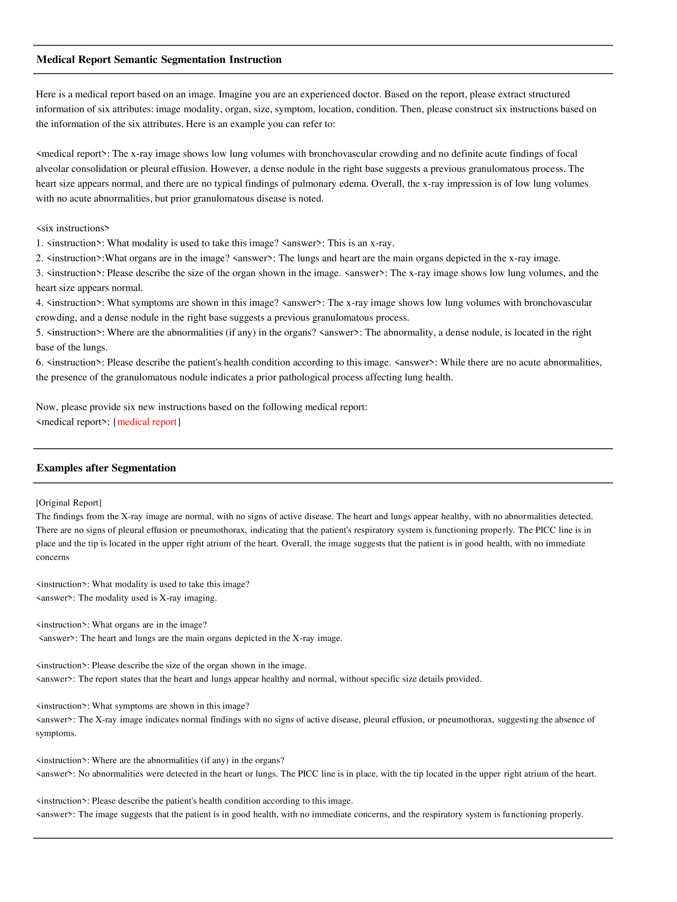

# MedThink：让医疗视觉语言模型深思熟虑，以减少幻觉现象

发布时间：2024年06月17日

`LLM应用

这篇论文介绍了一种名为MedThink的方法，旨在通过模仿人类认知过程和引入思维链（CoT）策略来提升大型视觉语言模型（LVLMs）在医学图像报告生成任务中的表现，并减少模型幻觉问题。这种方法直接应用于具体的医学图像报告生成任务，属于大型语言模型（LLM）的具体应用领域，因此应归类为LLM应用。` `人工智能`

> MedThink: Inducing Medical Large-scale Visual Language Models to Hallucinate Less by Thinking More

# 摘要

> 大型视觉语言模型（LVLMs）在处理多模态医学生成任务时，常遭遇模型幻觉问题，严重影响其生成准确性，限制了其在实际医疗诊断中的应用。增强医学生成任务的训练数据是解决此问题的关键，但医学数据的稀缺和隐私保护限制了模型的准确性和泛化能力。本文提出了一种名为MedThink的方法，通过模仿人类认知过程，构建精细的指令对，并将推理中的思维链（CoT）策略引入训练，有效提升了LVLMs在医学图像报告生成中的表现，并显著减少了幻觉现象。相关资源即将公开。

> When Large Vision Language Models (LVLMs) are applied to multimodal medical generative tasks, they suffer from significant model hallucination issues. This severely impairs the model's generative accuracy, making it challenging for LVLMs to be implemented in real-world medical scenarios to assist doctors in diagnosis. Enhancing the training data for downstream medical generative tasks is an effective way to address model hallucination. Moreover, the limited availability of training data in the medical field and privacy concerns greatly hinder the model's accuracy and generalization capabilities. In this paper, we introduce a method that mimics human cognitive processes to construct fine-grained instruction pairs and apply the concept of chain-of-thought (CoT) from inference scenarios to training scenarios, thereby proposing a method called MedThink. Our experiments on various LVLMs demonstrate that our novel data construction method tailored for the medical domain significantly improves the model's performance in medical image report generation tasks and substantially mitigates the hallucinations. All resources of this work will be released soon.

[Arxiv](https://arxiv.org/abs/2406.11451)