# 大型语言模型中的元思考

发布时间：2024年06月17日

`LLM理论

这篇论文介绍了一种名为元推理提示（MRP）的新型系统提示方法，专门为大型语言模型（LLMs）设计。这种方法通过模仿人类的元推理过程，使LLMs能够根据任务需求灵活选择和应用推理方法，从而提升性能和计算效率。论文中提到的MRP方法涉及两个主要步骤：选择最佳推理策略和应用该策略完成任务。这种方法的提出和验证表明了其在多任务中的有效性，并强调了其在LLMs中的重要性和潜力。因此，这篇论文更偏向于LLM的理论研究，探讨了如何改进和优化LLM的推理能力。` `人工智能`

> Meta Reasoning for Large Language Models

# 摘要

> 我们推出了元推理提示（MRP），这是一种创新的系统提示方法，灵感源自人类的元推理，专为大型语言模型（LLMs）设计。传统的基于上下文学习的推理技术，如思维树，虽有潜力，但在多样任务中难以持续保持顶尖性能。MRP通过引导LLMs根据任务需求灵活选择和应用推理方法，既提升了性能又优化了计算效率。MRP使LLM推理分为两步：首先，根据任务线索和方法描述选择最佳推理策略；然后，应用该策略完成任务。这种策略模仿了人类的元推理，使模型在多领域表现卓越。通过广泛测试，我们验证了MRP的效果，显示其在多任务中达到或接近最先进水平。MRP是LLMs在识别问题认知挑战和利用多种推理方法优势方面的一大进步。每个LLM都应配备MRP，以释放其潜能，确保在不断变化的挑战和应用中保持适应性。

> We introduce Meta-Reasoning Prompting (MRP), a novel and efficient system prompting method for large language models (LLMs) inspired by human meta-reasoning. Traditional in-context learning-based reasoning techniques, such as Tree-of-Thoughts, show promise but lack consistent state-of-the-art performance across diverse tasks due to their specialized nature. MRP addresses this limitation by guiding LLMs to dynamically select and apply different reasoning methods based on the specific requirements of each task, optimizing both performance and computational efficiency. With MRP, LLM reasoning operates in two phases. Initially, the LLM identifies the most appropriate reasoning method using task input cues and objective descriptions of available methods. Subsequently, it applies the chosen method to complete the task. This dynamic strategy mirrors human meta-reasoning, allowing the model to excel in a wide range of problem domains. We evaluate the effectiveness of MRP through comprehensive benchmarks. The results demonstrate that MRP achieves or approaches state-of-the-art performance across diverse tasks. MRP represents a significant advancement in enabling LLMs to identify cognitive challenges across problems and leverage benefits across different reasoning approaches, enhancing their ability to handle diverse and complex problem domains efficiently. Every LLM deserves a Meta-Reasoning Prompting to unlock its full potential and ensure adaptability in an ever-evolving landscape of challenges and applications.

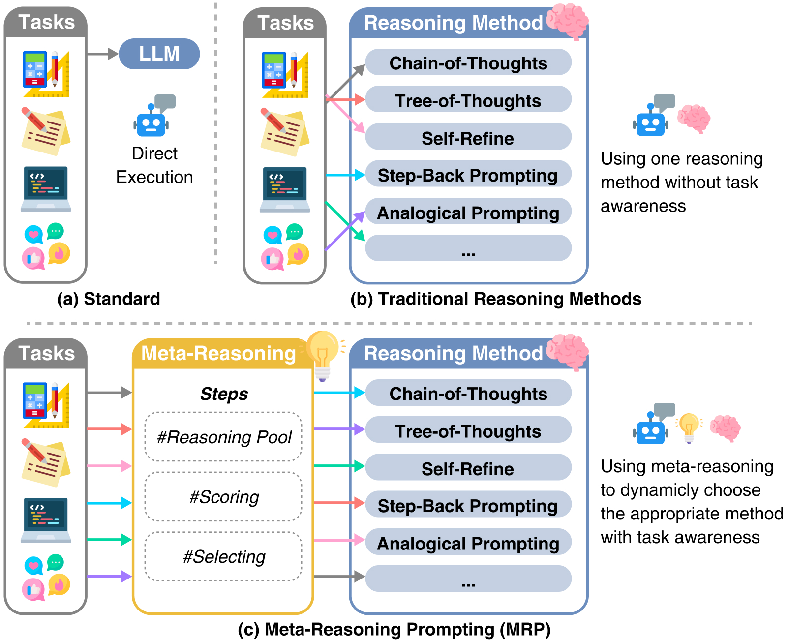

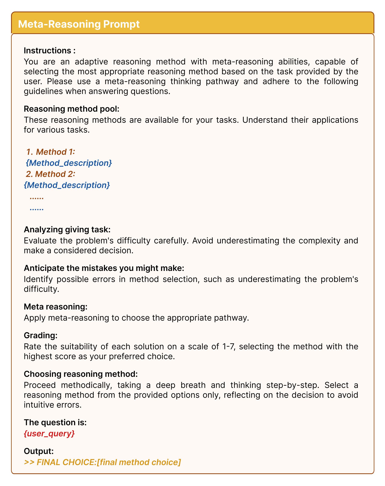

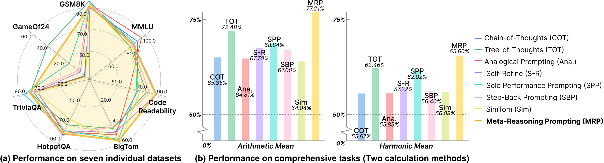

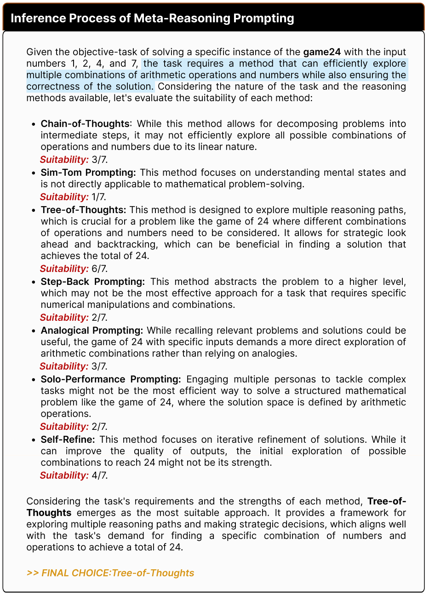

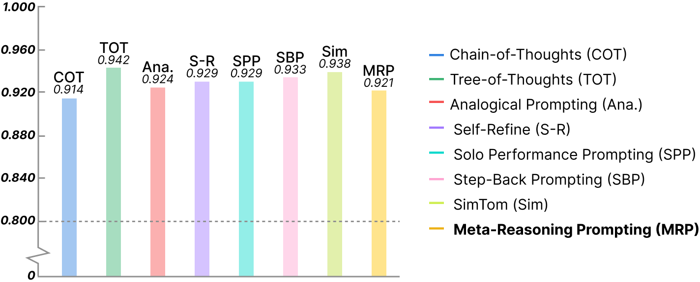

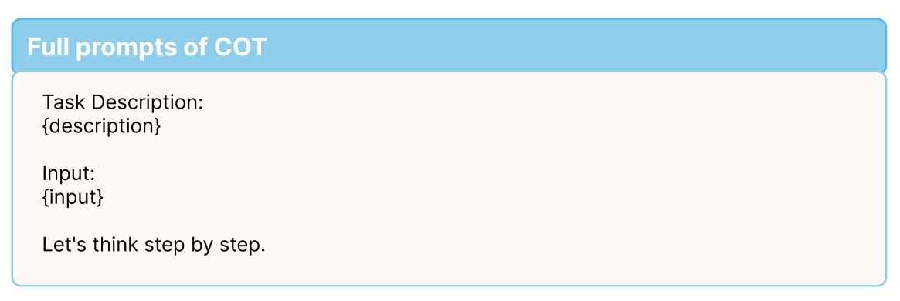

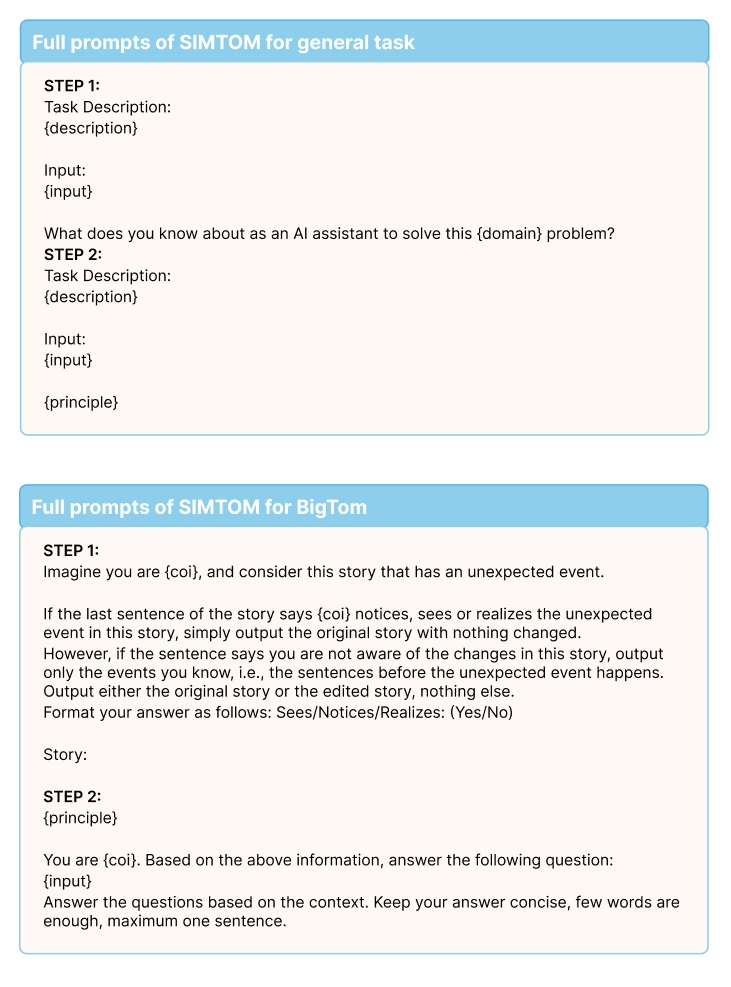

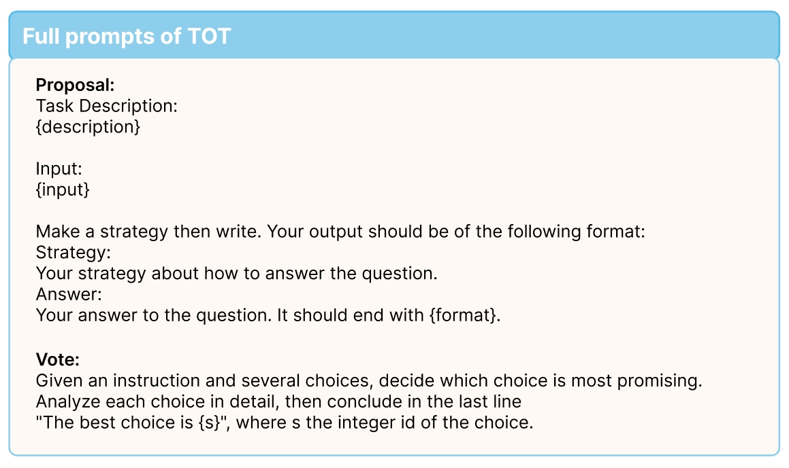

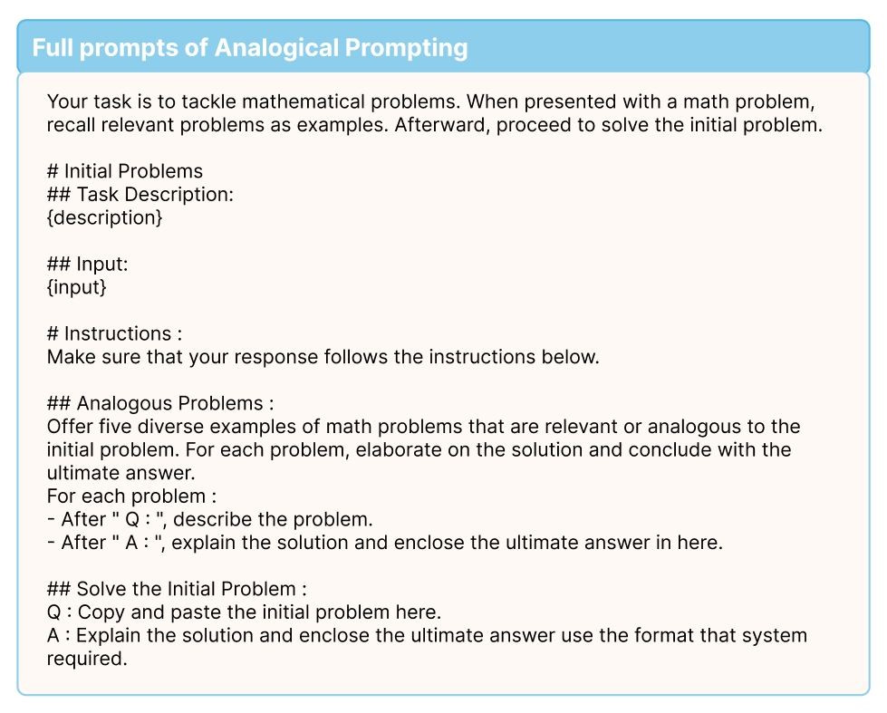

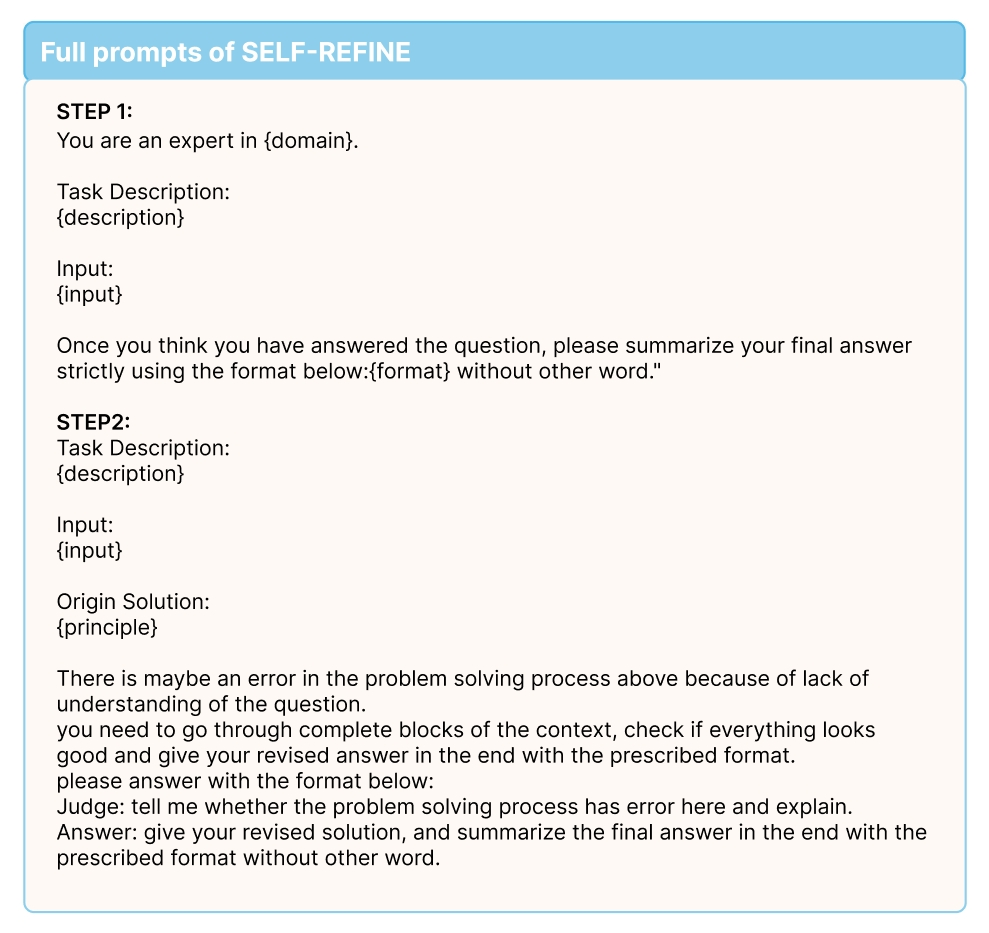

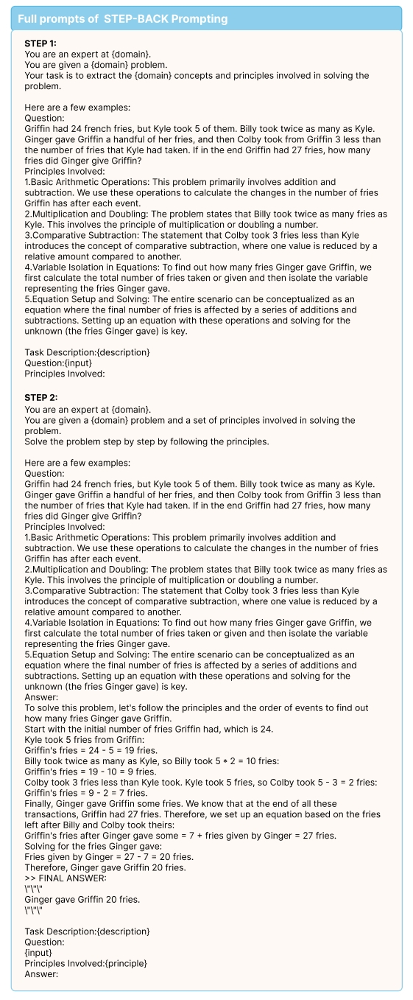

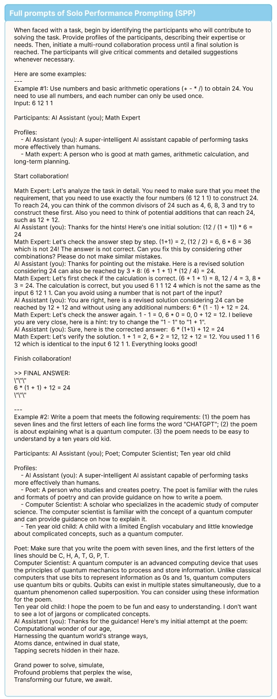

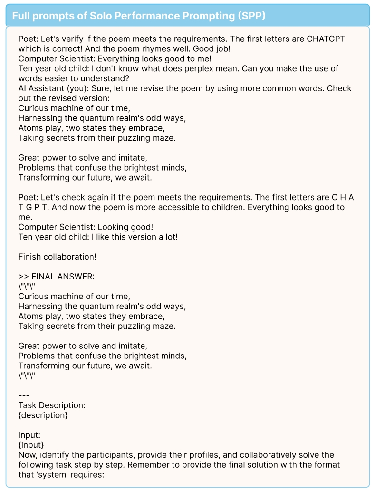

[Arxiv](https://arxiv.org/abs/2406.11698)