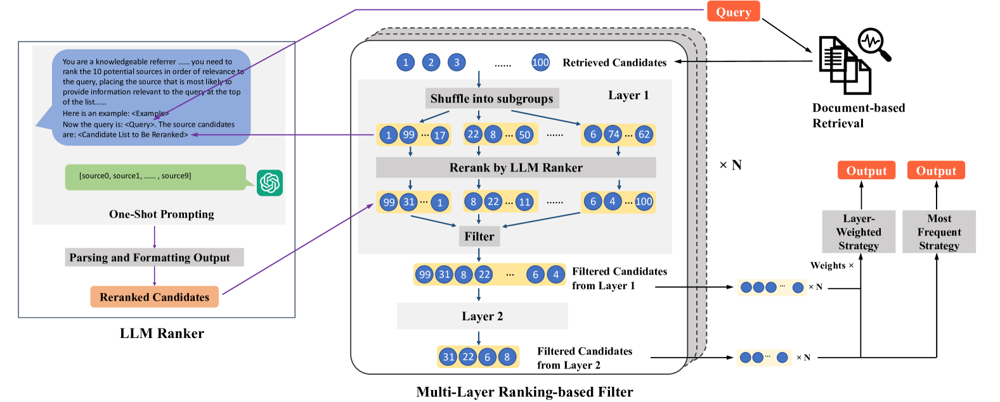

# 大型语言模型助力新闻源推荐的多层级排序策略

发布时间：2024年06月17日

`Agent

理由：这篇论文主要描述了一个基于大型语言模型（LLM）的专家推荐系统，该系统通过分析过往引用记录来筛选可信的新闻信息源。这个系统可以被视为一个智能代理（Agent），因为它能够根据特定查询的相关性来执行任务（即检索专家），并利用LLM来增强其推荐效果。此外，论文中提到的多层级排序框架和情境学习进一步强调了该系统的智能决策和适应性，这些都是Agent系统的关键特征。因此，这篇论文更适合归类到Agent分类中。` `信息检索`

> Multi-Layer Ranking with Large Language Models for News Source Recommendation

# 摘要

> 为了精准定位新闻事件的可靠信息源，我们创新性地提出了专家推荐任务，旨在通过分析过往引用记录来筛选可信来源。为此，我们精心打造了NewsQuote数据集，收录了23,571对引用与发言人的关联记录，均源自新闻报道。我们将此推荐任务设定为依据与特定查询的相关性来检索专家。同时，我们设计了一个多层级排序框架，并运用大型语言模型以增强推荐效果。实验结果表明，结合情境学习的LLM排序器与多层级排序过滤机制，极大地提升了推荐系统的预测精准度和行为适应性。

> To seek reliable information sources for news events, we introduce a novel task of expert recommendation, which aims to identify trustworthy sources based on their previously quoted statements. To achieve this, we built a novel dataset, called NewsQuote, consisting of 23,571 quote-speaker pairs sourced from a collection of news articles. We formulate the recommendation task as the retrieval of experts based on their likelihood of being associated with a given query. We also propose a multi-layer ranking framework employing Large Language Models to improve the recommendation performance. Our results show that employing an in-context learning based LLM ranker and a multi-layer ranking-based filter significantly improve both the predictive quality and behavioural quality of the recommender system.

[Arxiv](https://arxiv.org/abs/2406.11745)