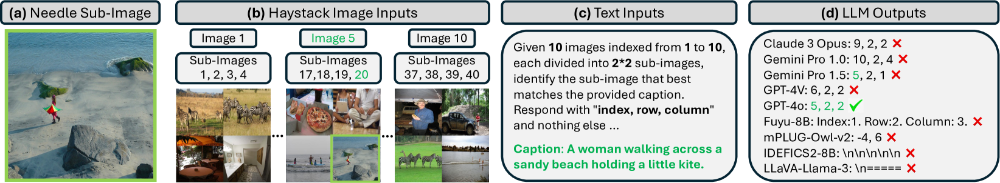
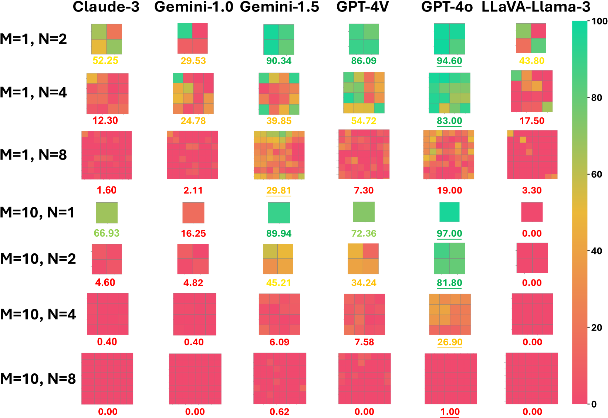
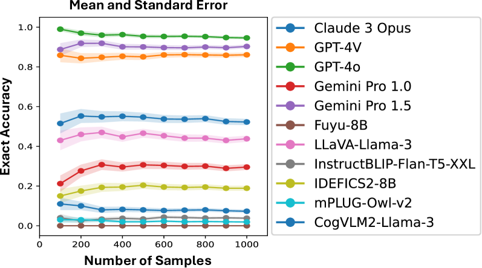
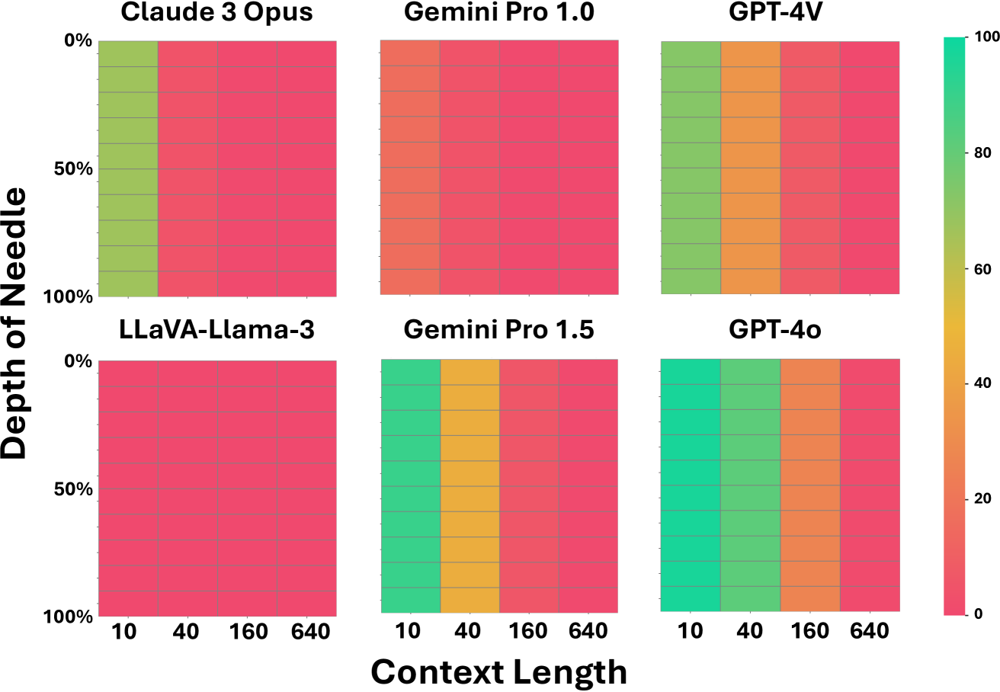
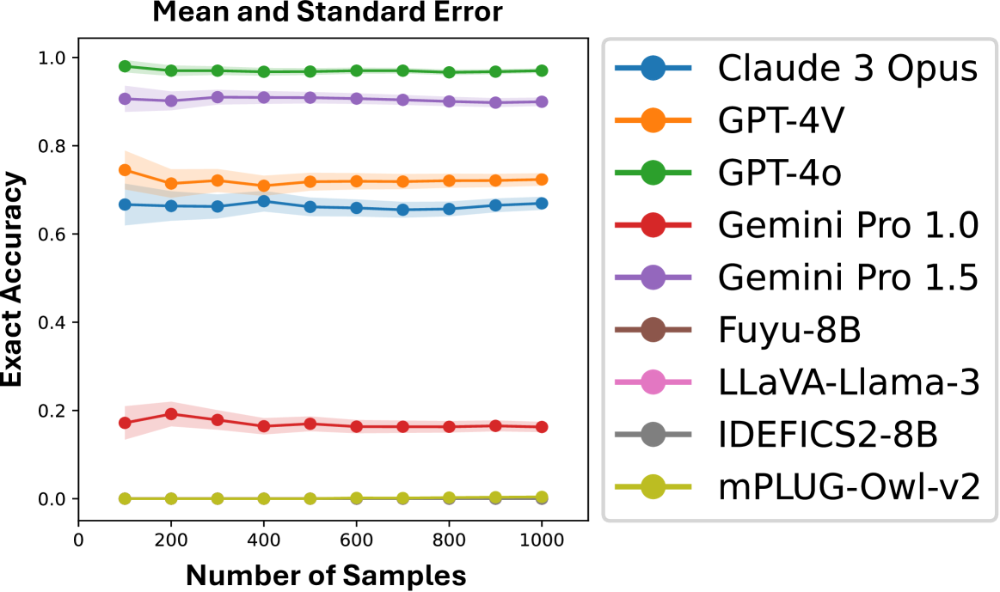

# 多模态寻针记：多模态大型语言模型长上下文能力的基准测试

发布时间：2024年06月17日

`LLM应用

理由：这篇论文介绍了“多模态寻针”（MMNeedle）基准，这是一个专门设计来评估多模态大型语言模型（MLLMs）的长上下文处理能力的工具。论文通过实际的测试和评估，探讨了MLLMs在处理长上下文任务中的表现，并对比了不同模型的性能。这种类型的研究属于应用层面的探讨，因为它关注的是如何通过特定的基准测试来评估和改进模型的实际应用能力，而不是理论层面的模型构建或算法研究。因此，将其归类为LLM应用是合适的。` `人工智能` `图像处理`

> Multimodal Needle in a Haystack: Benchmarking Long-Context Capability of Multimodal Large Language Models

# 摘要

> 多模态大型语言模型（MLLMs）在多个领域展现出显著潜力，激发了研究者和实践者的广泛关注。尽管如此，对其长上下文能力的深入评估仍显不足。为此，我们推出了“多模态寻针”（MMNeedle）基准，专为测试MLLMs的长上下文处理能力而设计。我们不仅采用多图像输入，还通过图像拼接技术扩展上下文长度，并创建了一套自动标记系统，用于子图像级检索。MMNeedle通过挑战模型在一系列图像（草堆）中根据文本指引找到特定子图像（针）的能力，来评估MLLMs。这要求模型具备深入理解复杂视觉上下文及在长图像序列中高效检索信息的能力。通过此基准，我们对比了包括API和开源在内的顶尖MLLMs。结果表明，GPT-4o在长上下文任务中表现卓越，但在负样本处理上存在幻觉问题。此外，我们的评估揭示了API模型与开源模型间显著的性能差异。所有相关代码、数据及复现指南已公开于https://github.com/Wang-ML-Lab/multimodal-needle-in-a-haystack。

> Multimodal Large Language Models (MLLMs) have shown significant promise in various applications, leading to broad interest from researchers and practitioners alike. However, a comprehensive evaluation of their long-context capabilities remains underexplored. To address these gaps, we introduce the MultiModal Needle-in-a-haystack (MMNeedle) benchmark, specifically designed to assess the long-context capabilities of MLLMs. Besides multi-image input, we employ image stitching to further increase the input context length, and develop a protocol to automatically generate labels for sub-image level retrieval. Essentially, MMNeedle evaluates MLLMs by stress-testing their capability to locate a target sub-image (needle) within a set of images (haystack) based on textual instructions and descriptions of image contents. This setup necessitates an advanced understanding of extensive visual contexts and effective information retrieval within long-context image inputs. With this benchmark, we evaluate state-of-the-art MLLMs, encompassing both API-based and open-source models. The findings reveal that GPT-4o consistently surpasses other models in long-context scenarios, but suffers from hallucination problems in negative samples, i.e., when needles are not in the haystacks. Our comprehensive long-context evaluation of MLLMs also sheds lights on the considerable performance gap between API-based and open-source models. All the code, data, and instructions required to reproduce the main results are available at https://github.com/Wang-ML-Lab/multimodal-needle-in-a-haystack.

[Arxiv](https://arxiv.org/abs/2406.11230)