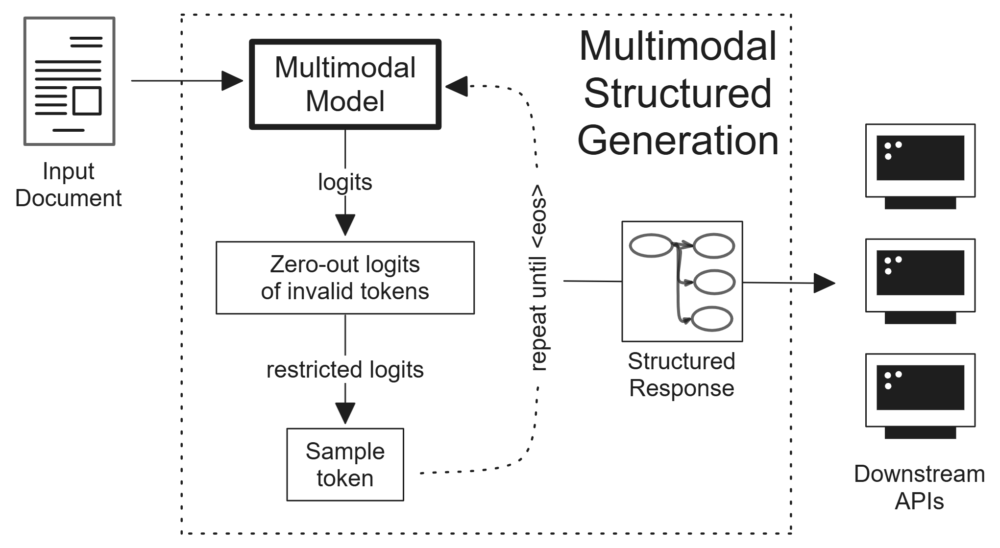
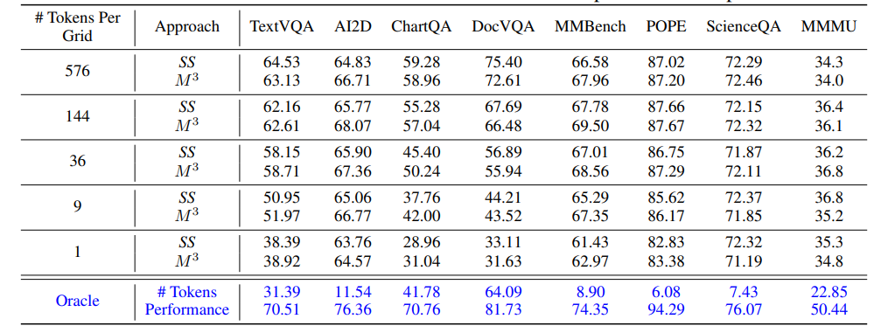

# CVPR第二届MMFM挑战赛技术报告：探索多模态结构化生成的新前沿

发布时间：2024年06月17日

`Agent

理由：这篇论文介绍了一种名为“多模态结构化生成”的框架，该框架通过限制多模态基础模型（MMFMs）的输出概率，使其在生成结构化输出前进行推理，以便下游API解析和利用。这种方法涉及到模型的微调和部署，以及在特定任务上的应用，如文档理解。虽然这种方法涉及到了模型的应用，但其核心在于提出了一种新的框架来优化模型的行为，使其更像一个智能代理（Agent），能够根据任务需求进行推理和决策。因此，将其归类为Agent更为合适。` `计算机视觉`

> Multimodal Structured Generation: CVPR's 2nd MMFM Challenge Technical Report

# 摘要

> 多模态基础模型（MMFMs）在计算机视觉和自然语言处理领域表现出色，但在如文档理解等特定任务上仍有提升空间。与单模态模型相比，MMFMs的微调和部署更为耗时耗力。本报告提出了一种名为“多模态结构化生成”的框架，通过限制MMFMs的输出概率，促使其在生成结构化输出前进行推理，以便下游API解析和利用。我们详细阐述了这一方法，包括技术细节、理论分析及在CVPR主办的第二届多模态基础模型挑战赛中的评估结果。该方法在第二阶段隐藏测试集中荣获第二，总体排名第三，证明了其对未知任务的泛化能力。此外，简单的工程设计胜过复杂的建模过程，这一观点在我们关于商业文档信息提取的论文中首次提出。所有相关脚本、部署指南及评估结果均可在https://github.com/leloykun/MMFM-Challenge查阅。

> Multimodal Foundation Models (MMFMs) have shown remarkable performance on various computer vision and natural language processing tasks. However, their performance on particular tasks such as document understanding is still limited. They also require more compute, time, and engineering resources to finetune and deploy compared to traditional, unimodal models. In this report, we present Multimodal Structured Generation, a general framework which constrains the output logits of frozen MMFMs to force them to reason before responding with structured outputs that downstream APIs can parse and use. We provide a detailed account of our approach, including the technical details, theoretical discussions, and final evaluation results in the 2nd Multimodal Foundation Models Challenge hosted by the Computer Vision and Pattern Recognition (CVPR) conference. Our approach achieved the second highest score in the hidden test set for Phase 2 and third highest overall. This shows the method's ability to generalize to unseen tasks. And that simple engineering can beat expensive & complicated modelling steps as we first discussed in our paper, Retrieval Augmented Structured Generation: Business Document Information Extraction as Tool Use. All of our scripts, deployment steps, and evaluation results can be accessed in https://github.com/leloykun/MMFM-Challenge

[Arxiv](https://arxiv.org/abs/2406.11403)