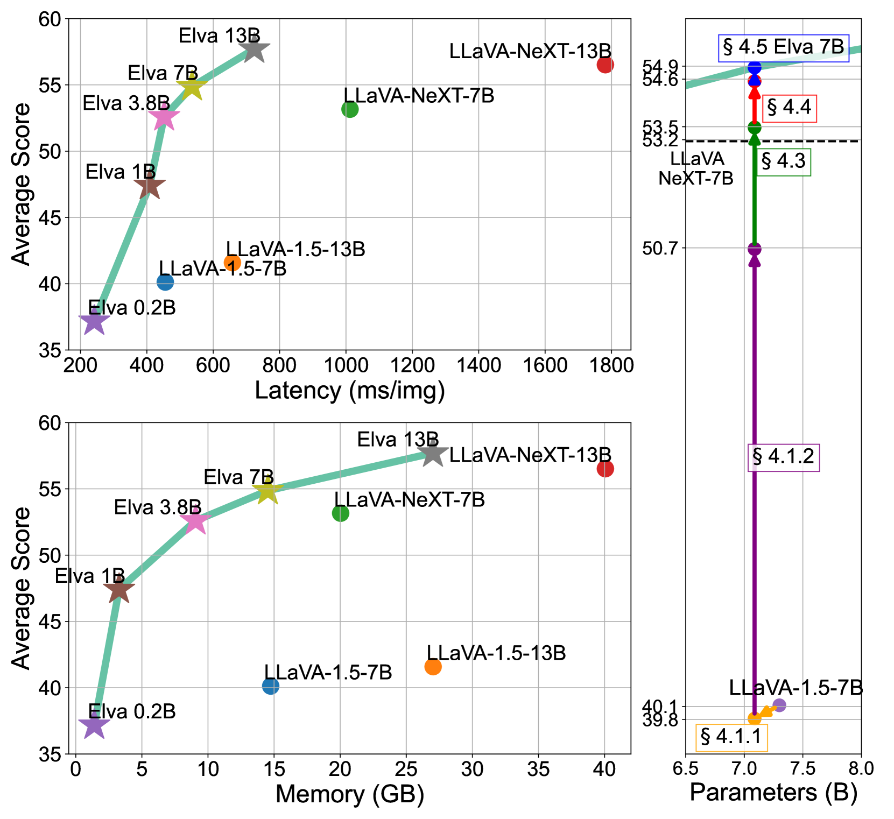
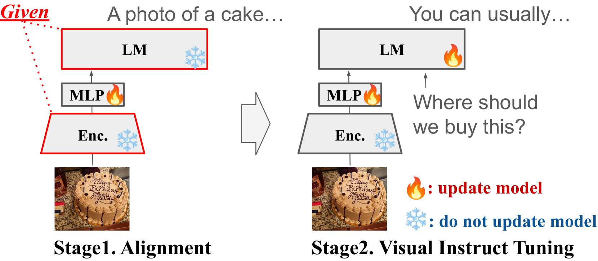
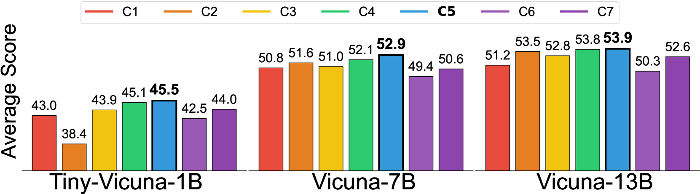
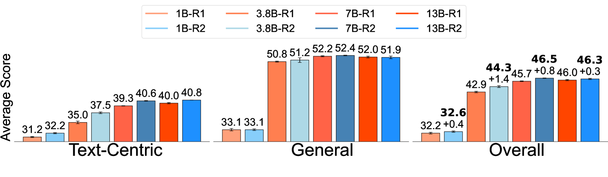
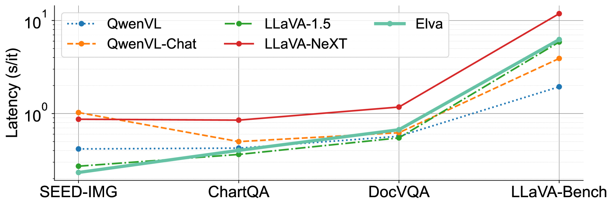
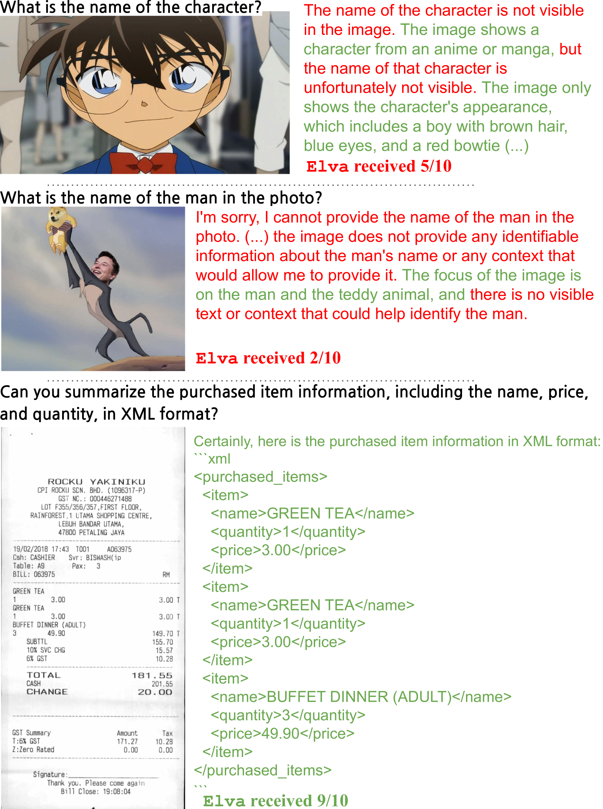
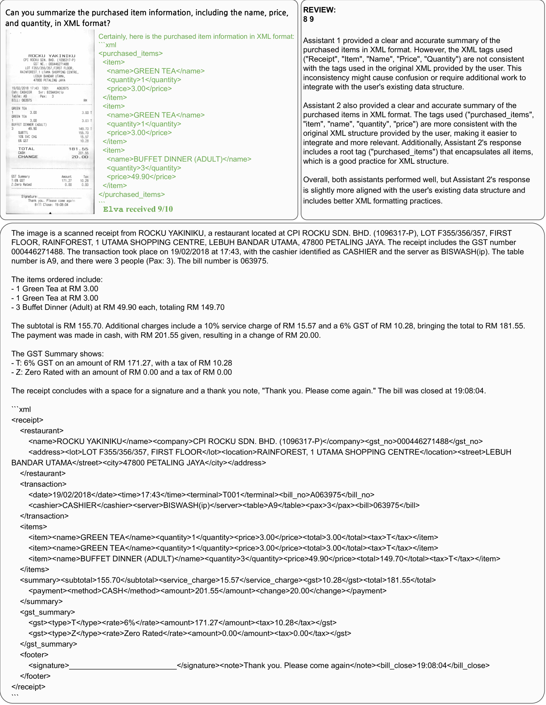

# 视觉情境下的自然语言理解：高效的语视觉助手在阅读与推理中的关键因素

发布时间：2024年06月17日

`LLM应用

这篇论文主要关注的是在视觉-语言模型中如何平衡模型规模与数据价值，以及如何通过优化模型设计来提高推理效率。虽然论文中提到了模型的参数规模（1.6亿至130亿），但重点在于模型的应用层面，即如何通过精确定位关键要素和优化模型组件来提升模型的实际应用性能。因此，这篇论文更适合归类为LLM应用，因为它探讨的是大型语言模型在视觉-语言任务中的实际应用和优化策略。` `人工智能` `计算机视觉`

> On Efficient Language and Vision Assistants for Visually-Situated Natural Language Understanding: What Matters in Reading and Reasoning

# 摘要

> 语言与视觉助手的最新进展虽令人瞩目，但其不透明性却阻碍了研究的广泛开展与成果的可复制性。尽管开源模型在处理常规图像任务上游刃有余，但面对复杂视觉情境下的文本理解时，却因高计算需求而步履维艰。此类任务往往需要更多的输入令牌和庞大的视觉模块以捕捉高分辨率信息。如何在模型规模与数据价值间找到平衡点，仍是待解之谜。本研究旨在通过精确定位关键要素，打造推理成本受限的高效视觉-语言模型，从而重塑模型设计。我们通过精心策划数据集、优化视觉组件及强化监督机制，实现了推理效率的大幅提升，同时保持了卓越性能。在涵盖1.6亿至130亿参数模型的广泛实验中，我们揭示了模型优化的关键洞察。所有代码、模型及数据集将在https://github.com/naver-ai/elva全面开源。

> Recent advancements in language and vision assistants have showcased impressive capabilities but suffer from a lack of transparency, limiting broader research and reproducibility. While open-source models handle general image tasks effectively, they face challenges with the high computational demands of complex visually-situated text understanding. Such tasks often require increased token inputs and large vision modules to harness high-resolution information. Striking a balance between model size and data importance remains an open question. This study aims to redefine the design of vision-language models by identifying key components and creating efficient models with constrained inference costs. By strategically formulating datasets, optimizing vision modules, and enhancing supervision techniques, we achieve significant improvements in inference throughput while maintaining high performance. Extensive experiments across models ranging from 160M to 13B parameters offer insights into model optimization. We will fully open-source our codebase, models, and datasets at https://github.com/naver-ai/elva .

[Arxiv](https://arxiv.org/abs/2406.11823)