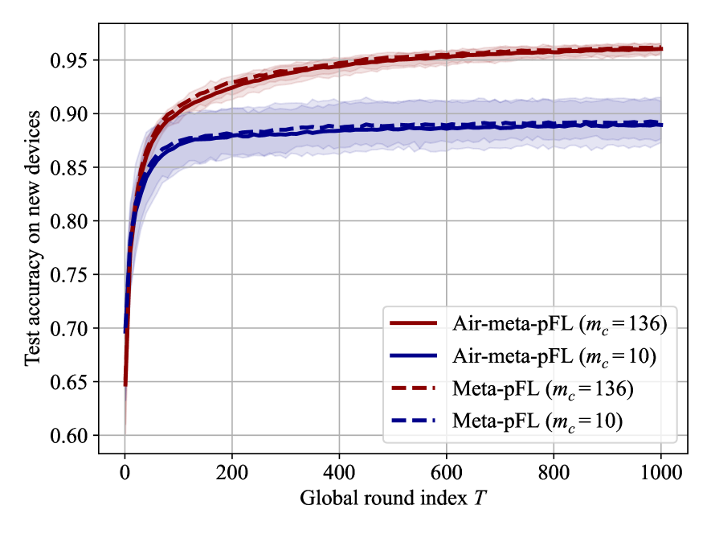

# 利用空中联邦元学习实现预训练与个性化微调：探索收敛与泛化之间的平衡

发布时间：2024年06月17日

`Agent

这篇论文主要探讨了在无线网络环境下，基于元学习的个性化联邦学习（meta-pFL）如何通过共享信道连接的代理实现泛化性能。它分析了泛化与收敛之间的平衡，并提供了模拟结果来支持理论分析。因此，这篇论文更符合Agent分类，因为它关注的是代理（Agent）在联邦学习环境中的性能和泛化能力。` `无线网络` `联邦学习`

> Pre-Training and Personalized Fine-Tuning via Over-the-Air Federated Meta-Learning: Convergence-Generalization Trade-Offs

# 摘要

> 现代AI应用，如LLMs，其训练模式已演变为预训练加微调。随着公开数据集的减少，以及AI模型普及化的努力，预训练正逐步从集中式转向联邦学习（FL）。元学习为此提供了一个框架，使得预训练与微调得以规范化。基于元学习的个性化FL（meta-pFL）不仅实现了个性化，还针对新任务和代理的泛化能力进行了优化。本文探讨了在无线网络环境下，meta-pFL如何通过共享信道连接的代理实现泛化性能。通过空中计算技术，我们分析了泛化与收敛之间的微妙平衡：信道干扰虽能提升泛化，却可能影响收敛。大量模拟结果支持了这一理论分析。

> For modern artificial intelligence (AI) applications such as large language models (LLMs), the training paradigm has recently shifted to pre-training followed by fine-tuning. Furthermore, owing to dwindling open repositories of data and thanks to efforts to democratize access to AI models, pre-training is expected to increasingly migrate from the current centralized deployments to federated learning (FL) implementations. Meta-learning provides a general framework in which pre-training and fine-tuning can be formalized. Meta-learning-based personalized FL (meta-pFL) moves beyond basic personalization by targeting generalization to new agents and tasks. This paper studies the generalization performance of meta-pFL for a wireless setting in which the agents participating in the pre-training phase, i.e., meta-learning, are connected via a shared wireless channel to the server. Adopting over-the-air computing, we study the trade-off between generalization to new agents and tasks, on the one hand, and convergence, on the other hand. The trade-off arises from the fact that channel impairments may enhance generalization, while degrading convergence. Extensive numerical results validate the theory.

[Arxiv](https://arxiv.org/abs/2406.11569)