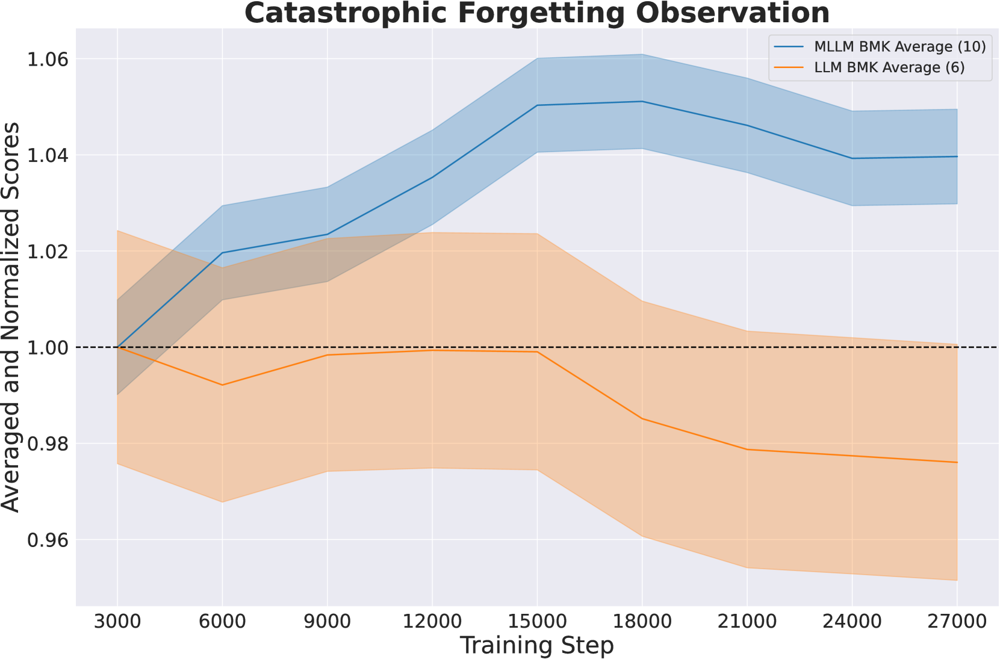
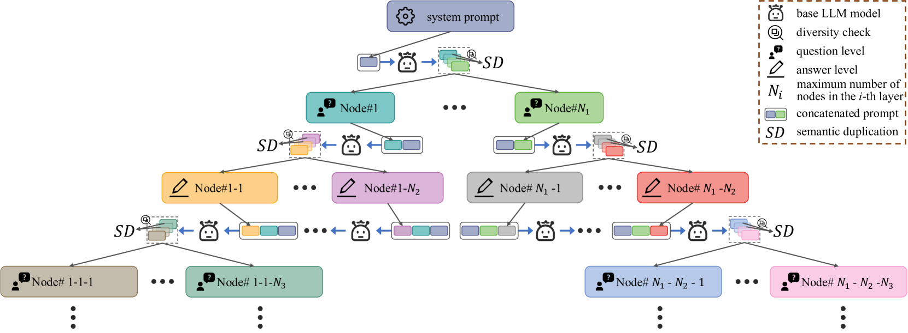
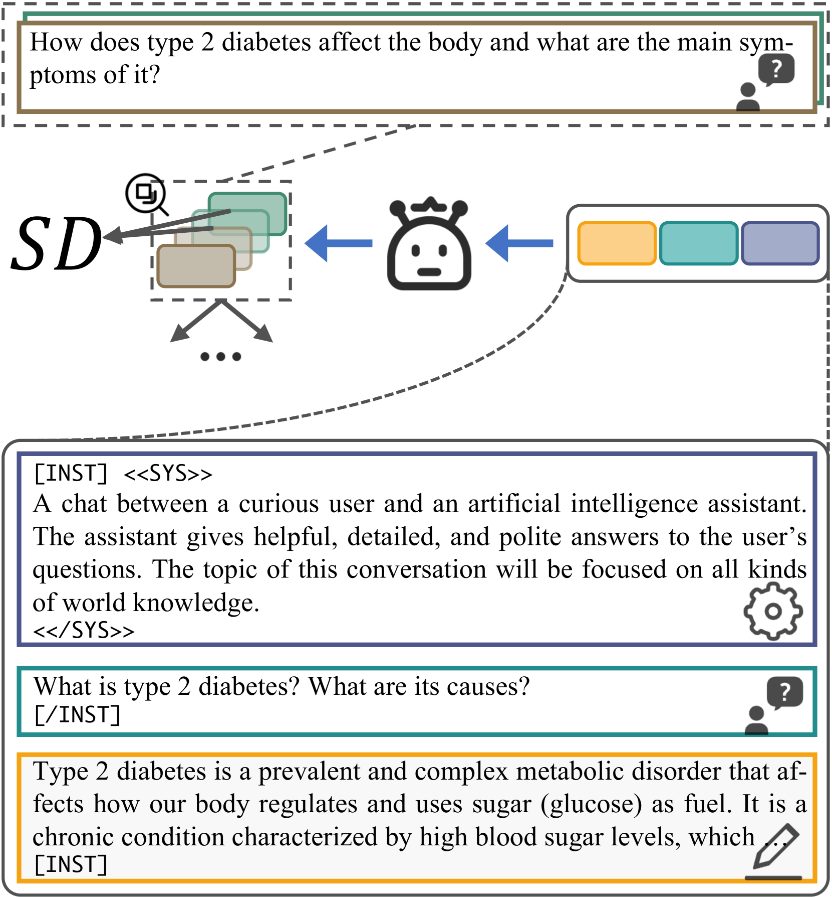
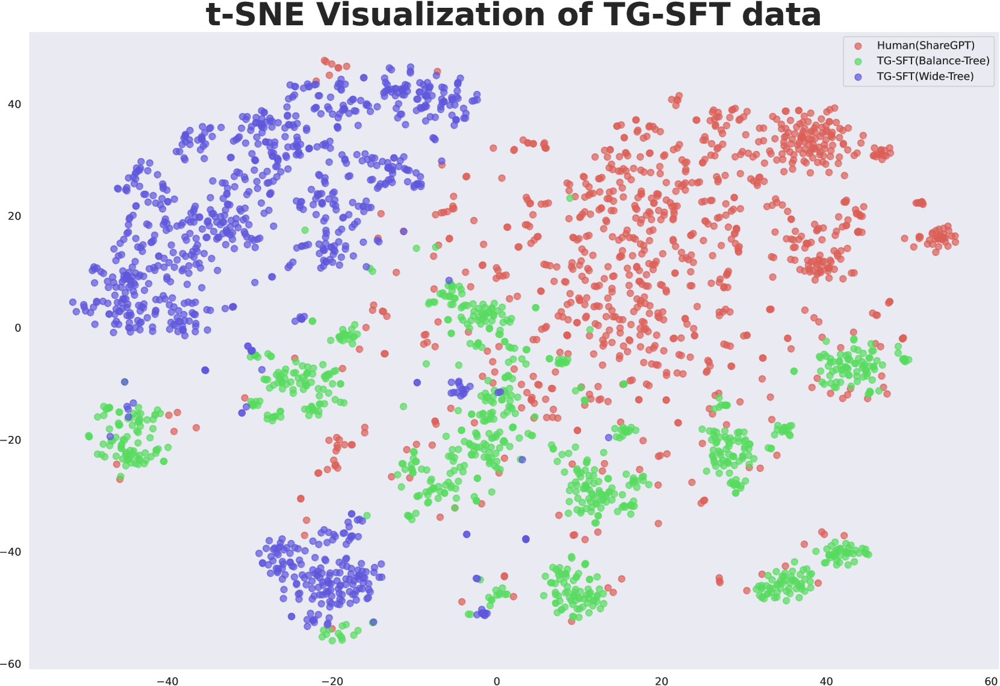
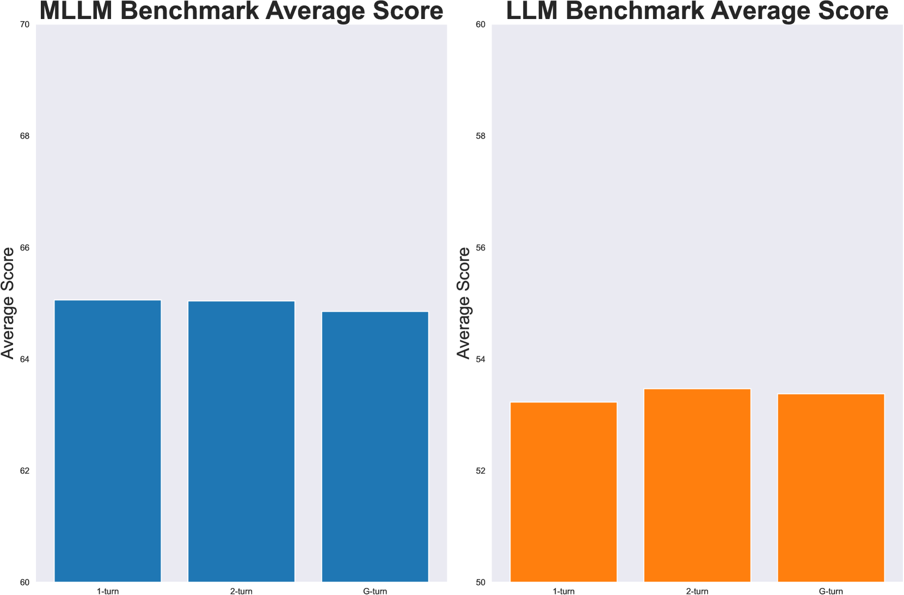

# 在大规模语言模型中知识保留：一种与模型无关的自解压策略

发布时间：2024年06月17日

`LLM应用

这篇论文主要探讨了大型语言模型（LLMs）在特定领域数据上进行监督微调（SFT）后面临的知识遗忘问题，并提出了一种创新的模型无关自解压技术——树生成（TG）来解决这一问题。这种方法特别针对多模态大型语言模型（MLLMs），通过生成用于指令调整的SFT数据，有效缓解了知识遗忘问题。因此，这篇论文属于LLM应用类别，因为它关注的是LLMs在实际应用中的具体问题和解决方案，而不是理论研究或Agent、RAG相关的研究。` `多模态学习` `模型微调`

> Preserving Knowledge in Large Language Model: A Model-Agnostic Self-Decompression Approach

# 摘要

> 人类在吸收新知的同时不忘旧识，然而大型语言模型（LLMs）在特定领域数据上进行监督微调（SFT）后，却常面临知识遗忘的困境。特别是多模态大型语言模型（MLLMs），它们结合了LLM核心与视觉模块，与单模态版本相比，在语言测试中的表现大打折扣。为此，我们提出了一种创新的模型无关自解压技术——树生成（TG），它巧妙地将LLMs内的知识解压至训练数据中。本文聚焦于TG-SFT，这一技术能生成用于指令调整的SFT数据。通过在MLLMs的SFT阶段融入这些数据，我们有效缓解了遗忘问题。

> Humans can retain old knowledge while learning new information, but Large Language Models (LLMs) often suffer from catastrophic forgetting when post-pretrained or supervised fine-tuned (SFT) on domain-specific data. Moreover, for Multimodal Large Language Models (MLLMs) which are composed of the LLM base and visual projector (e.g. LLaVA), a significant decline in performance on language benchmarks was observed compared to their single-modality counterparts. To address these challenges, we introduce a novel model-agnostic self-decompression method, Tree Generation (TG), that decompresses knowledge within LLMs into the training corpus. This paper focuses on TG-SFT, which can synthetically generate SFT data for the instruction tuning steps. By incorporating the dumped corpus during SFT for MLLMs, we significantly reduce the forgetting problem.

[Arxiv](https://arxiv.org/abs/2406.11354)