# XLogoOnline环境下视觉编程的程序综合基准测试

发布时间：2024年06月17日

`LLM应用

这篇论文探讨了大型语言和多模态模型在需要结合多种技能的任务上的表现，并提出了一种微调流程来提升模型性能。研究集中在程序合成任务上，通过创建一个新的基准和使用合成数据集进行模型微调，以改善模型在特定任务上的表现。这属于应用层面的研究，因为它关注的是如何通过实际操作和数据集调整来优化大型语言模型在特定任务上的应用性能，而不是理论模型的基础研究或Agent的设计与实现。因此，它被归类为LLM应用。`

> Program Synthesis Benchmark for Visual Programming in XLogoOnline Environment

# 摘要

> 大型语言和多模态模型在特定技能的测试中表现出色，但在需要多技能结合的任务上表现如何尚不明确。本文中，我们基于XLogoOnline视觉编程环境，精心设计了一个程序合成的新基准，包含85个真实世界任务，每个任务都考验着空间规划、基础编程和逻辑推理等技能的综合运用。评估结果显示，即使是最先进的模型如GPT-4V和Llama3-70B，在这些任务上的成功率也仅为20%和2.35%。为此，我们开发了一套微调流程，利用包含80000多个任务的合成数据集来提升模型性能，并展示了如何通过模拟器反馈来优化训练数据分布。经过微调的Llama3-8B模型在这些任务上大放异彩，远超其他模型，我们对模型在不同技能维度上的表现进行了深入分析。我们计划公开这一基准，以促进未来在视觉编程领域的程序合成研究。

> Large language and multimodal models have shown remarkable successes on various benchmarks focused on specific skills such as general-purpose programming, natural language understanding, math word problem-solving, and visual question answering. However, it is unclear how well these models perform on tasks that require a combination of these skills. In this paper, we curate a novel program synthesis benchmark based on the XLogoOnline visual programming environment. The benchmark comprises 85 real-world tasks from the Mini-level of the XLogoOnline environment, each requiring a combination of different skills such as spatial planning, basic programming, and logical reasoning. Our evaluation shows that current state-of-the-art models like GPT-4V and Llama3-70B struggle to solve these tasks, achieving only 20% and 2.35% success rates. Next, we develop a fine-tuning pipeline to boost the performance of models by leveraging a large-scale synthetic training dataset with over 80000 tasks. Moreover, we showcase how emulator-driven feedback can be used to design a curriculum over training data distribution. We showcase that a fine-tuned Llama3-8B drastically outperforms GPT-4V and Llama3-70B models, and provide an in-depth analysis of the models' expertise across different skill dimensions. We will publicly release the benchmark for future research on program synthesis in visual programming.

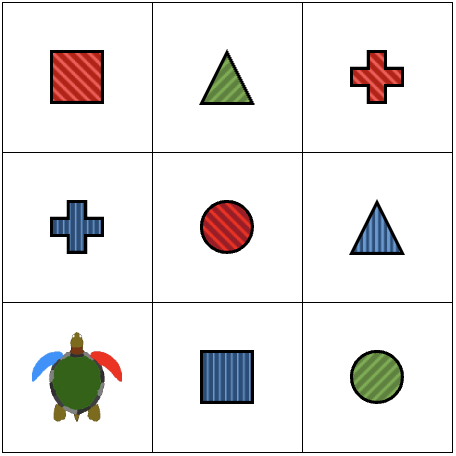

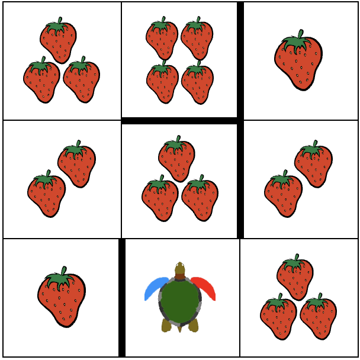

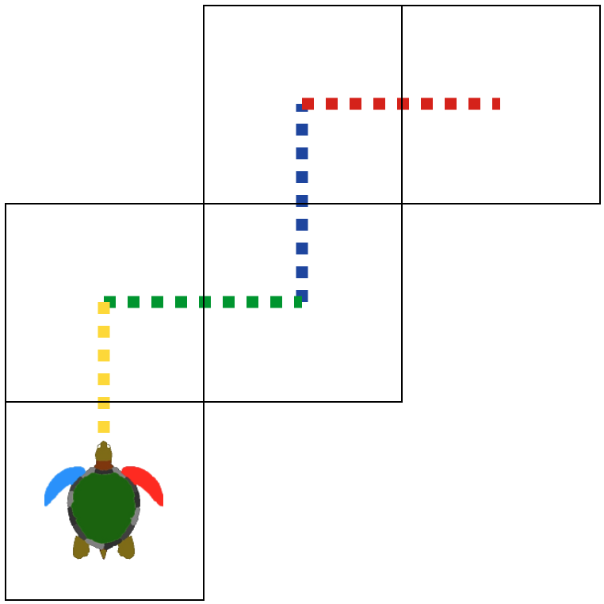

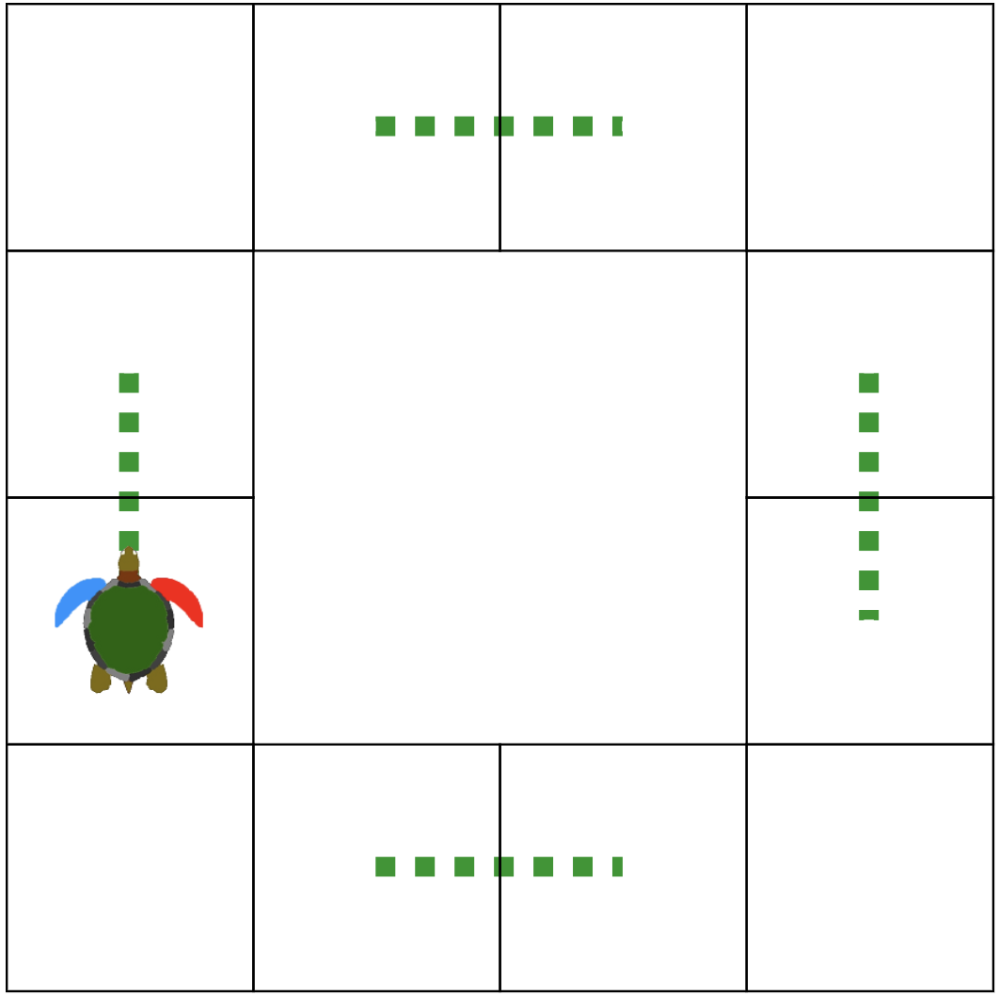

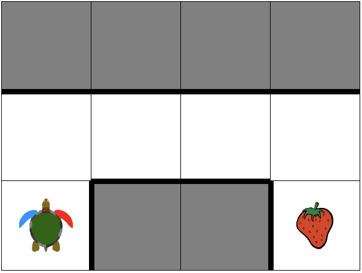

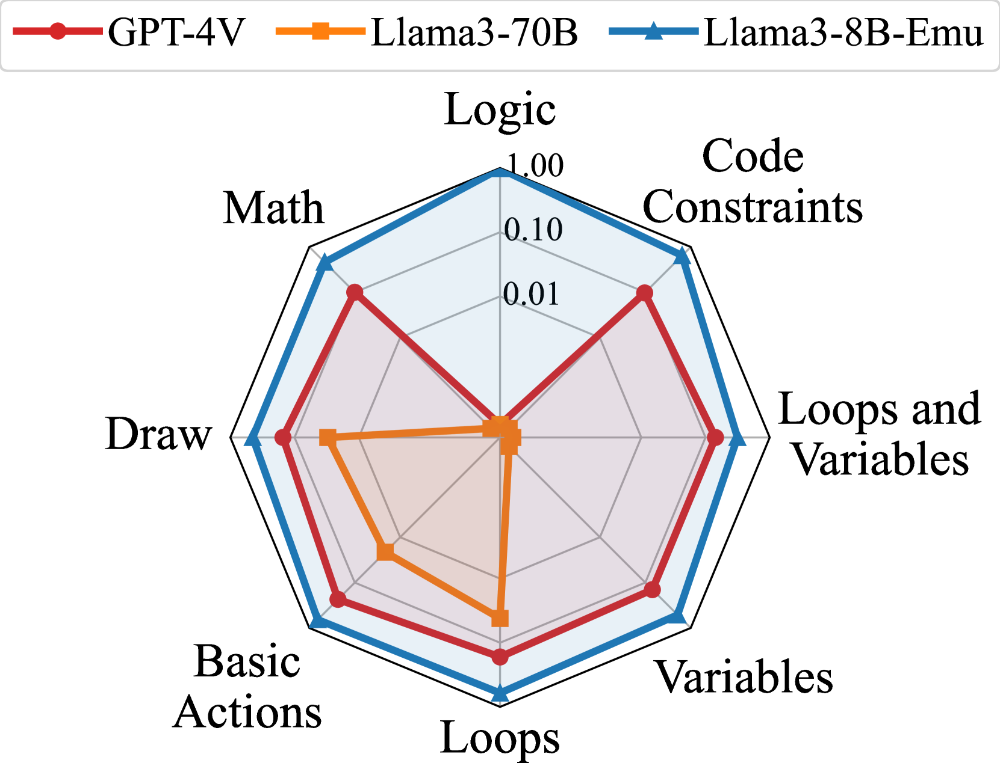

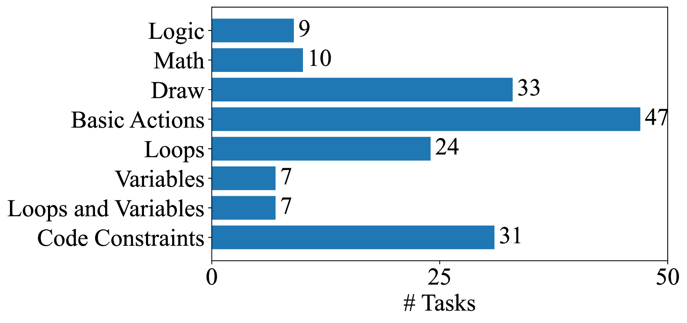

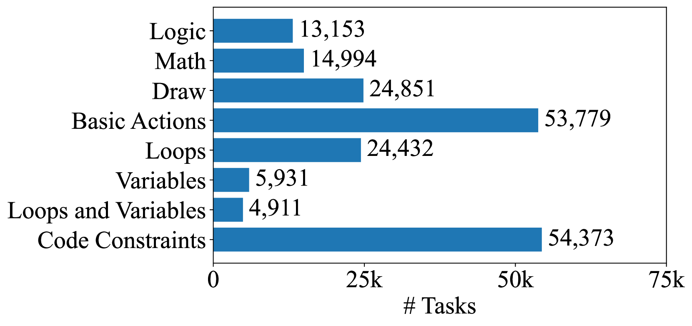

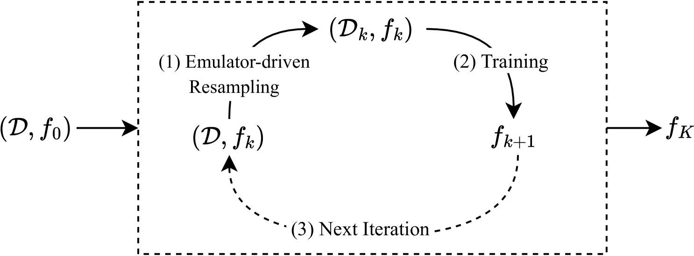

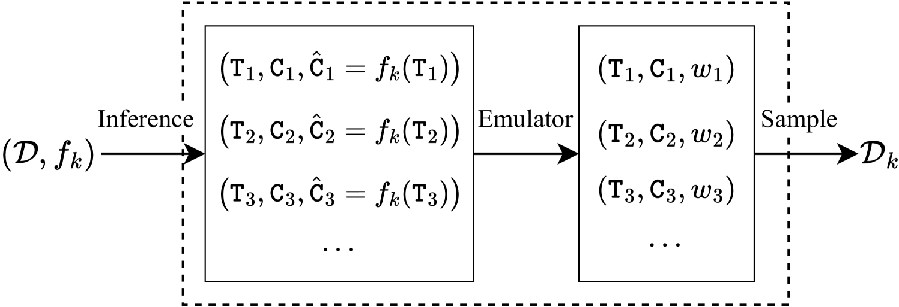

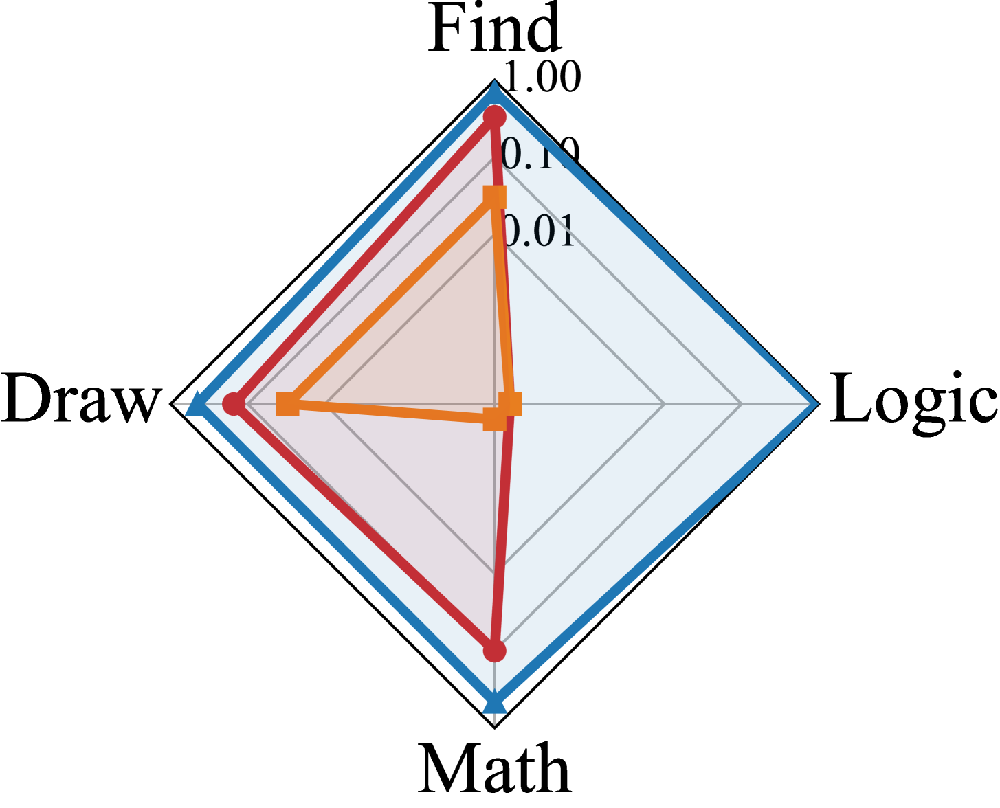

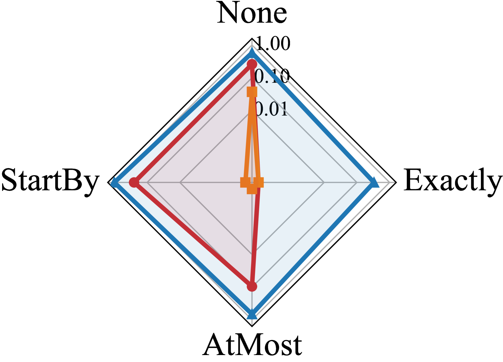

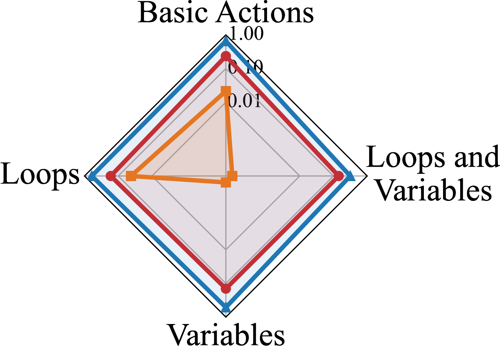

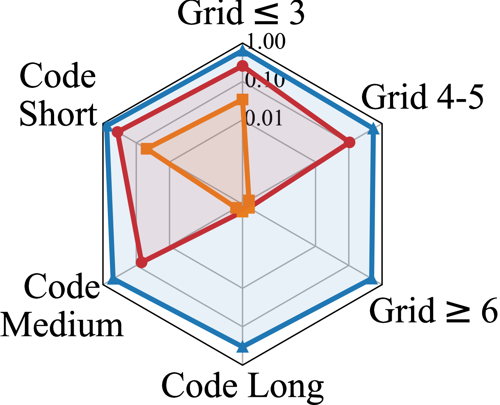

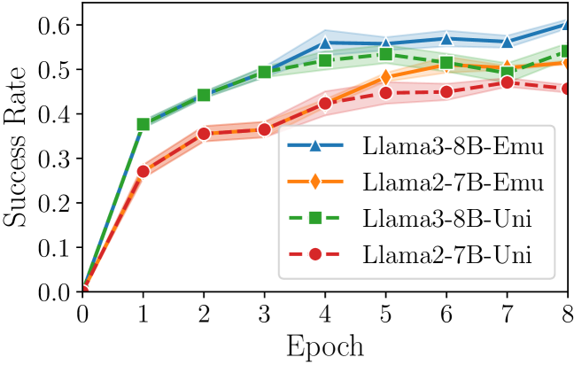

[Arxiv](https://arxiv.org/abs/2406.11334)