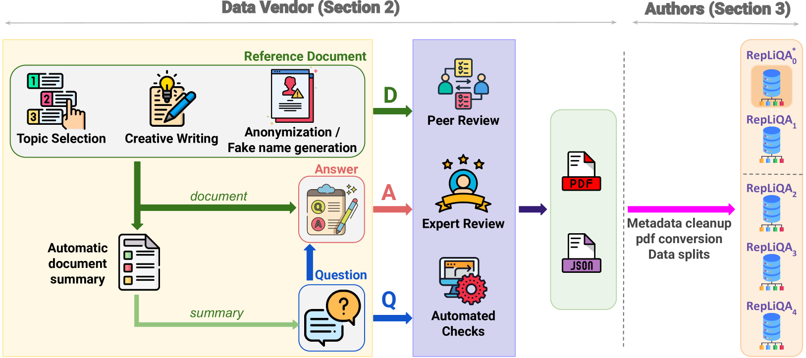
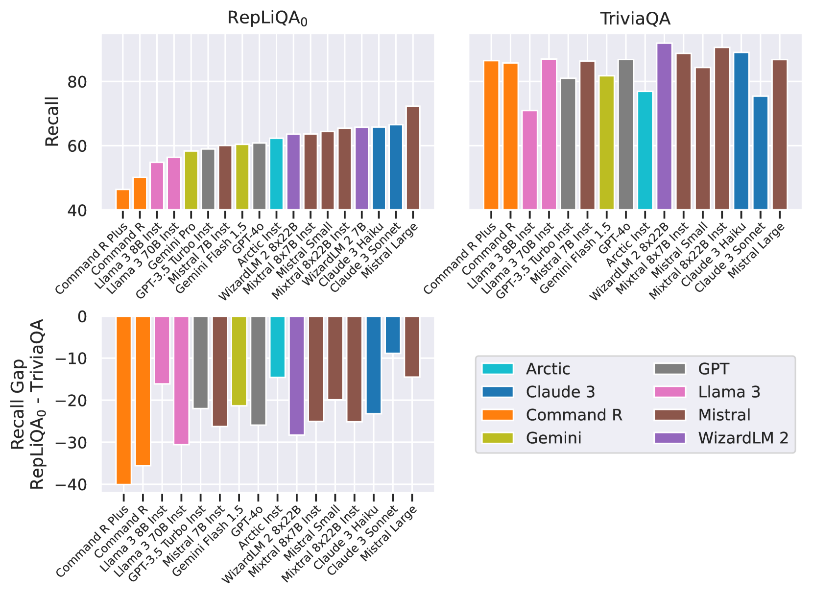
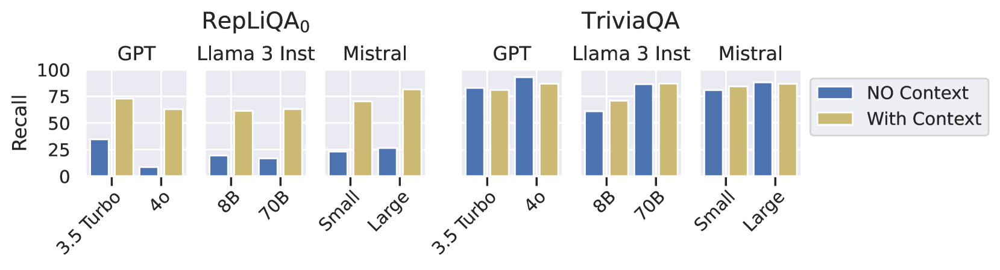
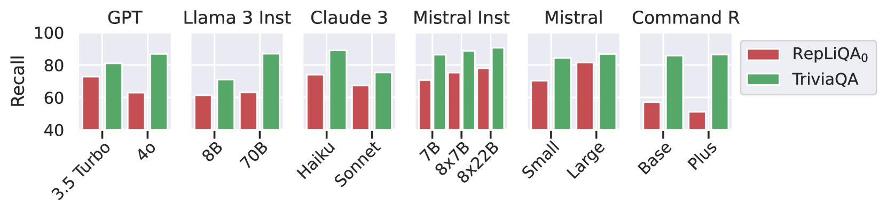
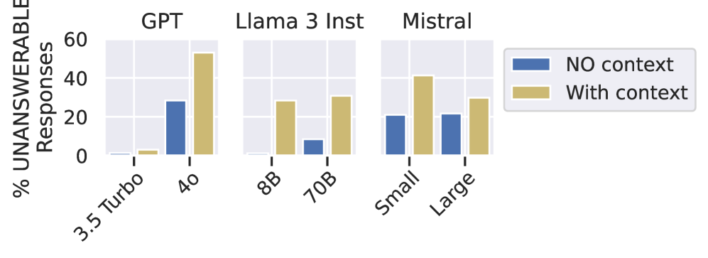
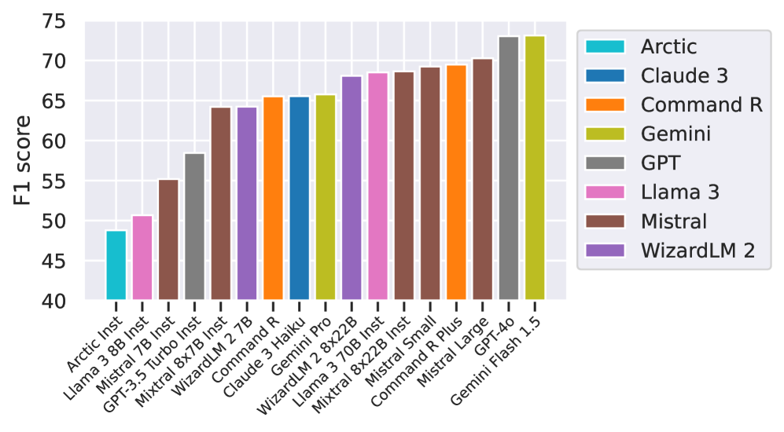
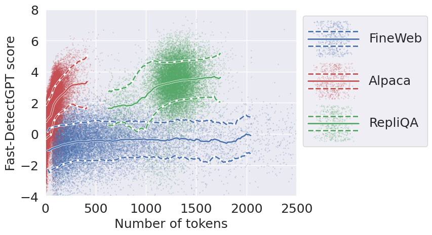
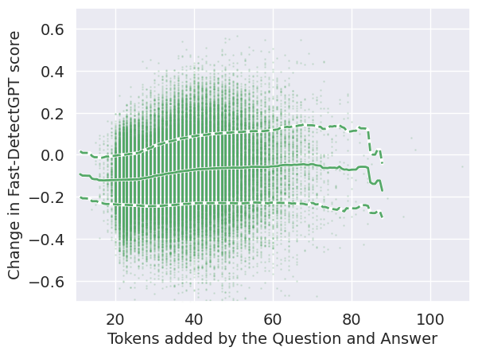

# RepLiQA：专为大型语言模型在未知参考内容上的问答性能基准测试而设计的数据集

发布时间：2024年06月17日

`LLM应用

这篇论文主要讨论了大型语言模型（LLMs）的评估问题，特别是关于如何避免使用可能已经泄露到训练集中的测试数据来评估模型，以确保评估的准确性。为此，作者推出了一个名为RepLiQA的新测试数据集，专门设计用于问答和主题检索任务，以提供更准确的评估。这个数据集的设计和使用直接关联到LLMs的应用层面，即如何更有效地评估和改进这些模型的性能，而不是探讨LLMs的理论基础或Agent的设计与应用。因此，这篇论文最适合归类为LLM应用。` `问答系统` `数据集评估`

> RepLiQA: A Question-Answering Dataset for Benchmarking LLMs on Unseen Reference Content

# 摘要

> 大型语言模型（LLMs）通过互联网自动抓取的海量数据进行训练，这些数据既包含丰富的常识性内容（如维基百科），也可能与评估LLMs的基准数据集重叠。因此，使用可能已泄露至训练集的测试数据来评估模型，可能会得出误导性结论。为了确保对语言模型的评估更为准确，我们推出了一个名为RepLiQA的新测试数据集，专为问答和主题检索任务设计。RepLiQA包含五个测试集分割，其中四个在发布前未曾公开或暴露给LLMs。每个RepLiQA样本包括：一个由人工编写的虚构场景参考文档、一个相关问题、一个直接从文档中提取的真实答案，以及包含答案的文档段落。这意味着，模型只有在能够从提供的文档中提取相关信息时，才能给出准确答案。我们通过大规模基准测试，对比了多种类型和规模的LLMs在上下文条件语言建模中的表现差异。RepLiQA的详细信息可在此链接获取：https://huggingface.co/datasets/ServiceNow/repliqa。

> Large Language Models (LLMs) are trained on vast amounts of data, most of which is automatically scraped from the internet. This data includes encyclopedic documents that harbor a vast amount of general knowledge (e.g., Wikipedia) but also potentially overlap with benchmark datasets used for evaluating LLMs. Consequently, evaluating models on test splits that might have leaked into the training set is prone to misleading conclusions. To foster sound evaluation of language models, we introduce a new test dataset named RepLiQA, suited for question-answering and topic retrieval tasks. RepLiQA is a collection of five splits of test sets, four of which have not been released to the internet or exposed to LLM APIs prior to this publication. Each sample in RepLiQA comprises (1) a reference document crafted by a human annotator and depicting an imaginary scenario (e.g., a news article) absent from the internet; (2) a question about the document's topic; (3) a ground-truth answer derived directly from the information in the document; and (4) the paragraph extracted from the reference document containing the answer. As such, accurate answers can only be generated if a model can find relevant content within the provided document. We run a large-scale benchmark comprising several state-of-the-art LLMs to uncover differences in performance across models of various types and sizes in a context-conditional language modeling setting. Released splits of RepLiQA can be found here: https://huggingface.co/datasets/ServiceNow/repliqa.

[Arxiv](https://arxiv.org/abs/2406.11811)