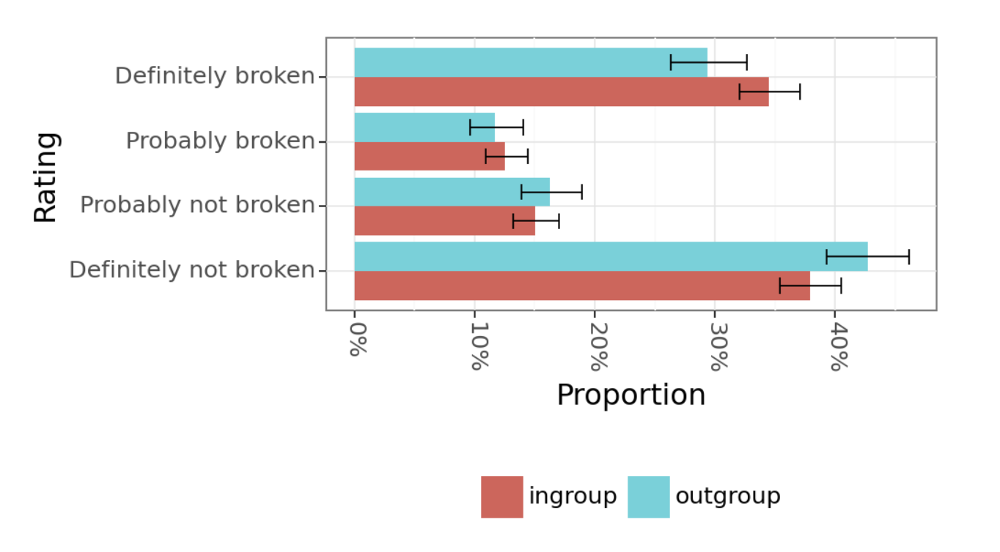

# STAR：运用社会技术方法的红队语言模型策略

发布时间：2024年06月17日

`Agent

理由：该论文摘要中提到的STAR框架，专注于优化大型语言模型（LLM）的安全测试，特别是通过红队实践来提升模型的安全性。这种框架涉及对模型的主动测试和评估，类似于一个智能代理（Agent）在执行任务，即识别和解决模型中的安全问题。因此，将其归类为Agent是合适的。` `安全测试` `人工智能`

> STAR: SocioTechnical Approach to Red Teaming Language Models

# 摘要

> 本研究推出的STAR框架，优化了大型语言模型安全测试的红队实践。STAR的两大亮点：一是通过参数化指令提升红队操作的灵活性，有效扩大风险检测范围，同时深入剖析模型缺陷，成本不变；二是精准匹配人群特征，提升对特定群体潜在伤害的评估敏感度，标注质量更上一层楼。此外，STAR引入创新仲裁机制，视分歧为提升评估准确性的宝贵资源，而非干扰，从而确保了标签的一致性和可靠性。

> This research introduces STAR, a sociotechnical framework that improves on current best practices for red teaming safety of large language models. STAR makes two key contributions: it enhances steerability by generating parameterised instructions for human red teamers, leading to improved coverage of the risk surface. Parameterised instructions also provide more detailed insights into model failures at no increased cost. Second, STAR improves signal quality by matching demographics to assess harms for specific groups, resulting in more sensitive annotations. STAR further employs a novel step of arbitration to leverage diverse viewpoints and improve label reliability, treating disagreement not as noise but as a valuable contribution to signal quality.

[Arxiv](https://arxiv.org/abs/2406.11757)