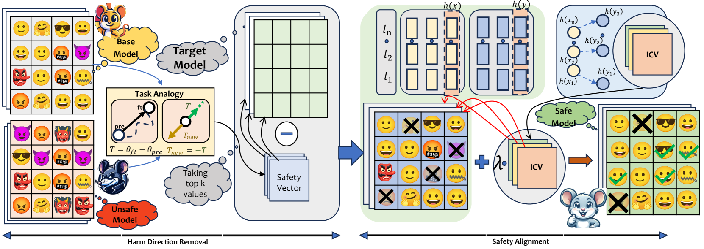

# 安全算术：一种通过微调参数和激活，确保语言模型在测试阶段安全对齐的新框架

发布时间：2024年06月17日

`LLM应用

这篇论文摘要讨论了大型语言模型（LLMs）在翻译和问答等应用中的安全对齐问题，并提出了一种新的“安全算术”框架来增强模型的安全性。该框架旨在避免产生有害内容，并促进生成安全响应，同时保持模型的实用性。这与LLM的应用相关，特别是在提高模型在实际应用中的安全性和可靠性方面。因此，它属于LLM应用分类。` `人工智能安全`

> Safety Arithmetic: A Framework for Test-time Safety Alignment of Language Models by Steering Parameters and Activations

# 摘要

> 随着大型语言模型（LLMs）在翻译和问答等应用中的核心地位日益凸显，确保其与人类价值观的安全对齐变得至关重要。现有的对齐技术在应对多变的用户意图和复杂任务目标时显得力不从心，导致模型易产生有害内容。为此，我们创新性地提出了“安全算术”框架，这一无需额外训练的策略旨在增强LLM在基础模型、监督微调模型（SFT）及编辑模型等不同情境下的安全性。该框架通过“有害内容方向移除”和“安全对齐”两大机制，有效避免了有害内容的产生，并促进了安全响应的生成。同时，我们还发布了NoIntentEdit数据集，该数据集聚焦于那些若无意中使用可能危及模型安全的编辑实例。实验结果显示，安全算术不仅大幅提升了模型的安全性能，还避免了过度安全的问题，同时保持了模型的实用性，其效果在确保内容安全生成方面超越了现有技术。

> Ensuring the safe alignment of large language models (LLMs) with human values is critical as they become integral to applications like translation and question answering. Current alignment methods struggle with dynamic user intentions and complex objectives, making models vulnerable to generating harmful content. We propose Safety Arithmetic, a training-free framework enhancing LLM safety across different scenarios: Base models, Supervised fine-tuned models (SFT), and Edited models. Safety Arithmetic involves Harm Direction Removal to avoid harmful content and Safety Alignment to promote safe responses. Additionally, we present NoIntentEdit, a dataset highlighting edit instances that could compromise model safety if used unintentionally. Our experiments show that Safety Arithmetic significantly improves safety measures, reduces over-safety, and maintains model utility, outperforming existing methods in ensuring safe content generation.

[Arxiv](https://arxiv.org/abs/2406.11801)