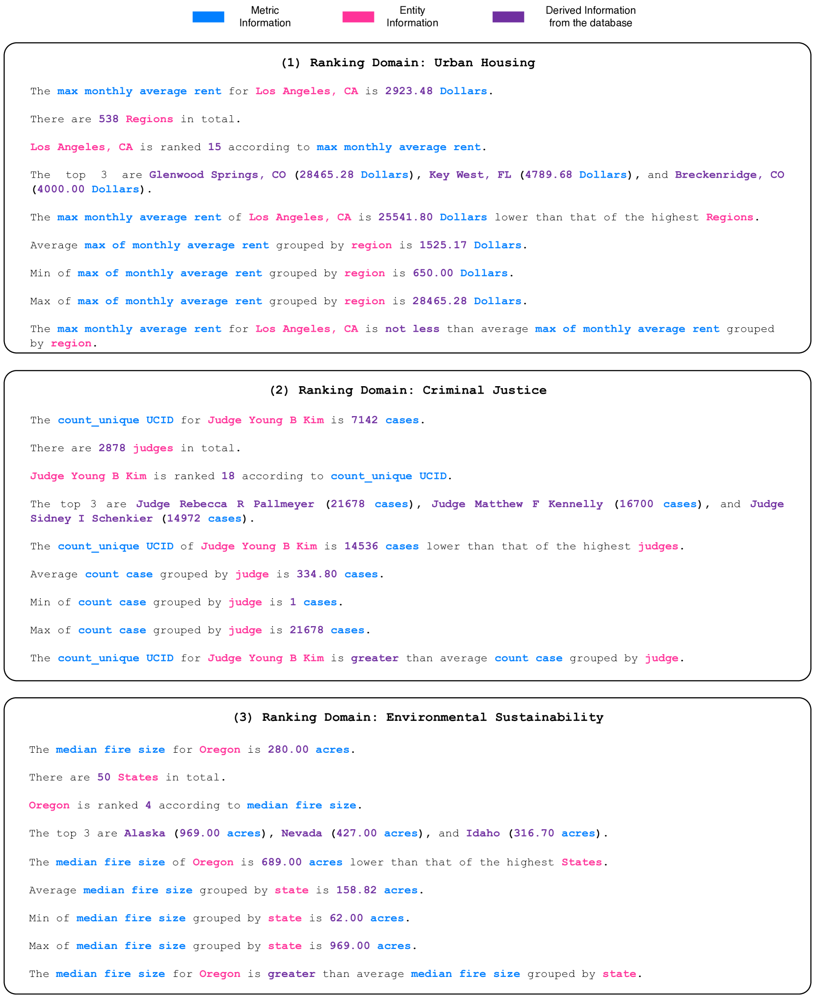

# Satyrn：分析增强生成之平台

发布时间：2024年06月17日

`RAG

这篇论文介绍了一种新的策略，即分析结构化数据并生成事实集以引导生成，类似于检索增强生成（RAG）中的检索文档。这种方法被称为分析增强生成（AAG），它使用标准分析技巧将生成的事实转换为文本，然后输入到大型语言模型（LLM）中。论文中提到的神经符号平台Satyrn利用了AAG方法，能够从庞大的数据库中生成准确、流畅、连贯的报告。因此，这篇论文更符合RAG分类，因为它专注于改进和增强LLM的生成过程，特别是通过结构化数据的分析来提升生成质量。` `数据分析` `报告生成`

> Satyrn: A Platform for Analytics Augmented Generation

# 摘要

> 大型语言模型（LLMs）能生成文档，检索增强生成（RAG）有效提升了准确性且不损流畅。但文本并非信息之海。我们提出新策略：分析结构化数据，生成事实集以引导生成，类似RAG中检索文档之用。此分析增强生成（AAG）法，运用标准分析技巧，将生成的事实转为文本，馈入LLM。我们研发的神经符号平台Satyrn，借助AAG，产出基于庞大数据库的精准、流畅、连贯报告。实验显示，即便用如Mistral-7B的小模型，Satyrn报告的准确声明超86%，流畅连贯，远胜GPT-4 Code Interpreter的57%准确率。

> Large language models (LLMs) are capable of producing documents, and retrieval augmented generation (RAG) has shown itself to be a powerful method for improving accuracy without sacrificing fluency. However, not all information can be retrieved from text. We propose an approach that uses the analysis of structured data to generate fact sets that are used to guide generation in much the same way that retrieved documents are used in RAG. This analytics augmented generation (AAG) approach supports the ability to utilize standard analytic techniques to generate facts that are then converted to text and passed to an LLM. We present a neurosymbolic platform, Satyrn that leverages AAG to produce accurate, fluent, and coherent reports grounded in large scale databases. In our experiments, we find that Satyrn generates reports in which over 86% accurate claims while maintaining high levels of fluency and coherence, even when using smaller language models such as Mistral-7B, as compared to GPT-4 Code Interpreter in which just 57% of claims are accurate.

[Arxiv](https://arxiv.org/abs/2406.12069)