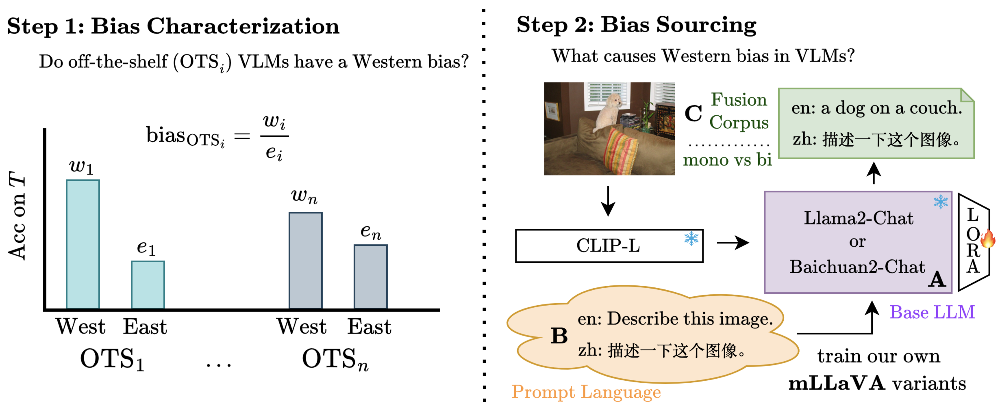
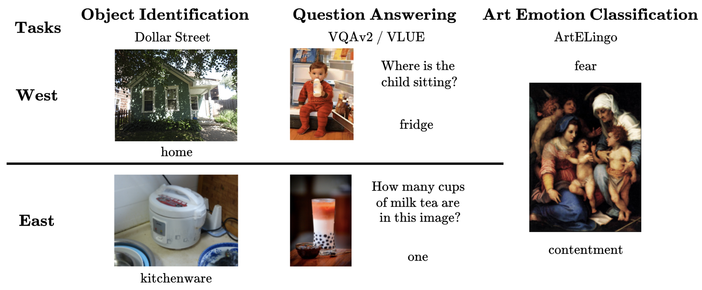
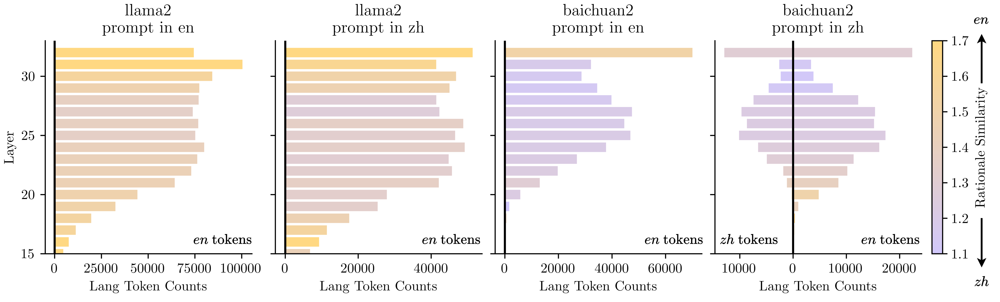

# 换位思考：揭示大型视觉-语言模型在图像理解中的西方文化偏见

发布时间：2024年06月17日

`Agent

理由：这篇论文主要探讨了视觉-语言模型（VLMs）在处理图像查询时的文化偏见问题，并提出了通过跨文化图像与注释来评估和改进这些模型的方法。虽然涉及到了语言模型（VLMs），但研究的重点在于如何通过跨文化数据和方法来调整和优化模型，以减少文化偏见，这更偏向于模型的应用和调整，而不是理论研究或特定的应用场景。因此，将其归类为Agent，即代表模型在特定任务（如跨文化图像理解）中的应用和调整。` `视觉理解` `跨文化研究`

> See It from My Perspective: Diagnosing the Western Cultural Bias of Large Vision-Language Models in Image Understanding

# 摘要

> 视觉-语言模型（VLMs）能以多语言解析图像查询，但文化背景亦影响视觉解读。西方人常聚焦图像主体，东方人则更关注整体场景。本研究揭示了VLMs在图像理解中的西方偏见，并通过跨文化图像与注释，评估了大型VLMs在视觉任务上的表现，发现西方文化下的表现更佳。实验表明，预训练时语言多样性的重要性，即便在英语环境下推理亦然。虽然使用目标文化语言能减轻偏见，但构建真正多元的AI仍需更广泛的语言代表性。

> Vision-language models (VLMs) can respond to queries about images in many languages. However, beyond language, culture affects how we see things. For example, individuals from Western cultures focus more on the central figure in an image while individuals from Eastern cultures attend more to scene context. In this work, we present a novel investigation that demonstrates and localizes VLMs' Western bias in image understanding. We evaluate large VLMs across subjective and objective visual tasks with culturally diverse images and annotations. We find that VLMs perform better on the Western subset than the Eastern subset of each task. Controlled experimentation tracing the source of this bias highlights the importance of a diverse language mix in text-only pre-training for building equitable VLMs, even when inference is performed in English. Moreover, while prompting in the language of a target culture can lead to reductions in bias, it is not a substitute for building AI more representative of the world's languages.

[Arxiv](https://arxiv.org/abs/2406.11665)