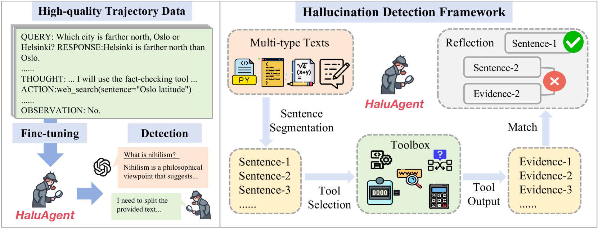

# 小身材，大能量！让小型语言模型成为幻觉的克星。

发布时间：2024年06月17日

`Agent

这篇论文介绍了一个名为 HaluAgent 的框架，它是一个专门设计用于检测幻觉的系统，能够使小型语言模型如 Baichuan2-Chat 7B 自主选择工具来识别文本、代码及数学表达式中的幻觉。HaluAgent 结合了语言模型与多功能工具箱，并采用了精细的三阶段检测框架与记忆机制。该框架通过中英文数据集的微调，展示了双语幻觉检测的能力，并在实验中证明了其性能可以与强大的闭源模型如 GPT-4 相媲美，甚至在某些情况下超越 GPT-4。因此，这篇论文属于Agent分类，因为它描述了一个能够自主执行任务的智能代理系统。` `人工智能`

> Small Agent Can Also Rock! Empowering Small Language Models as Hallucination Detector

# 摘要

> 幻觉检测对LLMs而言颇具挑战，现有研究多依赖于如GPT-4这类强大的闭源模型。本文提出的HaluAgent框架，让小型LLMs如Baichuan2-Chat 7B能自主选择工具，精准识别文本、代码及数学表达式中的幻觉。HaluAgent融合了LLM与多功能工具箱，并采用精细的三阶段检测框架与记忆机制。通过利用中英文数据集合成检测轨迹进行微调，HaluAgent展现了双语幻觉检测的能力。实验证明，仅用2K样本调优，HaluAgent便能在多类型任务和数据集上与GPT-4媲美，甚至在无额外工具支持下超越GPT-4。相关数据集与代码已公开于https://github.com/RUCAIBox/HaluAgent。

> Hallucination detection is a challenging task for large language models (LLMs), and existing studies heavily rely on powerful closed-source LLMs such as GPT-4. In this paper, we propose an autonomous LLM-based agent framework, called HaluAgent, which enables relatively smaller LLMs (e.g. Baichuan2-Chat 7B) to actively select suitable tools for detecting multiple hallucination types such as text, code, and mathematical expression. In HaluAgent, we integrate the LLM, multi-functional toolbox, and design a fine-grained three-stage detection framework along with memory mechanism. To facilitate the effectiveness of HaluAgent, we leverage existing Chinese and English datasets to synthesize detection trajectories for fine-tuning, which endows HaluAgent with the capability for bilingual hallucination detection. Extensive experiments demonstrate that only using 2K samples for tuning LLMs, HaluAgent can perform hallucination detection on various types of tasks and datasets, achieving performance comparable to or even higher than GPT-4 without tool enhancements on both in-domain and out-of-domain datasets. We release our dataset and code at https://github.com/RUCAIBox/HaluAgent.

[Arxiv](https://arxiv.org/abs/2406.11277)