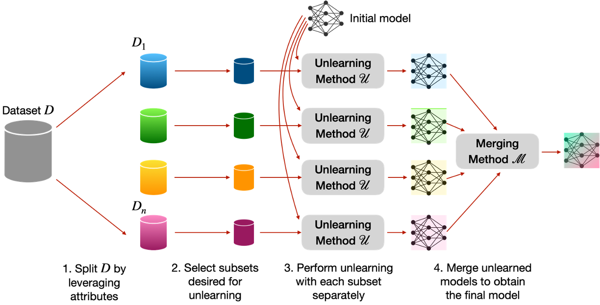
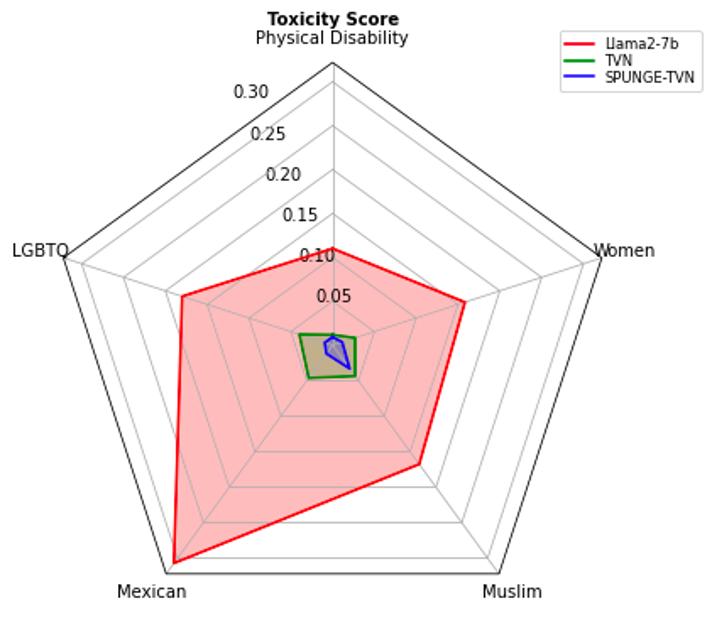
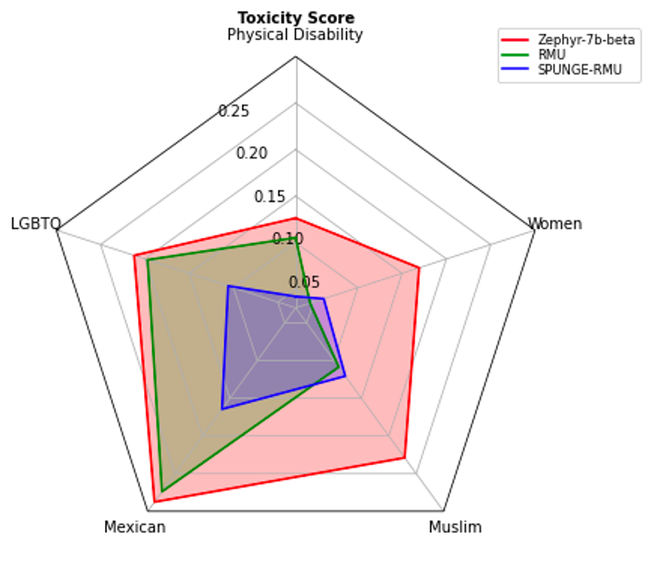
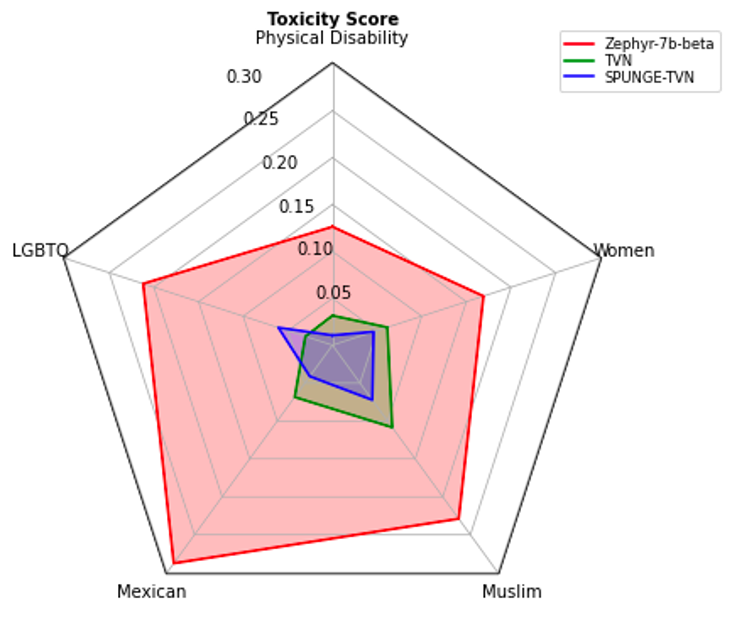

# 分而忘之，合而强之：借助数据属性，提升大型语言模型中遗忘技术的效能

发布时间：2024年06月17日

`LLM应用

这篇论文主要探讨了大型语言模型（LLMs）在社会和伦理风险方面的应用，特别是通过机器遗忘技术来提升模型的安全性。论文提出的“分割遗忘合并”（SPUNGE）框架，是一种针对LLMs的具体应用技术，旨在通过特定的数据处理和模型整合方法来增强遗忘技术的效能。因此，这篇论文的内容更偏向于LLMs的实际应用层面，而不是理论研究或Agent、RAG相关的研究。` `人工智能安全` `机器学习`

> Split, Unlearn, Merge: Leveraging Data Attributes for More Effective Unlearning in LLMs

# 摘要

> 大型语言模型（LLMs）可能产生社会和伦理风险，如生成有害语言或助长危险知识的恶意利用。机器遗忘技术通过消除这些有害内容，为提升LLM安全性提供了一条新途径。本文提出的“分割遗忘合并”（SPUNGE）框架，能与各种遗忘技术协同，大幅增强其效能。SPUNGE通过将数据按特定属性分割，分别进行遗忘处理，再整合遗忘后的模型，巧妙利用了数据属性。实验结果显示，SPUNGE不仅显著提升了两种前沿遗忘技术在顶级LLMs上的表现，还确保了它们在常规学术测试中的全面能力。

> Large language models (LLMs) have shown to pose social and ethical risks such as generating toxic language or facilitating malicious use of hazardous knowledge. Machine unlearning is a promising approach to improve LLM safety by directly removing harmful behaviors and knowledge. In this paper, we propose "SPlit, UNlearn, MerGE" (SPUNGE), a framework that can be used with any unlearning method to amplify its effectiveness. SPUNGE leverages data attributes during unlearning by splitting unlearning data into subsets based on specific attribute values, unlearning each subset separately, and merging the unlearned models. We empirically demonstrate that SPUNGE significantly improves the performance of two recent unlearning methods on state-of-the-art LLMs while maintaining their general capabilities on standard academic benchmarks.

[Arxiv](https://arxiv.org/abs/2406.11780)