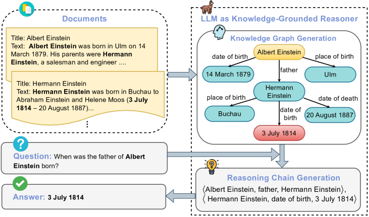
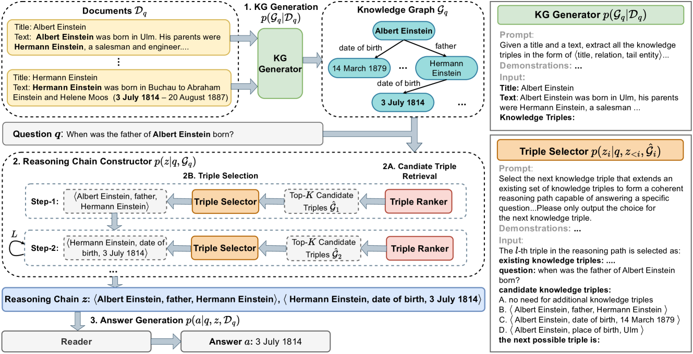
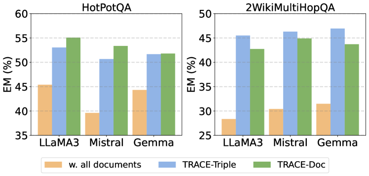
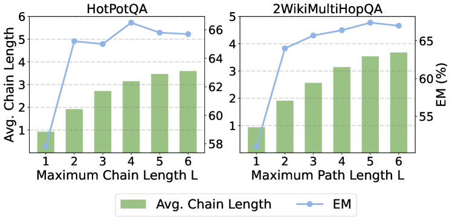
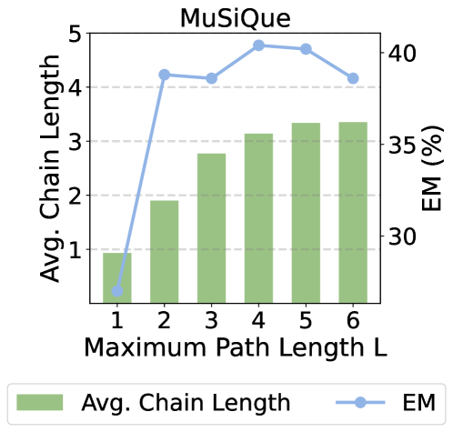
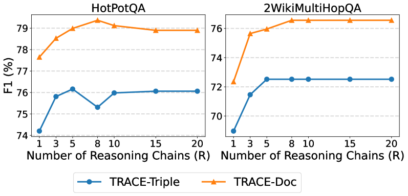
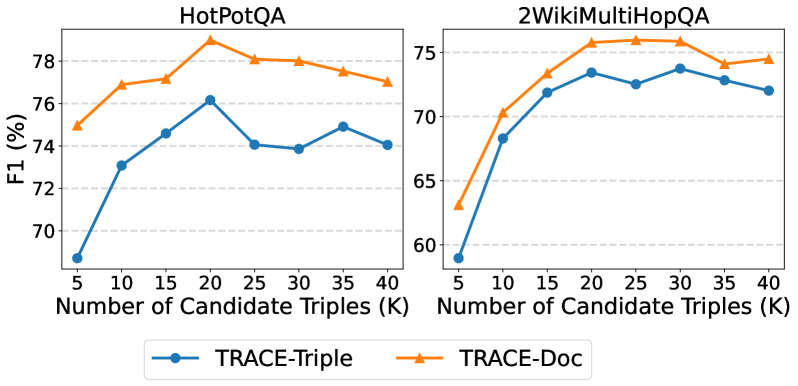
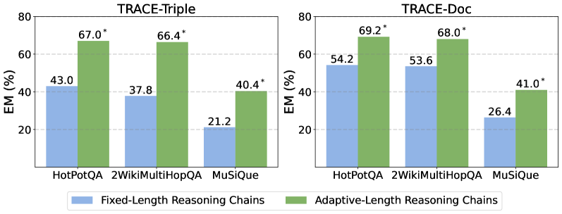

# 追迹证据：打造知识支撑的推理链条，助力检索增强生成

发布时间：2024年06月17日

`RAG

理由：这篇论文主要讨论了RAG（Retrieval-Augmented Generation）模型在问答任务中的应用，特别是针对检索器不完善导致的问题提出了TRACE方法，这是一种改进检索和推理过程的新方法。论文的核心在于优化RAG模型的检索和推理机制，以提高多步推理任务的性能，这与RAG模型的应用和改进紧密相关。因此，将其归类为RAG是合适的。` `问答系统` `知识图谱`

> TRACE the Evidence: Constructing Knowledge-Grounded Reasoning Chains for Retrieval-Augmented Generation

# 摘要

> RAG 模型在处理问答任务时表现出色，但其检索器的不完善可能导致无关信息的检索，从而在多步推理的多跳问题中引入噪声并影响性能。为此，我们开发了TRACE，一种能够构建基于知识的推理链的新方法，这些推理链由逻辑相连的知识三元组组成，旨在从检索文档中提取并整合关键证据以解答问题。TRACE通过KG生成器从文档中生成知识图谱，并利用自回归推理链构造器来构建这些推理链。实验表明，在三个多跳QA数据集上，TRACE相较于使用全部检索文档，性能提升了平均14.03%。这一结果强调了，使用推理链而非完整文档作为上下文，足以有效解答问题。

> Retrieval-augmented generation (RAG) offers an effective approach for addressing question answering (QA) tasks. However, the imperfections of the retrievers in RAG models often result in the retrieval of irrelevant information, which could introduce noises and degrade the performance, especially when handling multi-hop questions that require multiple steps of reasoning. To enhance the multi-hop reasoning ability of RAG models, we propose TRACE. TRACE constructs knowledge-grounded reasoning chains, which are a series of logically connected knowledge triples, to identify and integrate supporting evidence from the retrieved documents for answering questions. Specifically, TRACE employs a KG Generator to create a knowledge graph (KG) from the retrieved documents, and then uses an Autoregressive Reasoning Chain Constructor to build reasoning chains. Experimental results on three multi-hop QA datasets show that TRACE achieves an average performance improvement of up to 14.03% compared to using all the retrieved documents. Moreover, the results indicate that using reasoning chains as context, rather than the entire documents, is often sufficient to correctly answer questions.

[Arxiv](https://arxiv.org/abs/2406.11460)