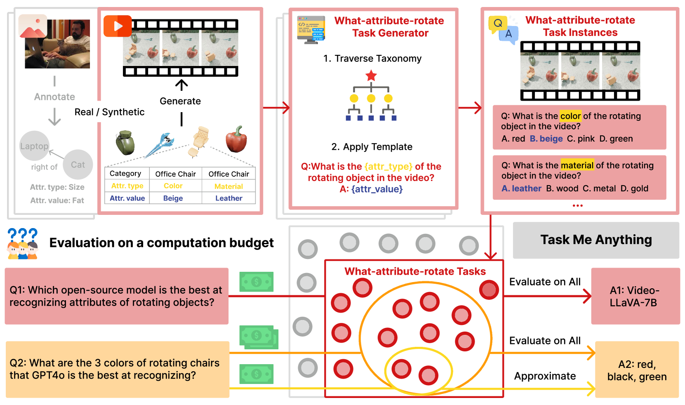
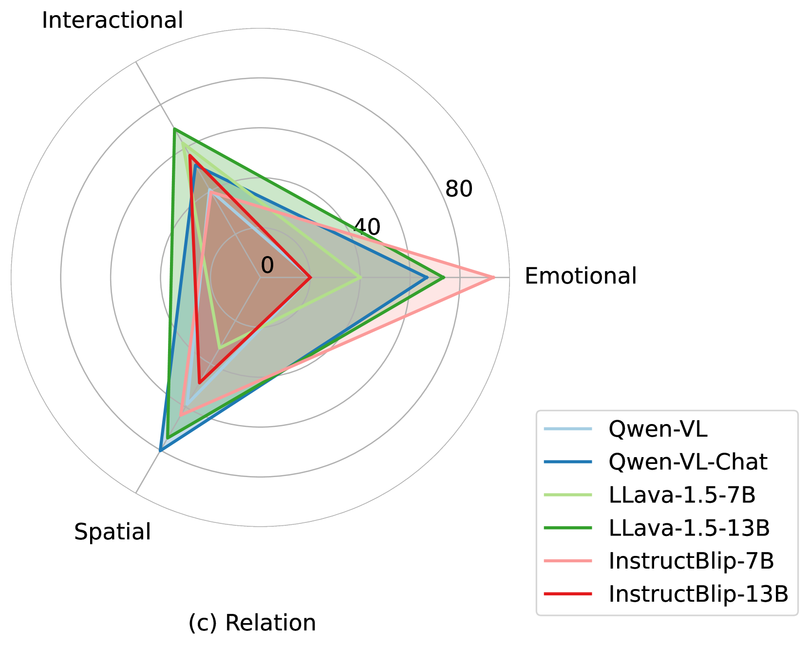
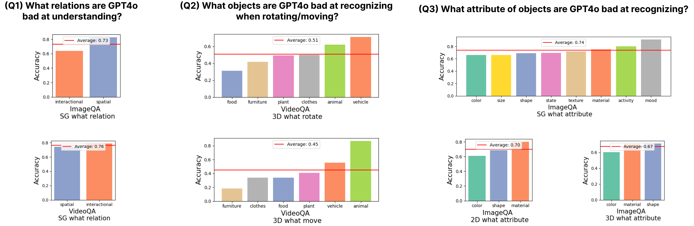
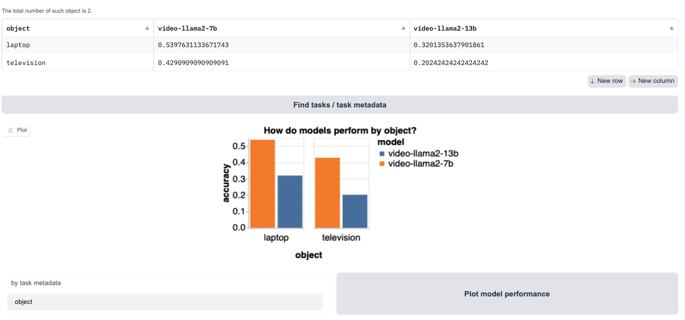

# 无所不能的任务挑战

发布时间：2024年06月17日

`LLM应用

这篇论文介绍了一个名为Task-Me-Anything的生成引擎，它能够根据用户需求定制基准，以评估大型多模态语言模型（MLMs）的性能。该引擎通过程序化地生成大量任务实例，帮助开发者根据特定需求选择合适的模型。这种方法直接应用于实际的MLM性能评估和模型选择，属于LLM应用的范畴。` `多模态学习` `基准测试`

> Task Me Anything

# 摘要

> 如今，大型多模态语言模型（MLMs）的基准测试旨在全面评估模型的能力，而非单一功能。这导致开发者在选择适合其应用的模型时，面对繁多的基准测试感到无所适从，难以判断哪个基准最能体现其特定需求。为此，本文推出了Task-Me-Anything，一个能够根据用户需求定制基准的生成引擎。它拥有一个可扩展的视觉资产分类，能程序化地生成大量任务实例，并在计算预算内高效解答用户关于MLM性能的疑问。该引擎包含113K张图像、10K个视频、2K个3D物体资产，涵盖超过365个物体类别、655个属性及335种关系，能生成7.5亿对图像/视频问答，专注于MLM的感知能力评估。Task-Me-Anything揭示了重要发现：开源MLMs在物体与属性识别上表现优异，但在空间及时序理解上存在不足；各模型各有千秋，大型模型普遍表现更佳，但也有例外；GPT4o在识别旋转或移动物体及区分颜色方面面临挑战。

> Benchmarks for large multimodal language models (MLMs) now serve to simultaneously assess the general capabilities of models instead of evaluating for a specific capability. As a result, when a developer wants to identify which models to use for their application, they are overwhelmed by the number of benchmarks and remain uncertain about which benchmark's results are most reflective of their specific use case. This paper introduces Task-Me-Anything, a benchmark generation engine which produces a benchmark tailored to a user's needs. Task-Me-Anything maintains an extendable taxonomy of visual assets and can programmatically generate a vast number of task instances. Additionally, it algorithmically addresses user queries regarding MLM performance efficiently within a computational budget. It contains 113K images, 10K videos, 2K 3D object assets, over 365 object categories, 655 attributes, and 335 relationships. It can generate 750M image/video question-answering pairs, which focus on evaluating MLM perceptual capabilities. Task-Me-Anything reveals critical insights: open-source MLMs excel in object and attribute recognition but lack spatial and temporal understanding; each model exhibits unique strengths and weaknesses; larger models generally perform better, though exceptions exist; and GPT4o demonstrates challenges in recognizing rotating/moving objects and distinguishing colors.

[Arxiv](https://arxiv.org/abs/2406.11775)