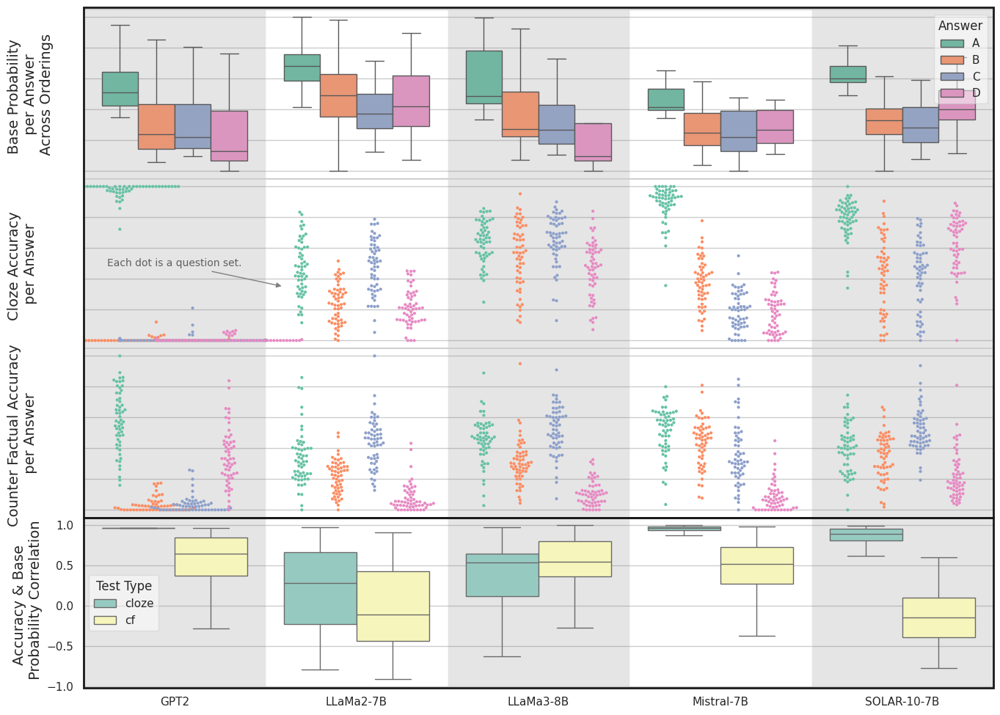

# 大型语言模型基准性能中的基础率效应：解析测试策略与基准表现之别

发布时间：2024年06月17日

`LLM理论

理由：这篇论文主要关注大型语言模型（LLM）在完形填空测试中的表现，并探讨了答案选项间的基础概率差异对任务表现的影响。论文提出了一个新的任务Nvr-X-MMLU，旨在区分考试技巧与实际任务表现。这些内容更多地涉及LLM的理论分析和性能评估，而不是具体的应用、Agent行为或RAG（检索增强生成）技术。因此，将其归类为LLM理论是合适的。` `语言模型评估`

> The Base-Rate Effect on LLM Benchmark Performance: Disambiguating Test-Taking Strategies from Benchmark Performance

# 摘要

> 完形填空测试常用于评估大型语言模型在多个基准任务上的表现。通过MMLU数据集，我们揭示了答案选项间的基础概率差异显著影响任务表现，如在不确定时倾向于选择A。研究发现，反事实提示能有效减轻这种基础概率效应。这种效应与人类考试策略相似，导致任务表现与考试技巧混为一谈。为此，我们提出Nvr-X-MMLU任务，作为MMLU的变种，旨在区分考试技巧与实际任务表现，并专注于后者。

> Cloze testing is a common method for measuring the behavior of large language models on a number of benchmark tasks. Using the MMLU dataset, we show that the base-rate probability (BRP) differences across answer tokens are significant and affect task performance ie. guess A if uncertain. We find that counterfactual prompting does sufficiently mitigate the BRP effect. The BRP effect is found to have a similar effect to test taking strategies employed by humans leading to the conflation of task performance and test-taking ability. We propose the Nvr-X-MMLU task, a variation of MMLU, which helps to disambiguate test-taking ability from task performance and reports the latter.

[Arxiv](https://arxiv.org/abs/2406.11634)