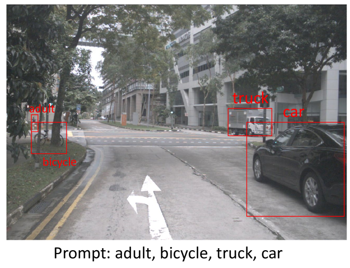

# CVPR2024基础小样本目标检测挑战解决方案

发布时间：2024年06月17日

`Agent

理由：这篇论文介绍了一种改进的少样本目标检测方法，该方法利用视觉语言模型（VLM）和多模态大型语言模型（MM-LLM）来生成参考表达和伪标签，以优化目标检测性能。这种方法涉及创建和使用特定的模型（Agent）来处理和改进目标检测任务，因此属于Agent分类。虽然涉及到了大型语言模型（LLM）的应用，但主要焦点是通过创建和优化模型来解决问题，而不是直接应用或理论探讨LLM本身。` `目标检测` `机器视觉`

> The Solution for CVPR2024 Foundational Few-Shot Object Detection Challenge

# 摘要

> 本报告提出了一种改进的少样本目标检测方法，该方法利用视觉语言模型（VLM）进行目标检测。但在特定数据集上，VLM可能出现检测目标与目标概念不匹配的问题，影响其零样本性能和基于伪标签的微调效果。为此，我们开发了VLM+框架，整合了多模态大型语言模型（MM-LLM）。我们利用MM-LLM为每个类别生成一系列参考表达，并通过最大IoU匹配选择最佳表达。接着，我们用这些表达为训练集图像生成伪标签，并与原始数据结合以微调VLM。通过迭代优化伪标签，我们的方法在最终测试中实现了32.56 mAP的性能提升。

> This report introduces an enhanced method for the Foundational Few-Shot Object Detection (FSOD) task, leveraging the vision-language model (VLM) for object detection. However, on specific datasets, VLM may encounter the problem where the detected targets are misaligned with the target concepts of interest. This misalignment hinders the zero-shot performance of VLM and the application of fine-tuning methods based on pseudo-labels. To address this issue, we propose the VLM+ framework, which integrates the multimodal large language model (MM-LLM). Specifically, we use MM-LLM to generate a series of referential expressions for each category. Based on the VLM predictions and the given annotations, we select the best referential expression for each category by matching the maximum IoU. Subsequently, we use these referential expressions to generate pseudo-labels for all images in the training set and then combine them with the original labeled data to fine-tune the VLM. Additionally, we employ iterative pseudo-label generation and optimization to further enhance the performance of the VLM. Our approach achieve 32.56 mAP in the final test.

[Arxiv](https://arxiv.org/abs/2406.12225)