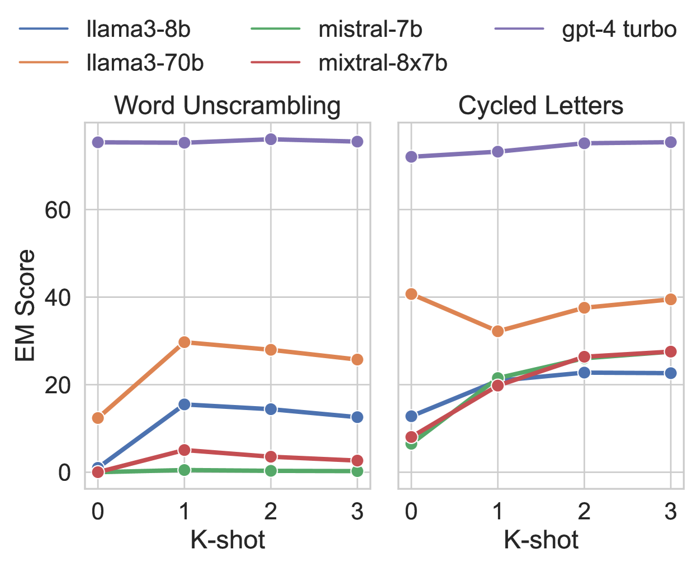
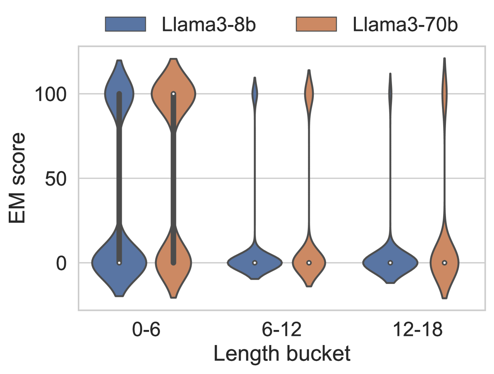
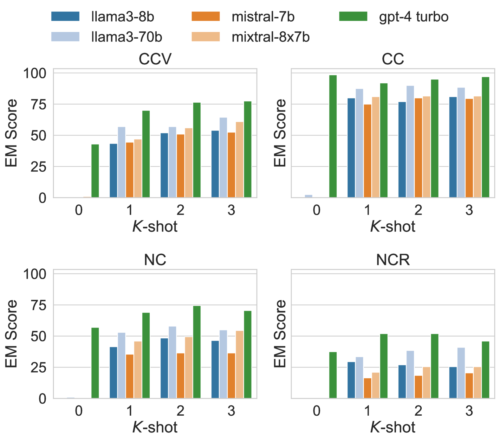
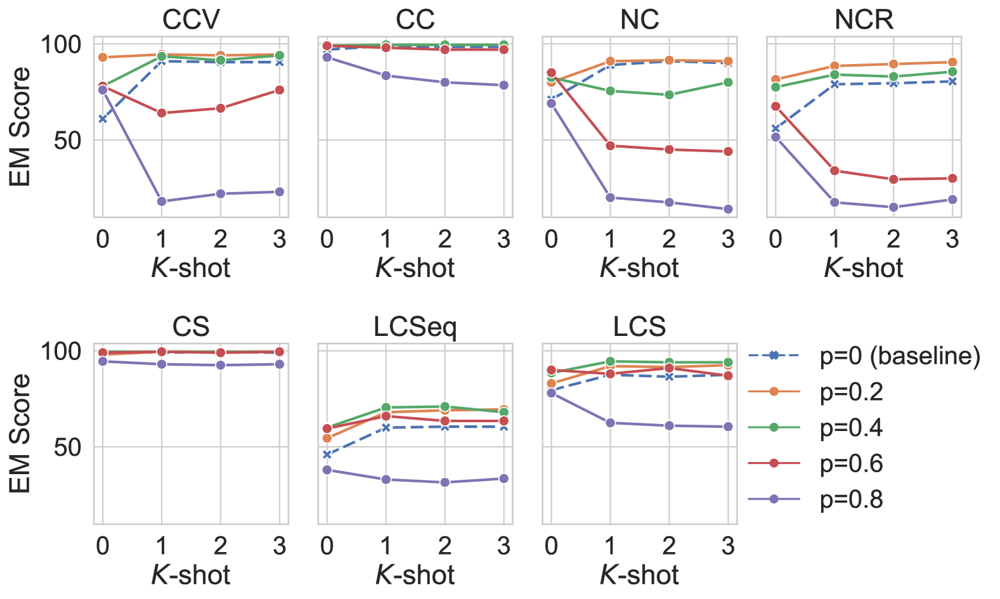
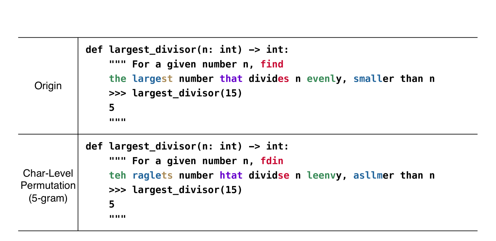

# 令牌化之殇：解析不足的诅咒在

发布时间：2024年06月17日

`LLM理论

这篇论文主要探讨了大型语言模型（LLMs）在处理文本时遇到的分词问题，特别是对排版错误和文本长度变化的敏感性，以及词元内部结构的复杂性。研究通过分析三个核心问题，即复杂问题解决、词元结构探查及对排版变化的韧性，来评估这些挑战对LLMs的影响。此外，论文还提出了使用子词正则化策略如BPE-dropout来减轻这些问题的影响。这些内容更偏向于LLM的理论研究，因此将其分类为LLM理论。` `机器学习`

> Tokenization Falling Short: The Curse of Tokenization

# 摘要

> 语言模型在处理文本时，常将原始内容拆分为预设词汇表中的子词序列，这一过程对排版错误和文本长度变化极为敏感，却忽视了词元内部结构的复杂性，我们称之为“分词之咒”。本研究深入分析了这一问题，并指出大型语言模型（LLMs）对此类挑战依旧脆弱。通过三个核心研究问题——复杂问题解决、词元结构探查及对排版变化的韧性，我们系统地探讨了这些挑战对LLMs的影响。研究发现，虽然增加模型参数能一定程度上缓解分词问题，但LLMs仍易受拼写错误及文本格式变化带来的偏见影响。实验结果显示，采用如BPE-dropout的子词正则化策略能有效减轻这一影响。我们计划公开研究代码和数据，以推动该领域的深入探索。

> Language models typically tokenize raw text into sequences of subword identifiers from a predefined vocabulary, a process inherently sensitive to typographical errors, length variations, and largely oblivious to the internal structure of tokens-issues we term the curse of tokenization. In this study, we delve into these drawbacks and demonstrate that large language models (LLMs) remain susceptible to these problems. This study systematically investigates these challenges and their impact on LLMs through three critical research questions: (1) complex problem solving, (2) token structure probing, and (3) resilience to typographical variation. Our findings reveal that scaling model parameters can mitigate the issue of tokenization; however, LLMs still suffer from biases induced by typos and other text format variations. Our experiments show that subword regularization such as BPE-dropout can mitigate this issue. We will release our code and data to facilitate further research.

[Arxiv](https://arxiv.org/abs/2406.11687)