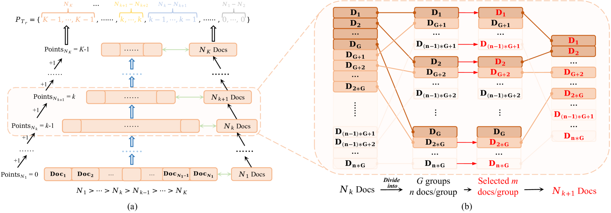

# TourRank：借助大型语言模型，采用锦标赛式策略进行文档排名

发布时间：2024年06月17日

`LLM应用

解析：这篇论文介绍了一种名为TourRank的方法，该方法针对大型语言模型（LLMs）在零-shot文档排序中的挑战进行了优化。这种方法通过锦标赛机制的智能分组和积分系统来改进排序过程，减少了输入顺序的影响，并在保持成本合理的同时提高了排序性能。因此，这项工作属于LLM的应用领域，具体是在文档排序这一特定任务上的应用。` `文档排序` `信息检索`

> TourRank: Utilizing Large Language Models for Documents Ranking with a Tournament-Inspired Strategy

# 摘要

> 大型语言模型（LLMs）在零-shot文档排序中表现出色，但仍面临挑战：输入长度限制、排序结果受文档输入顺序影响以及成本与性能的平衡难题。为此，我们创新性地提出了TourRank方法，借鉴锦标赛机制，通过智能分组和积分系统优化排序，减少了对输入顺序的依赖。在TREC DL和BEIR上的测试表明，TourRank在保持成本合理的同时，实现了顶尖的排序性能。

> Large Language Models (LLMs) are increasingly employed in zero-shot documents ranking, yielding commendable results. However, several significant challenges still persist in LLMs for ranking: (1) LLMs are constrained by limited input length, precluding them from processing a large number of documents simultaneously; (2) The output document sequence is influenced by the input order of documents, resulting in inconsistent ranking outcomes; (3) Achieving a balance between cost and ranking performance is quite challenging. To tackle these issues, we introduce a novel documents ranking method called TourRank, which is inspired by the tournament mechanism. This approach alleviates the impact of LLM's limited input length through intelligent grouping, while the tournament-like points system ensures robust ranking, mitigating the influence of the document input sequence. We test TourRank with different LLMs on the TREC DL datasets and the BEIR benchmark. Experimental results show that TourRank achieves state-of-the-art performance at a reasonable cost.

[Arxiv](https://arxiv.org/abs/2406.11678)