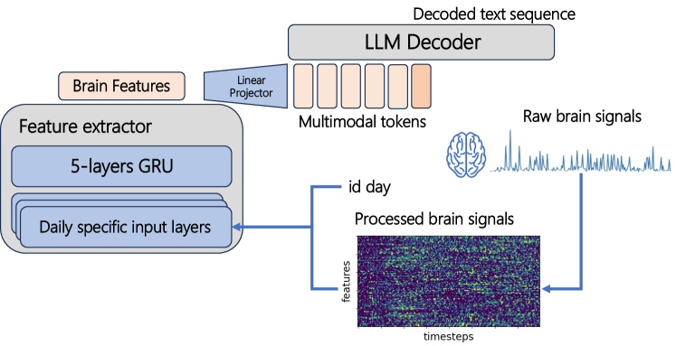
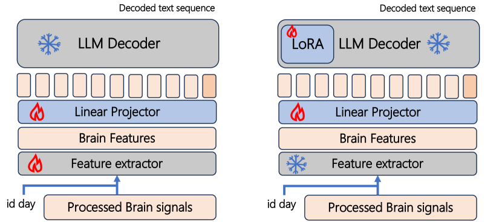
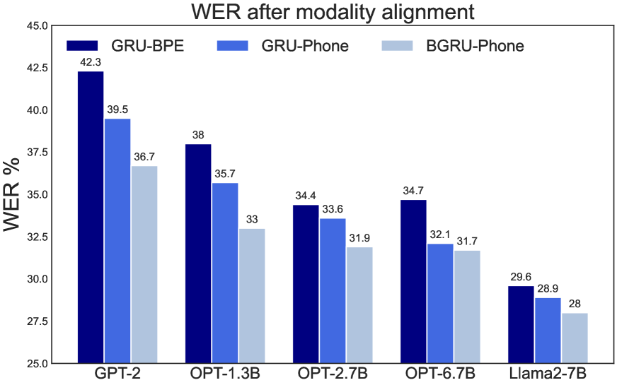
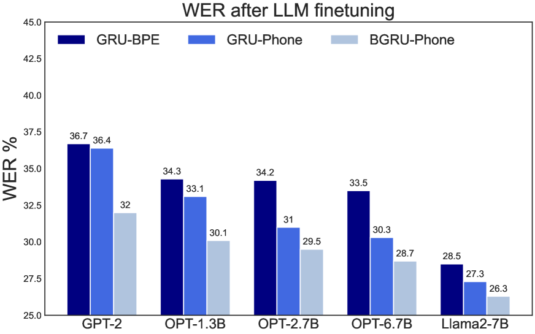

# 构建大型语言模型端到端框架，以解码侵入性脑信号

发布时间：2024年06月17日

`LLM应用

理由：这篇论文介绍了如何利用大型语言模型（LLMs）来解码侵入性脑信号，并将其应用于语音神经假体领域。这种方法展示了LLMs在实际应用中的潜力，特别是在脑机接口（BCIs）技术中。因此，这篇论文属于LLM应用类别，因为它探讨了LLMs在特定技术领域的实际应用和效果。` `脑机接口` `语音神经假体`

> Towards an End-to-End Framework for Invasive Brain Signal Decoding with Large Language Models

# 摘要

> 本文介绍了一种创新的端到端（E2E）框架，用于解码侵入性脑信号，为语音神经假体领域带来重大突破。我们利用大型语言模型（LLMs）的强大推理能力，实现了直接解码，并通过全面整合LLMs，达到了与顶尖级联模型相媲美的成果。这一进展凸显了E2E框架在语音神经假体中的巨大潜力，尤其是在脑机接口（BCIs）技术和相关数据集不断进步的背景下。本研究不仅证明了LLMs与E2E解码结合在提升语音神经假体性能上的有效性，也为BCI应用的未来研究指明了新方向，强调了LLMs在解码复杂神经信号以恢复通信中的重要作用。相关代码将发布于https://github.com/FsFrancis15/BrainLLM。

> In this paper, we introduce a groundbreaking end-to-end (E2E) framework for decoding invasive brain signals, marking a significant advancement in the field of speech neuroprosthesis. Our methodology leverages the comprehensive reasoning abilities of large language models (LLMs) to facilitate direct decoding. By fully integrating LLMs, we achieve results comparable to the state-of-the-art cascade models. Our findings underscore the immense potential of E2E frameworks in speech neuroprosthesis, particularly as the technology behind brain-computer interfaces (BCIs) and the availability of relevant datasets continue to evolve. This work not only showcases the efficacy of combining LLMs with E2E decoding for enhancing speech neuroprosthesis but also sets a new direction for future research in BCI applications, underscoring the impact of LLMs in decoding complex neural signals for communication restoration. Code will be made available at https://github.com/FsFrancis15/BrainLLM.

[Arxiv](https://arxiv.org/abs/2406.11568)