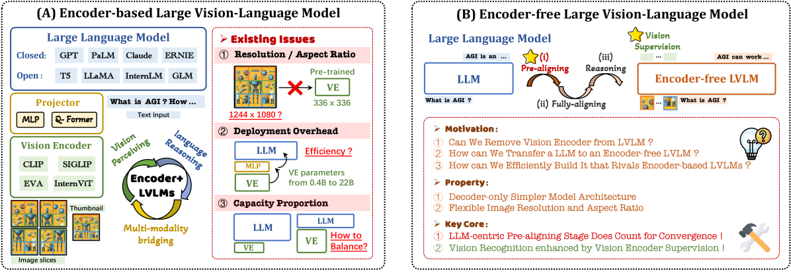
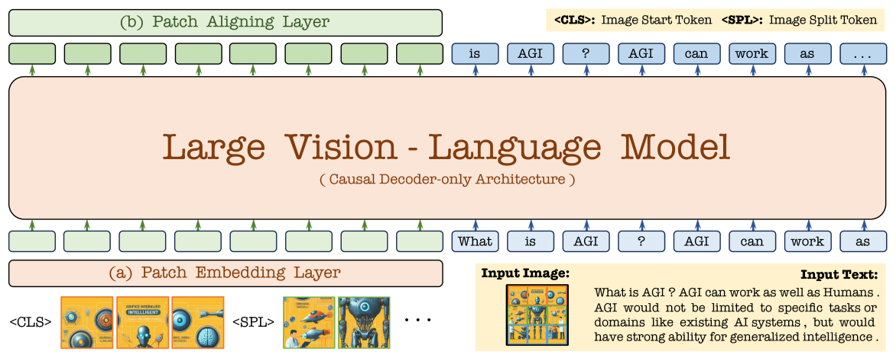
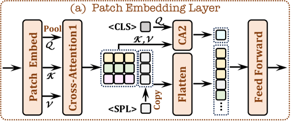
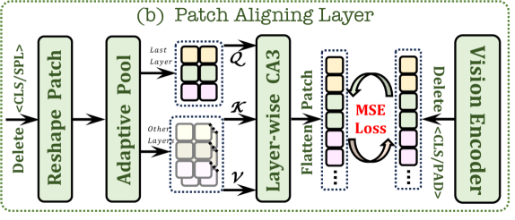
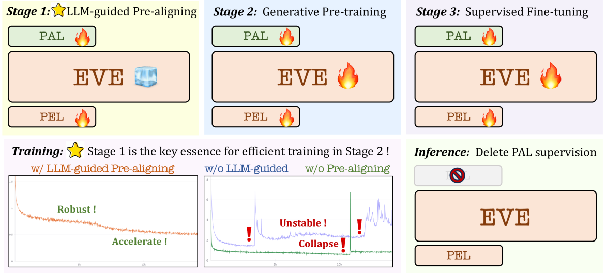
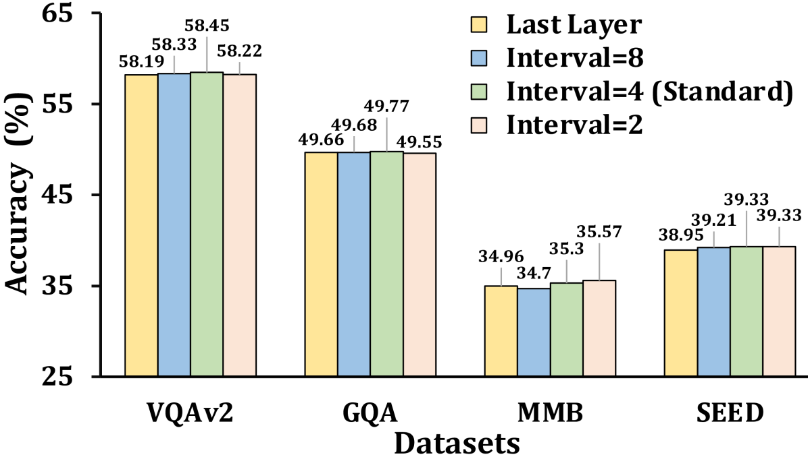
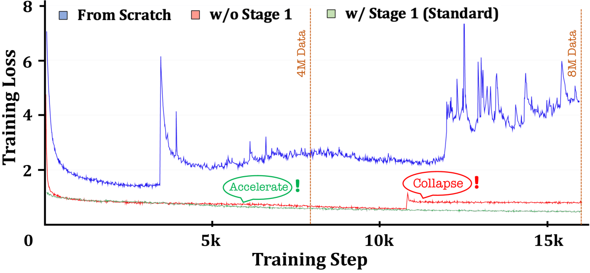
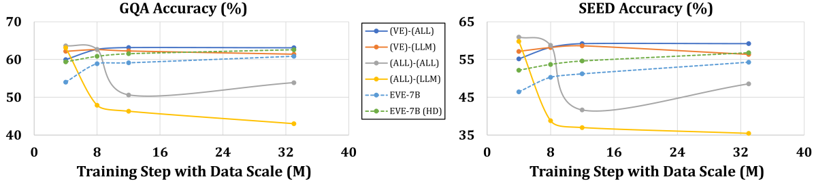

# 揭秘无需编码器的视觉-语言模型

发布时间：2024年06月17日

`LLM应用

理由：这篇论文主要探讨了视觉-语言模型（VLMs）中不依赖传统视觉编码器的新型训练策略，并提出了一种无编码器的视觉-语言模型EVE。这种模型的发展和应用直接关联到大型语言模型（LLMs）在视觉-语言任务中的应用，因此属于LLM应用类别。论文中提到的训练策略和模型EVE的开发，都是为了提高VLMs在处理视觉-语言任务时的效率和灵活性，这是LLM技术在实际应用中的一个具体体现。` `计算机视觉`

> Unveiling Encoder-Free Vision-Language Models

# 摘要

> 当前的视觉-语言模型（VLMs）主要依赖视觉编码器来提取视觉特征，再结合大型语言模型（LLMs）处理视觉-语言任务。但视觉编码器在抽象视觉表示时引入的强烈归纳偏置，如分辨率、宽高比和语义先验，可能限制了VLMs的灵活性与效率。直接训练不依赖视觉编码器的纯VLMs面临挑战，且研究较少。实证显示，无编码器的训练方法收敛慢，性能差距显著。本研究旨在弥合基于编码器与无编码器模型之间的差距，提出了一种简洁有效的训练策略，以推动纯VLMs的发展。通过深入实验，我们发现高效训练无编码器VLMs的关键在于：（1）在统一解码器内整合视觉-语言表示；（2）通过额外监督提升视觉识别能力。基于这些策略，我们开发了EVE，一种无编码器的视觉-语言模型，它训练和前向传播高效。仅用35M公开数据，EVE便能在多个视觉-语言基准上与同类基于编码器的VLMs媲美，并显著超越了训练过程神秘、数据未公开的Fuyu-8B。我们相信，EVE为跨模态开发纯解码器架构提供了一条高效透明的路径。代码和模型已公开于：https://github.com/baaivision/EVE。

> Existing vision-language models (VLMs) mostly rely on vision encoders to extract visual features followed by large language models (LLMs) for visual-language tasks. However, the vision encoders set a strong inductive bias in abstracting visual representation, e.g., resolution, aspect ratio, and semantic priors, which could impede the flexibility and efficiency of the VLMs. Training pure VLMs that accept the seamless vision and language inputs, i.e., without vision encoders, remains challenging and rarely explored. Empirical observations reveal that direct training without encoders results in slow convergence and large performance gaps. In this work, we bridge the gap between encoder-based and encoder-free models, and present a simple yet effective training recipe towards pure VLMs. Specifically, we unveil the key aspects of training encoder-free VLMs efficiently via thorough experiments: (1) Bridging vision-language representation inside one unified decoder; (2) Enhancing visual recognition capability via extra supervision. With these strategies, we launch EVE, an encoder-free vision-language model that can be trained and forwarded efficiently. Notably, solely utilizing 35M publicly accessible data, EVE can impressively rival the encoder-based VLMs of similar capacities across multiple vision-language benchmarks. It significantly outperforms the counterpart Fuyu-8B with mysterious training procedures and undisclosed training data. We believe that EVE provides a transparent and efficient route for developing a pure decoder-only architecture across modalities. Our code and models are publicly available at: https://github.com/baaivision/EVE.

[Arxiv](https://arxiv.org/abs/2406.11832)