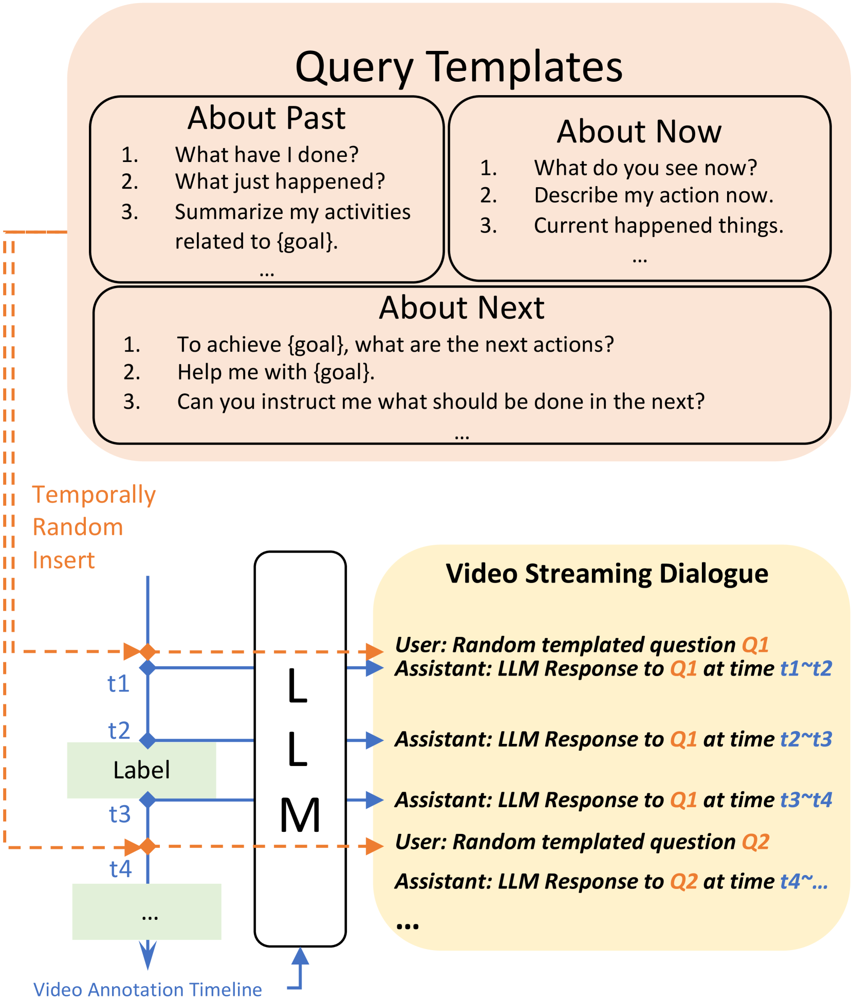
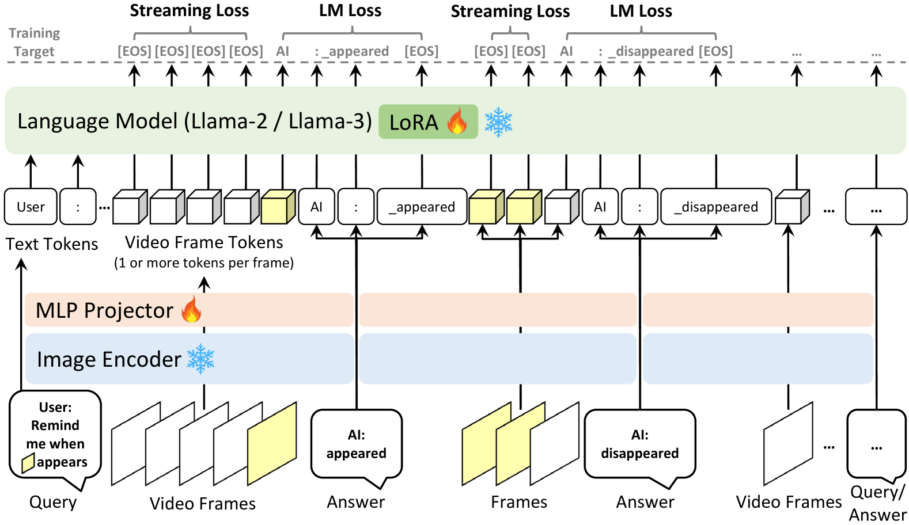
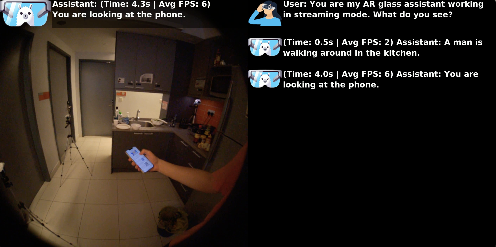
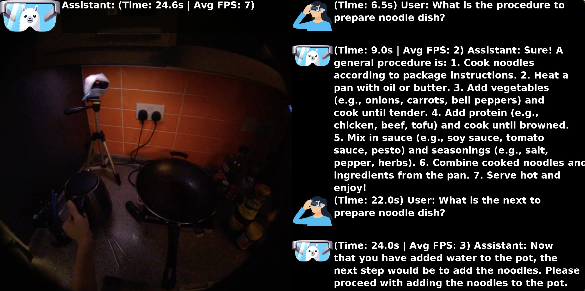

# VideoLLM-online：专为流媒体视频设计的在线大型语言模型

发布时间：2024年06月17日

`LLM应用

这篇论文介绍了针对大型语言模型（LLM）在处理视频流输入时的改进方法，提出了一个名为LIVE的框架，该框架能够实现时间对齐、长上下文和实时对话。论文中还提到了基于LIVE框架构建的VideoLLM-online模型，该模型在处理流视频方面表现出色，并且在公共离线视频基准测试中也展现了顶尖性能。这些内容主要关注于LLM在实际应用中的性能提升，因此属于LLM应用分类。` `视频处理` `对话系统`

> VideoLLM-online: Online Video Large Language Model for Streaming Video

# 摘要

> 最新的大型语言模型已融入视觉能力，使其能理解图像、视频及视觉-语言混合内容。但这些多模态模型的学习方法常将视频视为固定片段，处理流视频输入时效率与效果不佳。为此，我们提出了一种创新的学习-在视频流（LIVE）框架，它能在连续视频流中实现时间对齐、长上下文和实时对话。LIVE框架包含实现视频流对话的综合策略：（1）针对连续流输入的语言建模训练目标，（2）将离线时间注释转换为流对话格式的数据生成方案，以及（3）加速模型在实际视频流中响应的优化推理流程。基于LIVE框架，我们在Llama-2/Llama-3上构建了VideoLLM-online模型，显著提升了流视频处理能力。例如，该模型能在A100 GPU上以超过10 FPS的速度支持5分钟视频片段的流对话。此外，它在公共离线视频基准测试中，如识别、字幕和预测，也展现了顶尖性能。相关代码、模型、数据和演示已在https://showlab.github.io/videollm-online公开。

> Recent Large Language Models have been enhanced with vision capabilities, enabling them to comprehend images, videos, and interleaved vision-language content. However, the learning methods of these large multimodal models typically treat videos as predetermined clips, making them less effective and efficient at handling streaming video inputs. In this paper, we propose a novel Learning-In-Video-Stream (LIVE) framework, which enables temporally aligned, long-context, and real-time conversation within a continuous video stream. Our LIVE framework comprises comprehensive approaches to achieve video streaming dialogue, encompassing: (1) a training objective designed to perform language modeling for continuous streaming inputs, (2) a data generation scheme that converts offline temporal annotations into a streaming dialogue format, and (3) an optimized inference pipeline to speed up the model responses in real-world video streams. With our LIVE framework, we built VideoLLM-online model upon Llama-2/Llama-3 and demonstrate its significant advantages in processing streaming videos. For instance, on average, our model can support streaming dialogue in a 5-minute video clip at over 10 FPS on an A100 GPU. Moreover, it also showcases state-of-the-art performance on public offline video benchmarks, such as recognition, captioning, and forecasting. The code, model, data, and demo have been made available at https://showlab.github.io/videollm-online.

[Arxiv](https://arxiv.org/abs/2406.11816)