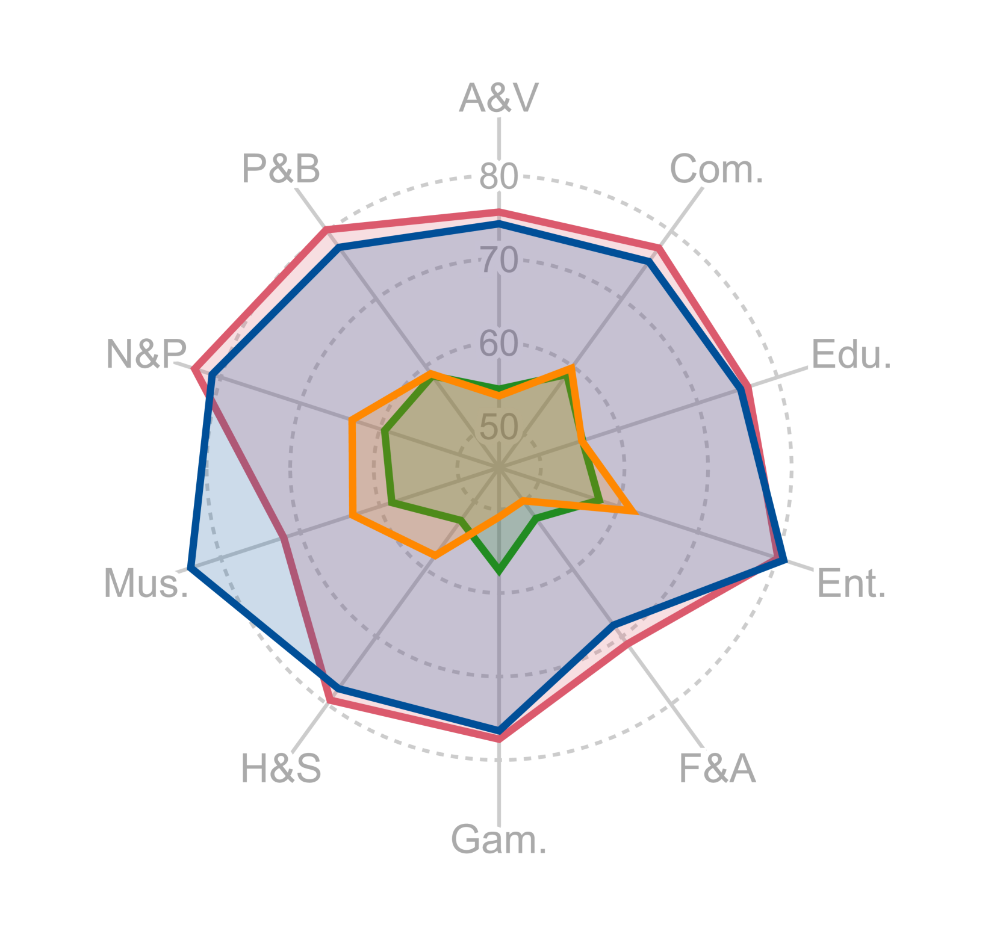

# VideoVista：视频理解和推理的多功能基准

发布时间：2024年06月17日

`LLM应用

这篇论文介绍了VideoVista，一个视频问答基准，用于评估大型多模态模型（LMMs）在视频理解和推理上的表现。它通过构建一个包含多种问题和视频的数据集，并利用GPT-4o等先进工具进行模型训练和评估。论文的主要关注点是应用大型语言模型（LLM）和多模态模型于视频分析领域，特别是视频理解和推理任务的评估和改进，因此属于LLM应用类别。` `视频分析` `人工智能评估`

> VideoVista: A Versatile Benchmark for Video Understanding and Reasoning

# 摘要

> 尽管大型多模态模型（LMMs）推动了视频分析的飞速进步，但仍缺少一个全面的评估基准来衡量这些模型在视频理解和推理上的表现。为此，我们推出了VideoVista，一个视频问答基准，它跨越多种内容、时长和能力，挑战多样。VideoVista包含25,000个问题，源自3,400个视频，涵盖14个类别，时长跨度大。它还覆盖了19种理解任务和8种推理任务。我们利用GPT-4o和先进工具构建了一个自动数据框架，并用于训练Video-LMMs。评估显示：1) Video-LMMs在细粒度视频任务上表现不佳；2) 逻辑和关系推理能力不足；3) 开源模型落后于GPT-4o和Gemini-1.5达20分。这表明VideoVista对于提升视频理解和推理能力的重要性。

> Despite significant breakthroughs in video analysis driven by the rapid development of large multimodal models (LMMs), there remains a lack of a versatile evaluation benchmark to comprehensively assess these models' performance in video understanding and reasoning. To address this, we present VideoVista, a video QA benchmark that integrates challenges across diverse content categories, durations, and abilities. Specifically, VideoVista comprises 25,000 questions derived from 3,400 videos spanning 14 categories (e.g., Howto, Film, and Entertainment) with durations ranging from a few seconds to over 10 minutes. Besides, it encompasses 19 types of understanding tasks (e.g., anomaly detection, interaction understanding) and 8 reasoning tasks (e.g., logical reasoning, causal reasoning). To achieve this, we present an automatic data construction framework, leveraging powerful GPT-4o alongside advanced analysis tools (e.g., video splitting, object segmenting, and tracking). We also utilize this framework to construct training data to enhance the capabilities of video-related LMMs (Video-LMMs). Through a comprehensive and quantitative evaluation of cutting-edge models, we reveal that: 1) Video-LMMs face difficulties in fine-grained video tasks involving temporal location, object tracking, and anomaly detection; 2) Video-LMMs present inferior logical and relation reasoning abilities; 3) Open-source Video-LMMs' performance is significantly lower than GPT-4o and Gemini-1.5, lagging by 20 points. This highlights the crucial role VideoVista will play in advancing LMMs that can accurately understand videos and perform precise reasoning.

[Arxiv](https://arxiv.org/abs/2406.11303)