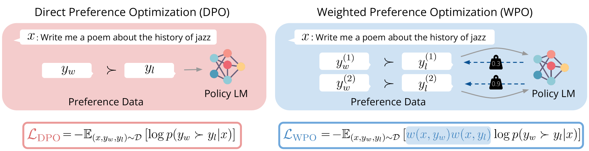
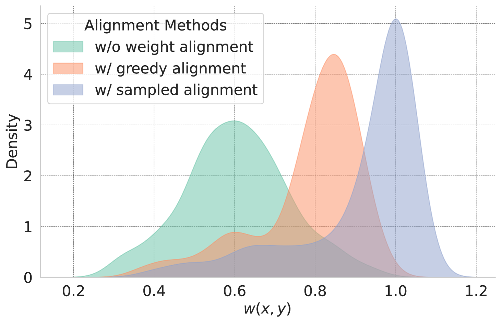
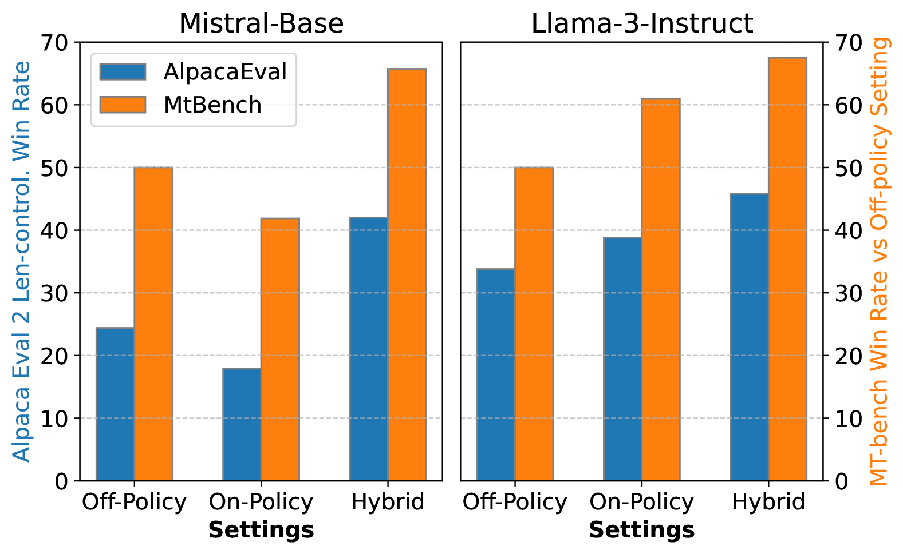
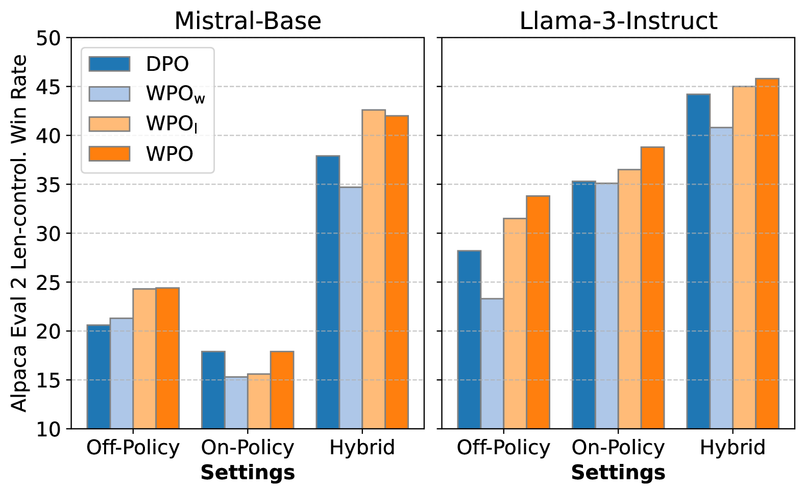
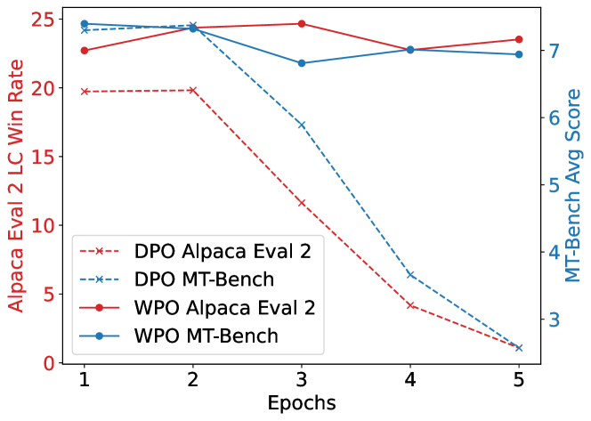

# 加权偏好优化（WPO）：提升 RLHF 性能的新策略

发布时间：2024年06月17日

`LLM应用

这篇论文主要讨论了通过人类反馈的强化学习（RLHF）来优化大型语言模型（LLMs）的方法，特别是提出了加权偏好优化（WPO）策略来解决离线策略偏好优化中的分布差异问题。这种方法旨在使LLMs更符合人类价值观，并在实际的基准测试中取得了显著的效果。因此，这篇论文属于LLM应用类别，因为它关注的是如何应用特定的技术来改进LLMs的性能和符合人类价值观。` `人工智能` `语言模型`

> WPO: Enhancing RLHF with Weighted Preference Optimization

# 摘要

> 通过人类反馈的强化学习（RLHF）为使大型语言模型（LLMs）更符合人类价值观提供了一种有前景的途径。离线策略偏好优化因其成本效益和可扩展性而被广泛采用，但常受限于数据收集策略与目标策略间的分布差异，导致优化效果不佳。本文提出了一种创新策略——加权偏好优化（WPO），通过重新加权偏好对，使离线数据更贴近在线数据，有效缓解了分布差异问题，同时优化过程无需额外成本。在Alpaca Eval 2和MT-bench等指令遵循基准测试中，WPO表现卓越，不仅超越了直接偏好优化（DPO）5.6%，还以48.6%的胜率在长度控制条件下击败了GPT-4-turbo，成为排行榜上最强大的8B模型。相关代码和模型将在https://github.com/wzhouad/WPO公开。

> Reinforcement learning from human feedback (RLHF) is a promising solution to align large language models (LLMs) more closely with human values. Off-policy preference optimization, where the preference data is obtained from other models, is widely adopted due to its cost efficiency and scalability. However, off-policy preference optimization often suffers from a distributional gap between the policy used for data collection and the target policy, leading to suboptimal optimization. In this paper, we propose a novel strategy to mitigate this problem by simulating on-policy learning with off-policy preference data. Our Weighted Preference Optimization (WPO) method adapts off-policy data to resemble on-policy data more closely by reweighting preference pairs according to their probability under the current policy. This method not only addresses the distributional gap problem but also enhances the optimization process without incurring additional costs. We validate our method on instruction following benchmarks including Alpaca Eval 2 and MT-bench. WPO not only outperforms Direct Preference Optimization (DPO) by up to 5.6% on Alpaca Eval 2 but also establishes a remarkable length-controlled winning rate against GPT-4-turbo of 48.6% based on Llama-3-8B-Instruct, making it the strongest 8B model on the leaderboard. We will release the code and models at https://github.com/wzhouad/WPO.

[Arxiv](https://arxiv.org/abs/2406.11827)