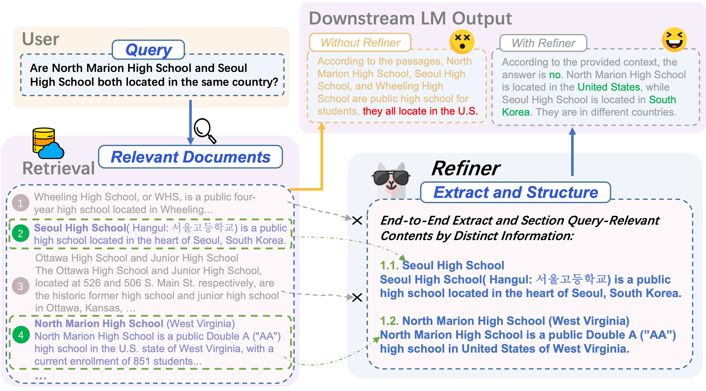
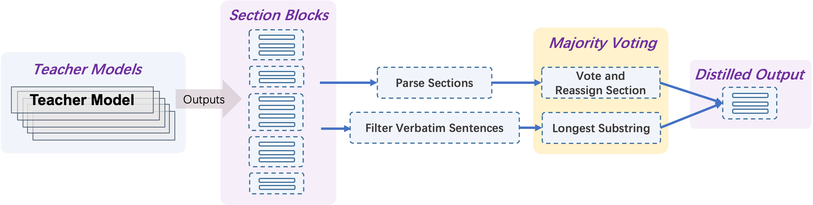
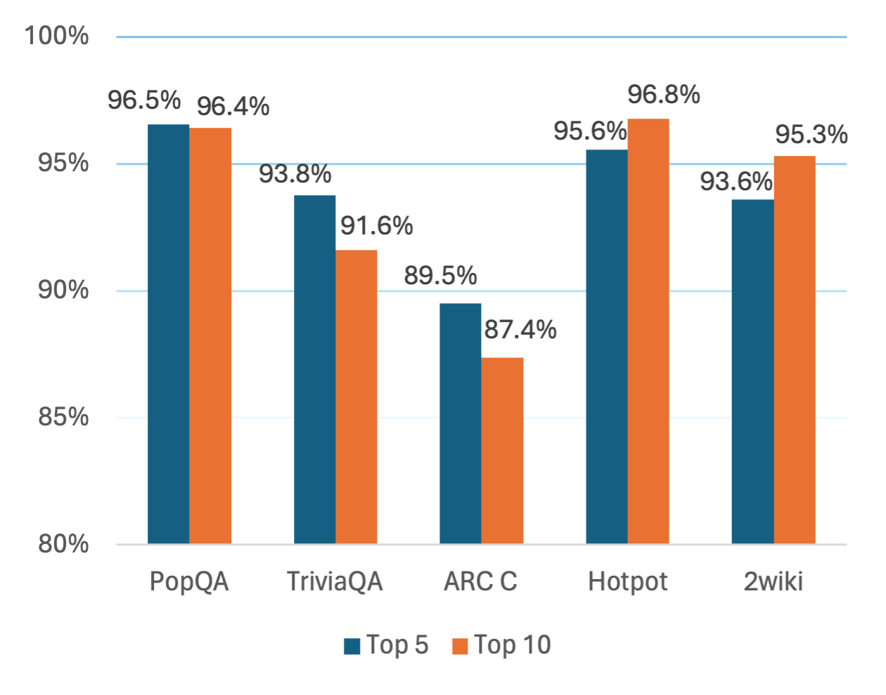
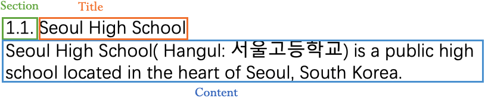

# 优化检索内容的结构，以增强问答系统的效能

发布时间：2024年06月17日

`RAG

理由：这篇论文主要讨论了检索增强生成（RAG）框架中的一个创新组件——“精炼器”（Refiner），它是一种端到端的提取与重组机制，用于改善LLM在知识密集型任务中的性能。论文详细介绍了“精炼器”如何工作，以及它如何通过自适应地提取和重组信息来提高LLM的性能，特别是在多跳问答任务中的表现。因此，这篇论文属于RAG分类，因为它专注于改进RAG框架的技术和应用。` `问答系统` `知识管理`

> : Restructure Retrieval Content Efficiently to Advance Question-Answering Capabilities

# 摘要

> 大型语言模型（LLMs）因参数知识有限，在知识密集型任务中常出现幻觉。为此，检索增强生成（RAG）通过整合外部文档片段来扩充LLM的知识库。通过提取或总结这些片段的信息，LLM的性能得以提升。但LLMs仍难以捕捉并利用分散的关键信息，这一挑战被称为“中途迷失”。为此，我们通常需重新组织信息，以便LLM识别关键点。我们提出的“精炼器”（Refiner）是一种端到端的提取与重组机制，它在RAG的后检索阶段发挥作用。“精炼器”使用单一的解码器专用LLM，自适应地提取与查询紧密相关的内容及其上下文，并根据内容间的关联性进行分节，从而凸显信息差异，并确保下游LLMs与原始上下文精准对齐。实验结果显示，经过训练的“精炼器”（拥有70亿参数）在提升下游LLM的答案准确性方面取得了显著成效，并在多种单跳和多跳问答任务中超越了其他顶尖的RAG和压缩技术。特别地，“精炼器”在多跳任务中实现了80.5%的令牌减少，并相比次优方案提升了1.6%至7.0%。作为一种即插即用的解决方案，“精炼器”能无缝融入RAG系统，广泛适用于各类开源框架。

> Large Language Models (LLMs) are limited by their parametric knowledge, leading to hallucinations in knowledge-extensive tasks. To address this, Retrieval-Augmented Generation (RAG) incorporates external document chunks to expand LLM knowledge. Furthermore, compressing information from document chunks through extraction or summarization can improve LLM performance. Nonetheless, LLMs still struggle to notice and utilize scattered key information, a problem known as the "lost-in-the-middle" syndrome. Therefore, we typically need to restructure the content for LLM to recognize the key information. We propose $\textit{Refiner}$, an end-to-end extract-and-restructure paradigm that operates in the post-retrieval process of RAG. $\textit{Refiner}$ leverages a single decoder-only LLM to adaptively extract query-relevant contents verbatim along with the necessary context, and section them based on their interconnectedness, thereby highlights information distinction, and aligns downstream LLMs with the original context effectively. Experiments show that a trained $\textit{Refiner}$ (with 7B parameters) exhibits significant gain to downstream LLM in improving answer accuracy, and outperforms other state-of-the-art advanced RAG and concurrent compressing approaches in various single-hop and multi-hop QA tasks. Notably, $\textit{Refiner}$ achieves a 80.5% tokens reduction and a 1.6-7.0% improvement margin in multi-hop tasks compared to the next best solution. $\textit{Refiner}$ is a plug-and-play solution that can be seamlessly integrated with RAG systems, facilitating its application across diverse open-source frameworks.

[Arxiv](https://arxiv.org/abs/2406.11357)