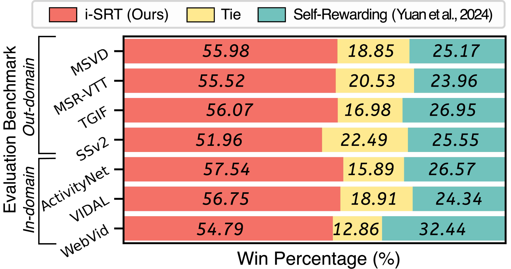
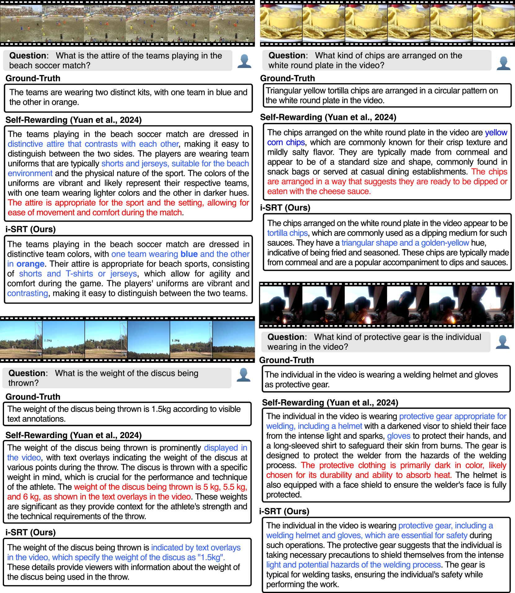

# i-SRT：迭代自我回顾判断，精准对齐大型多模态模型与视频内容

发布时间：2024年06月17日

`RAG

理由：这篇论文主要讨论了视频大型多模态模型（VLMMs）在对齐过程中的问题，并提出了一种新的方法——迭代自我反思判断（i-SRT）来改进模态对齐和减少冗余。这种方法涉及到模型的自我优化和对生成内容的评估，这与RAG（Retrieval-Augmented Generation）框架中的概念相似，即通过检索和生成相结合的方式来优化模型的性能。因此，这篇论文更适合归类于RAG，而不是Agent、LLM应用或LLM理论。` `视频问答` `多模态学习`

> i-SRT: Aligning Large Multimodal Models for Videos by Iterative Self-Retrospective Judgment

# 摘要

> 视频大型多模态模型（VLMMs）在对齐过程中常遭遇模态错位和冗长回答的问题。尽管自奖励或迭代直接偏好优化（DPO）等方法近期在语言模型对齐，尤其是推理任务上取得了显著进步，但应用于视频-语言模型的自对齐模型仍易产生冗长且无关的回答。为此，我们创新性地引入了迭代自我反思判断（i-SRT），通过循环审视和评估已生成的内容及偏好，有效提升了文本与视觉模态的对齐度，减少了冗余，并增强了内容的相关性。我们的实验在多个视频问答基准上验证了 i-SRT 的优越性，并承诺开源相关代码、模型及数据集，以促进更深入的研究。

> Aligning Video Large Multimodal Models (VLMMs) face challenges such as modality misalignment and verbose responses. Although iterative approaches such as self-rewarding or iterative direct preference optimization (DPO) recently showed a significant improvement in language model alignment, particularly on reasoning tasks, self-aligned models applied to large video-language models often result in lengthy and irrelevant responses. To address these challenges, we propose a novel method that employs self-retrospection to enhance both response generation and preference modeling, and call iterative self-retrospective judgment (i-SRT). By revisiting and evaluating already generated content and preference in loop, i-SRT improves the alignment between textual and visual modalities, reduce verbosity, and enhances content relevance. Our empirical evaluations across diverse video question answering benchmarks demonstrate that i-SRT significantly outperforms prior arts. We are committed to opensourcing our code, models, and datasets to encourage further investigation.

[Arxiv](https://arxiv.org/abs/2406.11280)