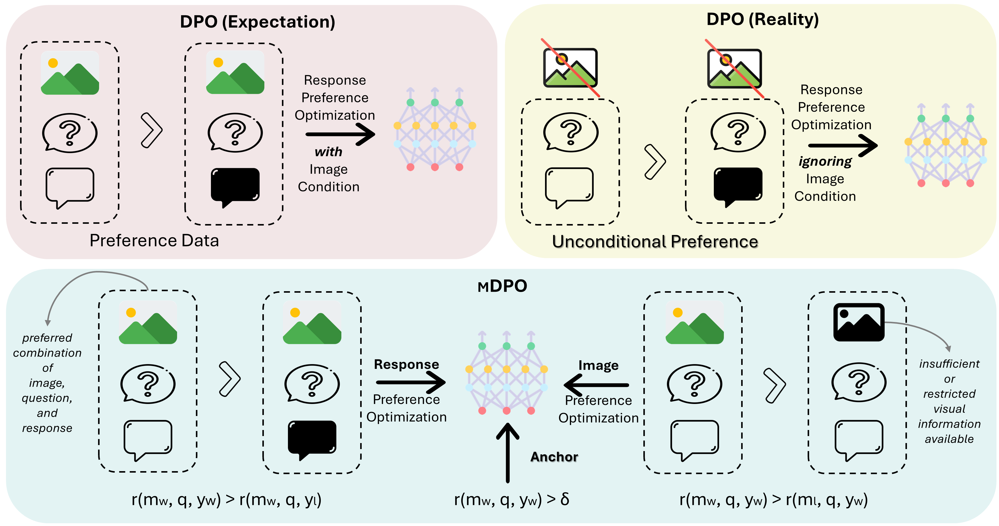
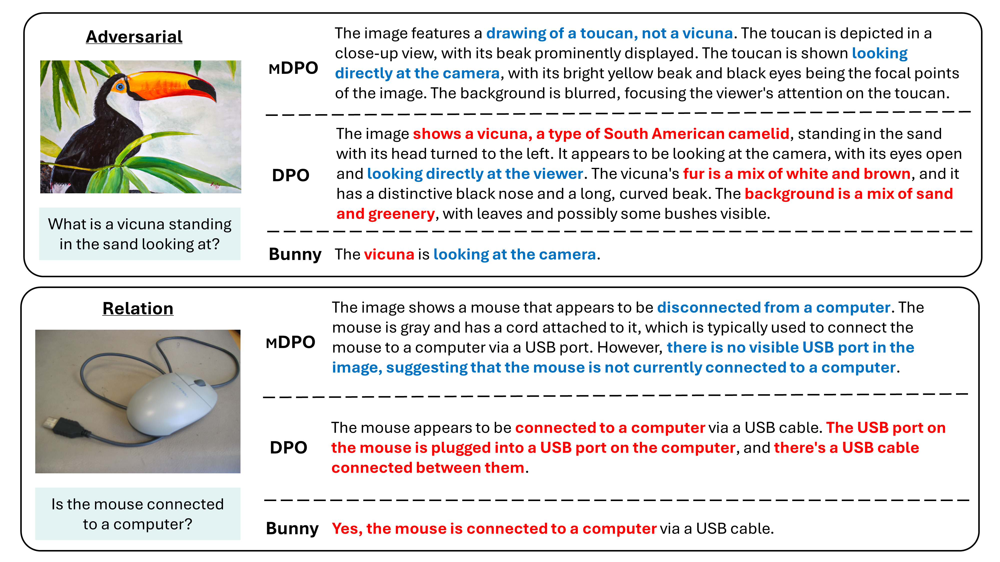
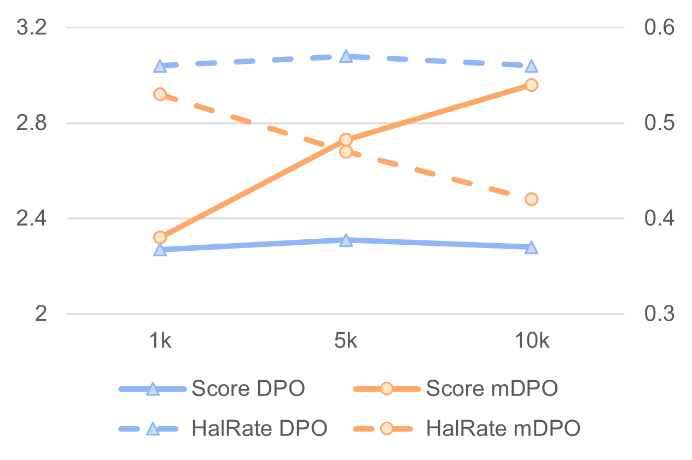

# mDPO：优化多模态大型语言模型的条件偏好

发布时间：2024年06月17日

`LLM应用

理由：这篇论文主要讨论了在多模态场景下对大型语言模型（LLM）进行偏好优化的改进方法，即mDPO。它针对现有方法在多模态偏好优化中忽视图像条件的问题，提出了一种新的优化目标和奖励锚点机制。这些改进旨在提升模型的性能，特别是在减少幻觉方面。因此，这篇论文属于LLM应用类别，因为它关注的是LLM在实际应用中的性能优化和问题解决。` `多模态学习` `人工智能`

> mDPO: Conditional Preference Optimization for Multimodal Large Language Models

# 摘要

> 直接偏好优化（DPO）在大型语言模型（LLM）对齐中表现出色。然而，将其应用于多模态场景时，持续改进面临挑战。我们的研究发现，模型在多模态偏好优化中忽视了图像条件，导致无条件偏好问题。为此，我们提出了mDPO，一种结合图像偏好多模态DPO目标，有效避免了仅语言偏好的过度优先。同时，我们引入了奖励锚点机制，确保所选响应的奖励始终为正，解决了相对偏好优化中的内在问题。实验结果显示，mDPO在两个不同规模的多模态LLM和三个主流基准测试中，不仅解决了无条件偏好问题，还显著提升了模型性能，特别是在减少幻觉方面。

> Direct preference optimization (DPO) has shown to be an effective method for large language model (LLM) alignment. Recent works have attempted to apply DPO to multimodal scenarios but have found it challenging to achieve consistent improvement. Through a comparative experiment, we identify the unconditional preference problem in multimodal preference optimization, where the model overlooks the image condition. To address this problem, we propose mDPO, a multimodal DPO objective that prevents the over-prioritization of language-only preferences by also optimizing image preference. Moreover, we introduce a reward anchor that forces the reward to be positive for chosen responses, thereby avoiding the decrease in their likelihood -- an intrinsic problem of relative preference optimization. Experiments on two multimodal LLMs of different sizes and three widely used benchmarks demonstrate that mDPO effectively addresses the unconditional preference problem in multimodal preference optimization and significantly improves model performance, particularly in reducing hallucination.

[Arxiv](https://arxiv.org/abs/2406.11839)