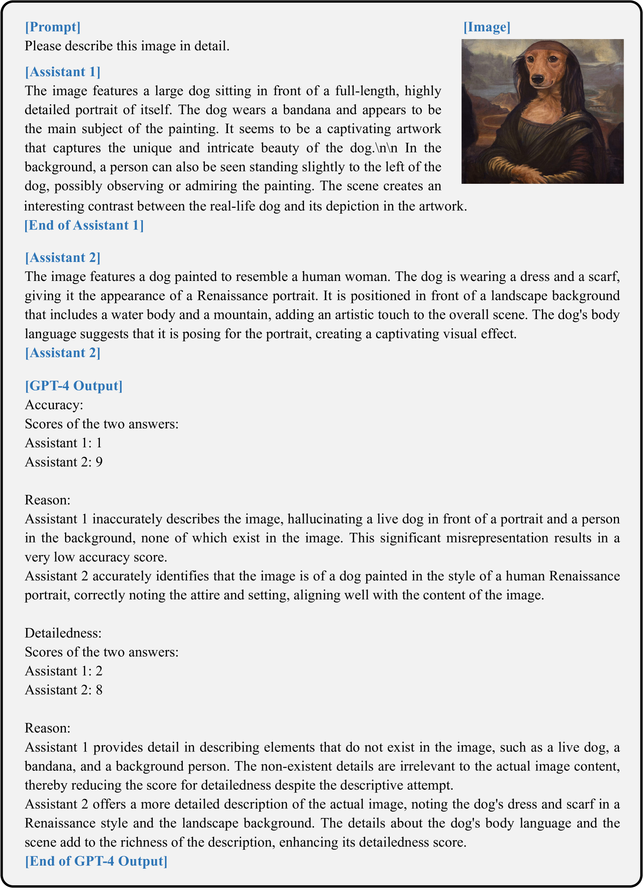

# AGLA：结合全局与局部注意力，有效缓解大型视觉-语言模型中的物体幻觉现象

发布时间：2024年06月18日

`LLM应用

理由：这篇论文主要关注大型视觉-语言模型（LVLMs）在处理多模态任务时遇到的问题，即对象幻觉，并提出了一种新的方法（AGLA）来解决这一问题。这种方法通过改进模型对图像特征的处理，特别是通过增强对局部特征的关注，来减少幻觉现象。因此，这项工作属于对LLM在特定应用场景下的改进和优化，属于LLM应用类别。` `计算机视觉`

> AGLA: Mitigating Object Hallucinations in Large Vision-Language Models with Assembly of Global and Local Attention

# 摘要

> 尽管大型视觉-语言模型（LVLMs）在多模态任务中表现出色，但它们普遍存在一个难题：对象幻觉，即生成的文本与图像中的真实对象不符。本文深入探讨了多种LVLMs，并发现对关键局部图像特征的关注不足是导致这一问题的主要原因。LVLMs往往忽视与提示相关的局部特征，而过度关注全局特征，这削弱了它们的视觉基础能力，进而引发幻觉。为此，我们提出了一种名为全球和局部注意力组合（AGLA）的创新方法，它无需额外训练，即可通过同时利用全局和局部特征来有效减少对象幻觉。AGLA通过一种图像-提示匹配机制，从图像中提取与提示相关的局部特征，同时屏蔽无关内容，从而增强了图像的表达。这种方法能够整合原始图像的全局特征和增强图像的局部特征，以生成更准确的解码分布。实验结果显示，AGLA在多个基准测试中显著减少了对象幻觉，并提升了LVLMs的整体感知能力。相关代码将在https://github.com/Lackel/AGLA公开。

> Despite their great success across various multimodal tasks, Large Vision-Language Models (LVLMs) are facing a prevalent problem with object hallucinations, where the generated textual responses are inconsistent with ground-truth objects in the given image. This paper investigates various LVLMs and pinpoints attention deficiency toward discriminative local image features as one root cause of object hallucinations. Specifically, LVLMs predominantly attend to prompt-independent global image features, while failing to capture prompt-relevant local features, consequently undermining the visual grounding capacity of LVLMs and leading to hallucinations. To this end, we propose Assembly of Global and Local Attention (AGLA), a training-free and plug-and-play approach that mitigates object hallucinations by exploring an ensemble of global features for response generation and local features for visual discrimination simultaneously. Our approach exhibits an image-prompt matching scheme that captures prompt-relevant local features from images, leading to an augmented view of the input image where prompt-relevant content is reserved while irrelevant distractions are masked. With the augmented view, a calibrated decoding distribution can be derived by integrating generative global features from the original image and discriminative local features from the augmented image. Extensive experiments show that AGLA consistently mitigates object hallucinations and enhances general perception capability for LVLMs across various discriminative and generative benchmarks. Our code will be released at https://github.com/Lackel/AGLA.

[Arxiv](https://arxiv.org/abs/2406.12718)