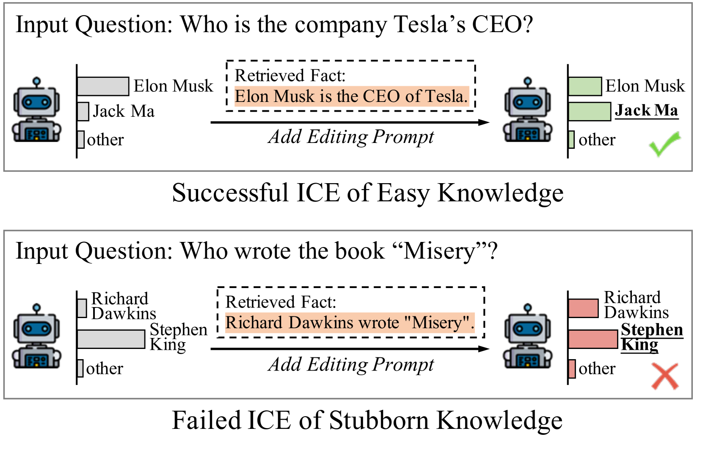
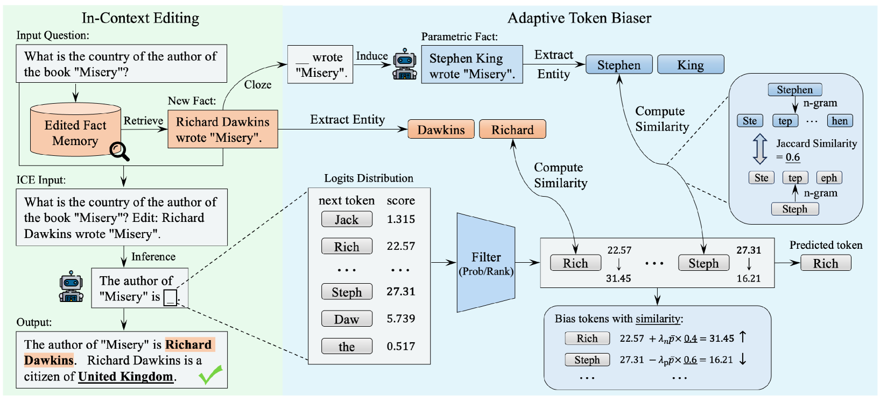
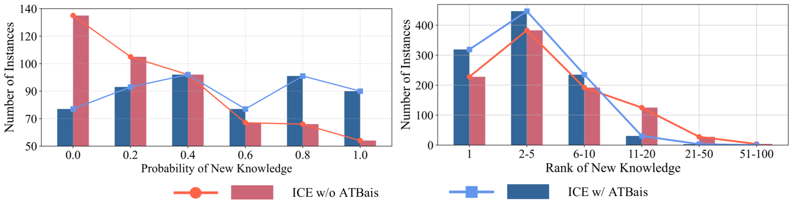
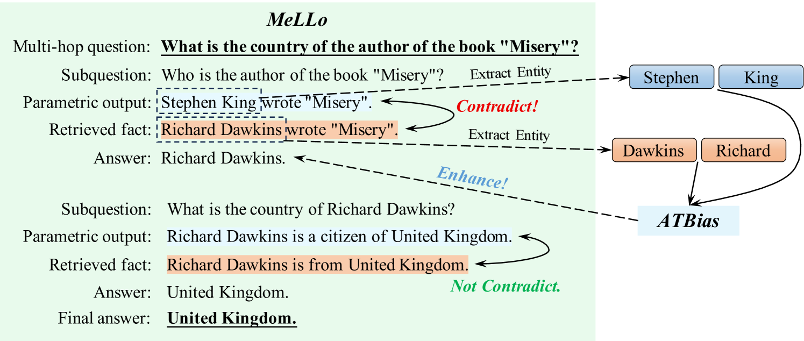
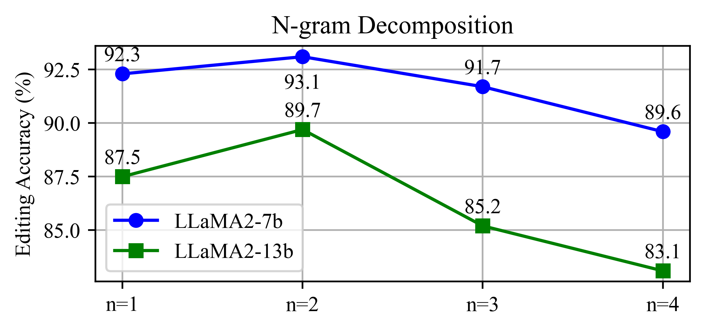
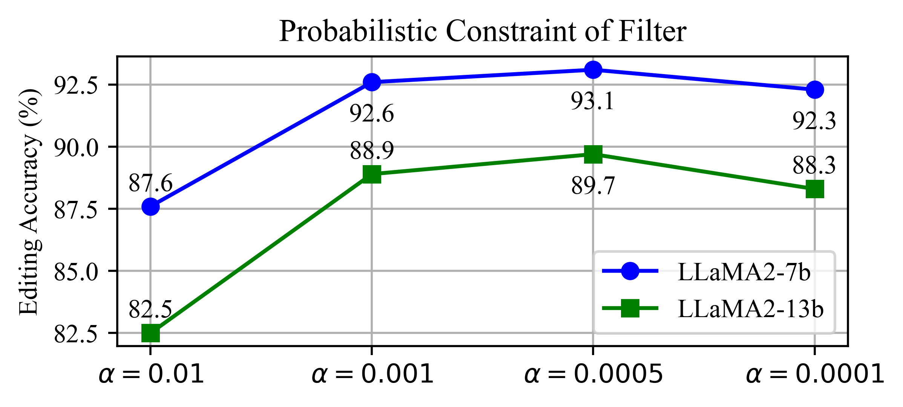
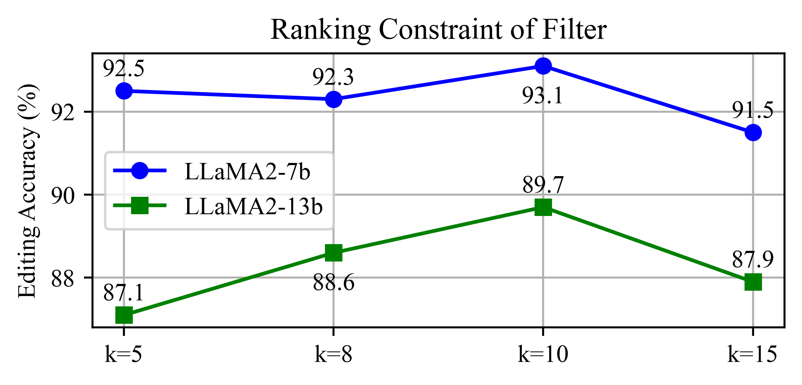

# 智能令牌偏置器：借助关键实体偏置实现知识精修

发布时间：2024年06月18日

`LLM应用

这篇论文摘要讨论了一种名为自适应令牌偏差器（ATBias）的新解码技术，该技术旨在精准提升情境编辑（ICE）在大型语言模型（LLMs）中的应用。ATBias通过专注于与知识紧密相关的令牌来增强ICE的性能，这种方法直接应用于LLMs的解码过程中，以提高知识编辑的效率和准确性。因此，这篇论文属于LLM应用分类，因为它专注于改进LLMs在特定应用场景（即知识编辑）中的性能。` `知识更新`

> Adaptive Token Biaser: Knowledge Editing via Biasing Key Entities

# 摘要

> 大型语言模型（LLMs）中的知识记忆迅速过时，而情境编辑（ICE）是目前更新这些知识的最有效手段。最新的研究通过改进解码策略来增强ICE，无需对模型内部结构或外部提示进行调整。然而，这种改进作用于整个序列生成过程，涉及众多非关键令牌。本研究提出了一种名为自适应令牌偏差器（ATBias）的新解码技术，旨在精准提升ICE。ATBias在解码时专注于与知识紧密相关的令牌，通过匹配新旧知识相关的主要实体来调整其逻辑值。实验证明，ATBias显著提升了ICE的性能，相比现有技术提高了32.3%，且延迟仅为一半。ATBias不仅增强了ICE的知识编辑能力，而且几乎无需额外成本即可广泛应用于LLMs。

> The parametric knowledge memorized by large language models (LLMs) becomes outdated quickly. In-context editing (ICE) is currently the most effective method for updating the knowledge of LLMs. Recent advancements involve enhancing ICE by modifying the decoding strategy, obviating the need for altering internal model structures or adjusting external prompts. However, this enhancement operates across the entire sequence generation, encompassing a plethora of non-critical tokens. In this work, we introduce $\textbf{A}$daptive $\textbf{T}$oken $\textbf{Bias}$er ($\textbf{ATBias}$), a new decoding technique designed to enhance ICE. It focuses on the tokens that are mostly related to knowledge during decoding, biasing their logits by matching key entities related to new and parametric knowledge. Experimental results show that ATBias significantly enhances ICE performance, achieving up to a 32.3% improvement over state-of-the-art ICE methods while incurring only half the latency. ATBias not only improves the knowledge editing capabilities of ICE but can also be widely applied to LLMs with negligible cost.

[Arxiv](https://arxiv.org/abs/2406.12468)