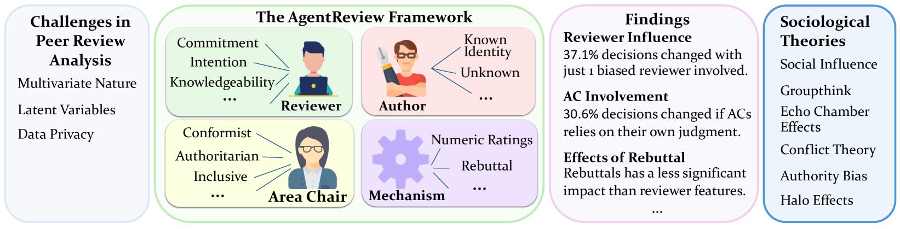
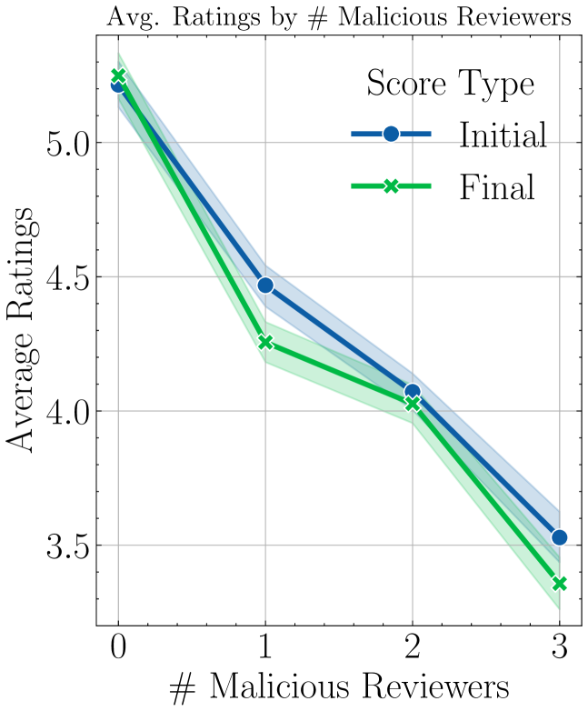

# AgentReview：揭示大型语言模型代理下的同行评审之谜

发布时间：2024年06月18日

`Agent

这篇论文介绍了一个基于大型语言模型（LLM）的同行评审模拟框架——AgentReview，它旨在解决传统同行评审方法中存在的数据敏感性和多变量复杂性问题。通过模拟评审过程，该研究揭示了评审者偏见对论文决策的影响，这种影响与社会学理论相吻合。因此，这篇论文更符合Agent分类，因为它涉及创建一个智能代理（Agent）来模拟和分析同行评审过程，而不是直接应用于LLM的理论研究或应用开发。` `科学出版` `同行评审`

> AgentReview: Exploring Peer Review Dynamics with LLM Agents

# 摘要

> 同行评审是科学出版的基石，但传统分析方法受限于数据敏感性和多变量复杂性。我们推出的AgentReview，作为首个基于LLM的同行评审模拟框架，成功解决了这些问题。研究发现，评审者偏见导致论文决策变化高达37.1%，这一结果与社会影响理论等社会学理论相吻合。我们期待这项研究能为优化同行评审机制提供深刻洞见。

> Peer review is fundamental to the integrity and advancement of scientific publication. Traditional methods of peer review analyses often rely on exploration and statistics of existing peer review data, which do not adequately address the multivariate nature of the process, account for the latent variables, and are further constrained by privacy concerns due to the sensitive nature of the data. We introduce AgentReview, the first large language model (LLM) based peer review simulation framework, which effectively disentangles the impacts of multiple latent factors and addresses the privacy issue. Our study reveals significant insights, including a notable 37.1% variation in paper decisions due to reviewers' biases, supported by sociological theories such as the social influence theory, altruism fatigue, and authority bias. We believe that this study could offer valuable insights to improve the design of peer review mechanisms.

[Arxiv](https://arxiv.org/abs/2406.12708)