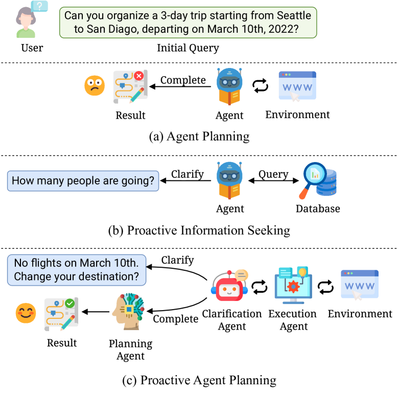
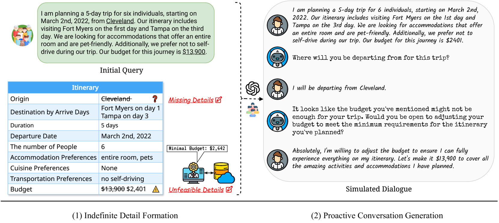
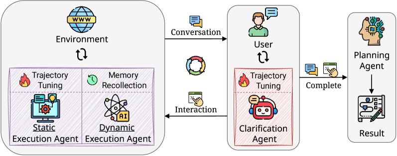

# “问前规划”：为现实世界规划设计的主动语言代理

发布时间：2024年06月18日

`Agent

这篇论文主要关注的是大型语言模型（LLMs）在语言代理中的应用，特别是在提升代理在现实场景中的规划能力，以及理解模糊用户指令进行推理和决策的能力。论文提出了一种新的任务——主动代理规划，并为此任务创建了新的基准数据集。此外，论文还设计了一种多代理框架CEP，以解决LLMs在主动规划上的局限性。因此，这篇论文更符合Agent分类，因为它主要探讨了如何通过LLMs来增强代理的功能和性能。` `人工智能` `自动化规划`

> Ask-before-Plan: Proactive Language Agents for Real-World Planning

# 摘要

> 大型语言模型（LLMs）的发展提升了语言代理在多样现实场景中的规划能力。然而，这些代理理解模糊用户指令以进行推理和决策的能力仍有待挖掘。为此，我们提出了一个新任务——主动代理规划，它要求代理通过分析用户对话和环境交互来预测澄清需求，利用外部工具获取信息，并制定满足用户需求的计划。我们为此任务创建了新基准数据集“Ask-before-Plan”。针对LLMs在主动规划上的局限，我们设计了一种多代理框架CEP，包含专门负责澄清、执行和规划的三个代理。我们为澄清和静态执行代理引入了轨迹调整，为动态执行代理设计了记忆回忆机制。在Ask-before-Plan数据集上的广泛测试和分析证实了CEP框架的有效性。

> The evolution of large language models (LLMs) has enhanced the planning capabilities of language agents in diverse real-world scenarios. Despite these advancements, the potential of LLM-powered agents to comprehend ambiguous user instructions for reasoning and decision-making is still under exploration. In this work, we introduce a new task, Proactive Agent Planning, which requires language agents to predict clarification needs based on user-agent conversation and agent-environment interaction, invoke external tools to collect valid information, and generate a plan to fulfill the user's demands. To study this practical problem, we establish a new benchmark dataset, Ask-before-Plan. To tackle the deficiency of LLMs in proactive planning, we propose a novel multi-agent framework, Clarification-Execution-Planning (\texttt{CEP}), which consists of three agents specialized in clarification, execution, and planning. We introduce the trajectory tuning scheme for the clarification agent and static execution agent, as well as the memory recollection mechanism for the dynamic execution agent. Extensive evaluations and comprehensive analyses conducted on the Ask-before-Plan dataset validate the effectiveness of our proposed framework.

[Arxiv](https://arxiv.org/abs/2406.12639)