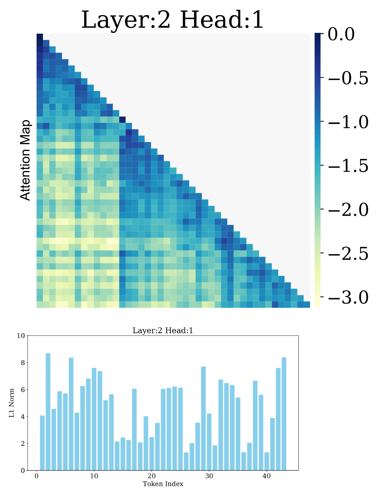
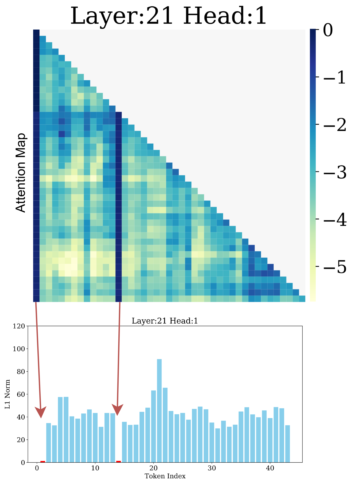
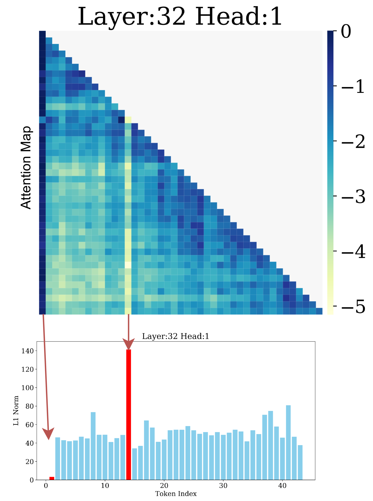
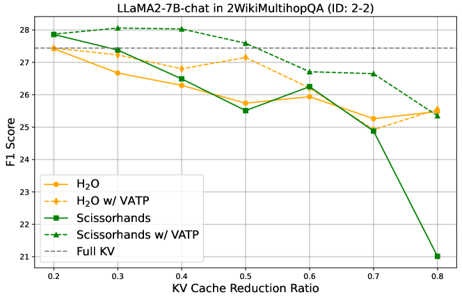

# 在KV缓存缩减中，单凭注意力分数不足以作为Token重要性的指标，价值因素同样关键。

发布时间：2024年06月18日

`LLM应用

这篇论文主要讨论了大型语言模型（LLMs）在处理长上下文任务时的内存和性能问题，并提出了一种新的方法——值感知令牌剪枝（VATP）来优化这一问题。这种方法通过结合注意力分数和值向量的$ \ell_{1} $范数来评估令牌的重要性，从而在减少内存开销的同时保持或提升模型性能。因此，这篇论文属于LLM应用类别，因为它关注的是LLMs在实际应用中的具体问题和解决方案。` `模型优化`

> Attention Score is not All You Need for Token Importance Indicator in KV Cache Reduction: Value Also Matters

# 摘要

> 通过扩展大型语言模型（LLMs）的上下文大小，我们能够解锁如书籍摘要等新任务的能力。然而，注意力机制中的键值（KV）缓存带来的内存开销，严重制约了LLMs的实际应用。近期研究尝试通过令牌剪枝技术减少KV缓存，仅以注意力分数作为令牌重要性的衡量标准。但我们的研究发现，值向量的范数分布并不均匀，这挑战了仅依赖注意力分数的合理性。基于此，我们创新性地提出了值感知令牌剪枝（VATP）方法，它结合了注意力分数与值向量的$ \ell_{1} $范数来综合评估令牌的重要性。在LLaMA2-7B-chat和Vicuna-v1.5-7B模型上，针对16项LongBench任务的广泛实验表明，VATP展现出了卓越的性能。

> Scaling the context size of large language models (LLMs) enables them to perform various new tasks, e.g., book summarization. However, the memory cost of the Key and Value (KV) cache in attention significantly limits the practical applications of LLMs. Recent works have explored token pruning for KV cache reduction in LLMs, relying solely on attention scores as a token importance indicator. However, our investigation into value vector norms revealed a notably non-uniform pattern questioning their reliance only on attention scores. Inspired by this, we propose a new method: Value-Aware Token Pruning (VATP) which uses both attention scores and the $ \ell_{1} $ norm of value vectors to evaluate token importance. Extensive experiments on LLaMA2-7B-chat and Vicuna-v1.5-7B across 16 LongBench tasks demonstrate VATP's superior performance.

[Arxiv](https://arxiv.org/abs/2406.12335)