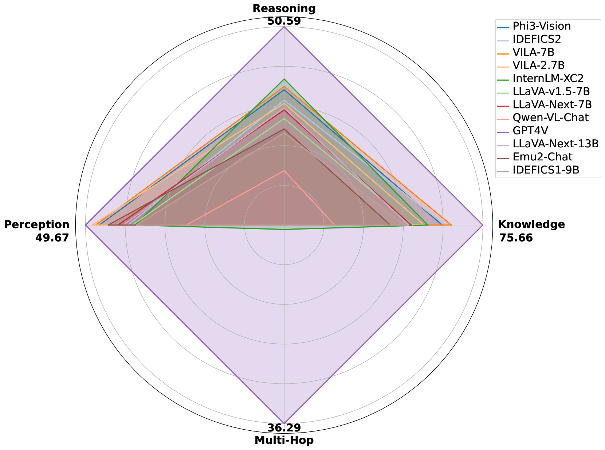
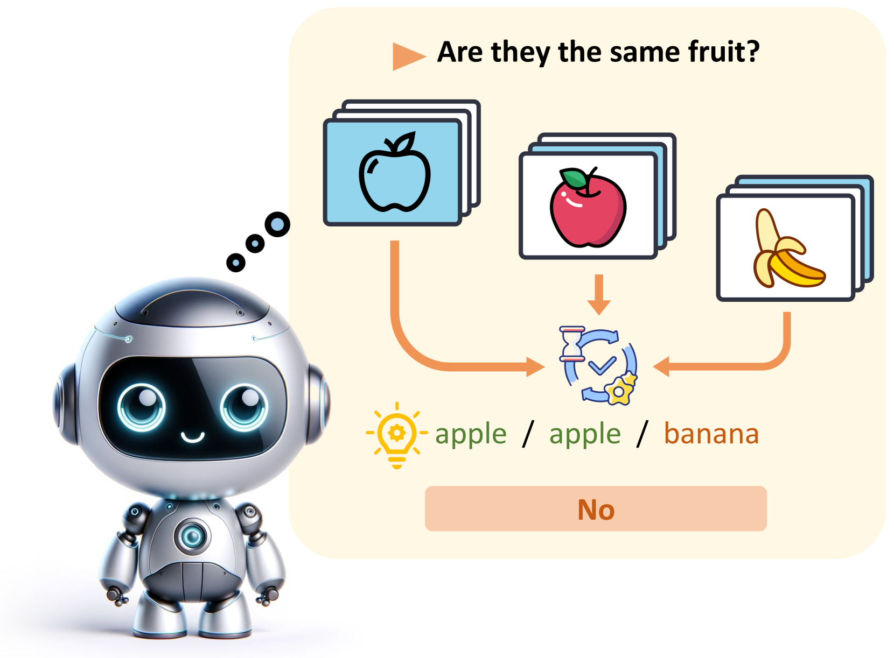
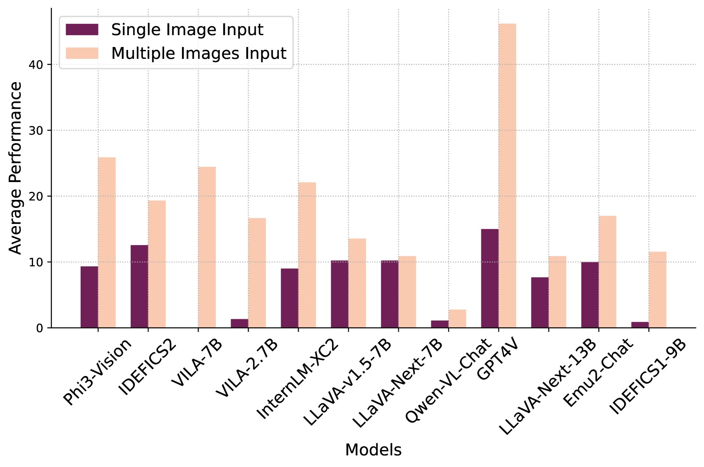
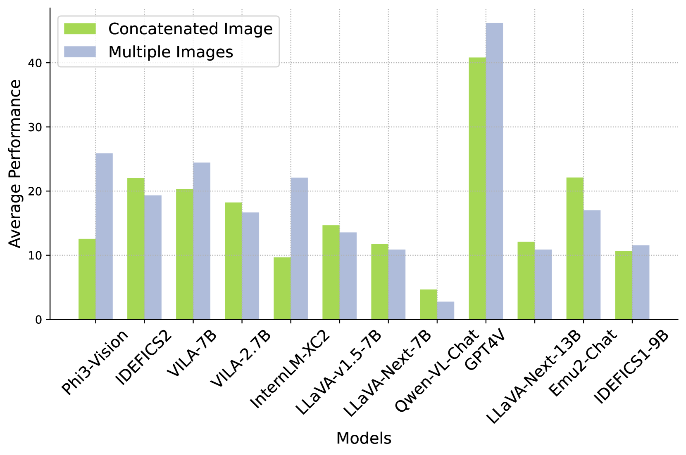
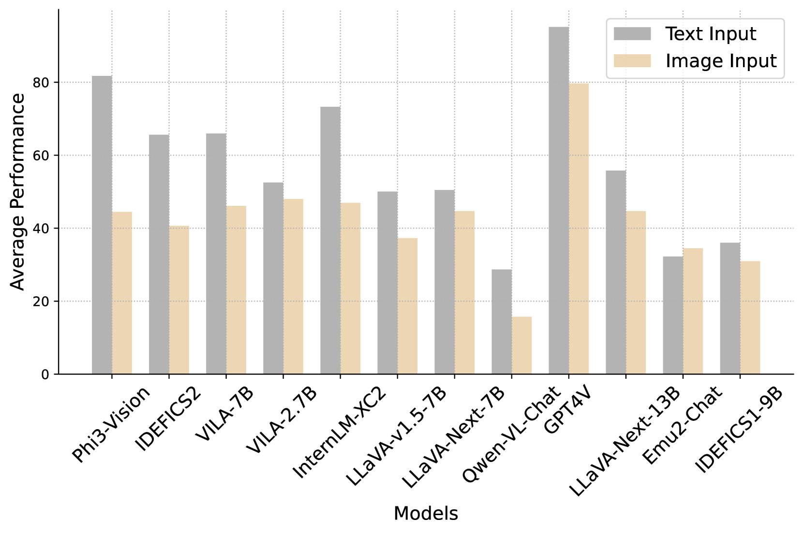
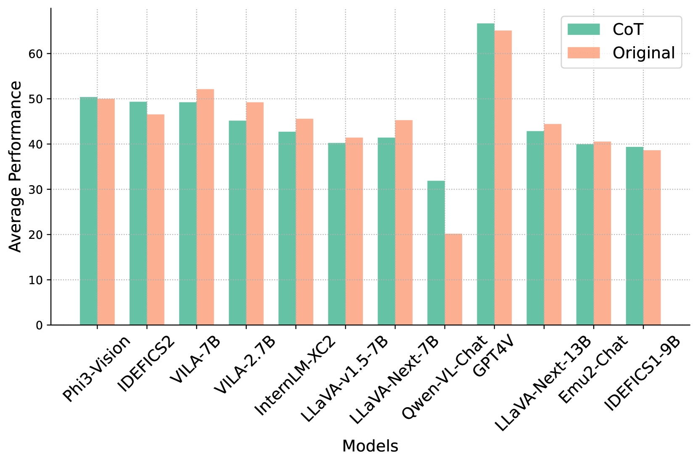

# 视觉与语言模型中的多图像理解基准：涵盖感知、知识、推理及多跳推理能力的全面评估

发布时间：2024年06月18日

`LLM应用

这篇论文主要关注的是多模态大型语言模型（LLMs）在处理多图像输入时的性能评估和挑战。通过引入Multi-Image Relational Benchmark（MIRB），论文评估了视觉语言模型（VLMs）在多图像间的比较、分析及推理能力，并指出了当前模型在多图像推理任务上的不足。这表明论文的重点在于应用层面的评估和改进，因此属于LLM应用分类。` `多模态学习` `视觉语言模型`

> Benchmarking Multi-Image Understanding in Vision and Language Models: Perception, Knowledge, Reasoning, and Multi-Hop Reasoning

# 摘要

> 随着大型语言模型（LLMs）技术的进步，自然语言处理的应用领域得到了极大的扩展，尤其是多模态LLMs，它们能够整合并解释视觉数据。然而，当前的视觉语言模型（VLMs）基准大多局限于单图像输入，忽略了多图像理解的重要性。为此，我们推出了Multi-Image Relational Benchmark（MIRB），专门用于评估VLMs在多图像间的比较、分析及推理能力。MIRB包含四个评估类别：感知、视觉世界知识、推理和多跳推理。通过广泛评估各类开源和闭源模型，我们发现，虽然开源VLMs在单图像任务上已接近GPT-4V的性能，但在多图像推理任务上仍有显著差距。研究还表明，即便是最先进的GPT-4V模型，在MIRB上也面临挑战，凸显了该领域的研究和发展需求。我们期望MIRB能成为推动下一代多模态模型发展的关键测试平台。

> The advancement of large language models (LLMs) has significantly broadened the scope of applications in natural language processing, with multi-modal LLMs extending these capabilities to integrate and interpret visual data. However, existing benchmarks for visual language models (VLMs) predominantly focus on single-image inputs, neglecting the crucial aspect of multi-image understanding. In this paper, we introduce a Multi-Image Relational Benchmark MIRB, designed to evaluate VLMs' ability to compare, analyze, and reason across multiple images. Our benchmark encompasses four categories: perception, visual world knowledge, reasoning, and multi-hop reasoning. Through a comprehensive evaluation of a wide range of open-source and closed-source models, we demonstrate that while open-source VLMs were shown to approach the performance of GPT-4V in single-image tasks, a significant performance gap remains in multi-image reasoning tasks. Our findings also reveal that even the state-of-the-art GPT-4V model struggles with our benchmark, underscoring the need for further research and development in this area. We believe our contribution of MIRB could serve as a testbed for developing the next-generation multi-modal models.

[Arxiv](https://arxiv.org/abs/2406.12742)