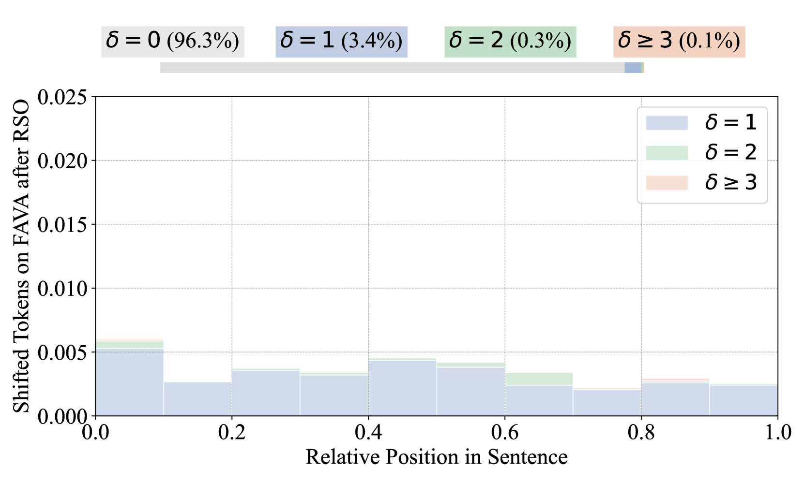

# 超越对齐不足：利用原子偏好提升大语言模型的事实性调优

发布时间：2024年06月18日

`LLM理论

这篇论文主要探讨了大型语言模型（LLMs）在事实性方面的表现，特别是在领域外（OOD）数据集上的评估。论文通过分析模型微调前后令牌分布的变化，揭示了事实性下降的原因，并提出了一个新的框架（APEFT）来增强模型对个别事实的敏感度。这些内容主要涉及LLM的理论研究和改进，因此归类为LLM理论。` `机器学习`

> Beyond Under-Alignment: Atomic Preference Enhanced Factuality Tuning for Large Language Models

# 摘要

> 大型语言模型（LLMs）虽取得显著成就，但仍常产生事实错误，即所谓的“幻觉”现象。近期，利用偏好学习微调模型以提升事实性成为一种趋势。然而，现有研究多聚焦于模型在领域内（ID）数据集的表现，而领域外（OOD）数据集的事实性评估则鲜有涉及。本文对采用不同偏好学习算法微调的模型进行了全面的事实性评估，发现这些模型在OOD数据集上的表现提升有限或有所下降。通过分析模型微调前后令牌分布的变化，我们揭示了模型在分布变化下事实性下降的主因是**欠对齐**而非**过度对齐**。为此，我们提出了**APEFT**（原子偏好增强事实性微调）框架，旨在提升模型对个别事实事实性的敏感度。实验结果显示，APEFT在ID和OOD数据集上平均提升了模型性能$\boldsymbol{3.45\%}$，效果显著。

> Large language models (LLMs) have achieved remarkable success but still tend to generate factually erroneous responses, a phenomenon known as hallucination. A recent trend is to use preference learning to fine-tune models to align with factuality. However, existing work primarily evaluates fine-tuned models on in-domain (ID) datasets and the factuality on out-of-domain (OOD) datasets remains underexplored. In this paper, we conduct a comprehensive evaluation of the factuality of different models tuned by various preference learning algorithms and demonstrate that their performance on OOD datasets either increases minimally or decreases. Subsequently, we reveal that the main cause of model's failure to uphold factuality under a distribution shift is \textbf{under-alignment}, rather than \textbf{over-alignment}, by analyzing the token distribution shift of the models before and after tuning. Finally, we propose \textbf{APEFT} (\textbf{A}tomic \textbf{P}reference \textbf{E}nhanced \textbf{F}actuality \textbf{T}uning), a framework that enhances model's awareness of factuality at the granularity of individual facts. Extensive experiments demonstrate that APEFT improves model performance by an average of $\boldsymbol{3.45\%}$ on both ID and OOD datasets, which is highly effective.

[Arxiv](https://arxiv.org/abs/2406.12416)