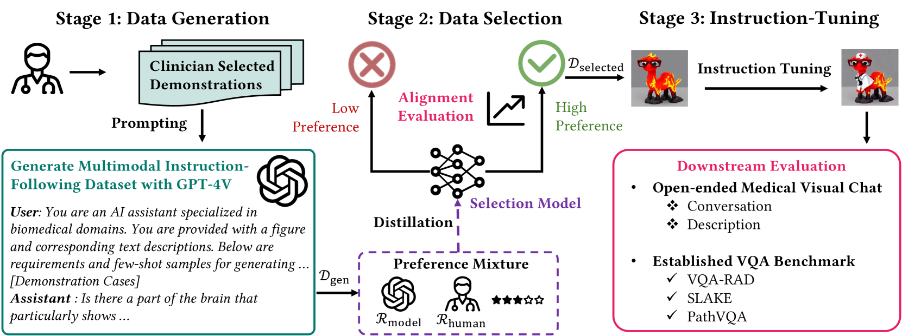

# 临床医生偏好对齐的生物医学视觉指令调优

发布时间：2024年06月18日

`RAG

理由：这篇论文介绍了一个名为BioMed-VITAL的框架，该框架专注于生成和筛选生物医学领域的多模态基础模型所需的指令数据。这个框架特别考虑了临床医生的偏好，并通过GPT-4V生成器和独立的选择模型来实现这一目标。这种方法涉及到生成和优化特定领域的数据集，这与RAG（Retrieval-Augmented Generation）模型的概念相似，即通过检索增强生成过程，以提高模型在特定任务上的性能。因此，这篇论文更适合归类为RAG，因为它展示了如何通过特定领域的数据增强来优化模型的性能。` `生物医学` `临床医学`

> Biomedical Visual Instruction Tuning with Clinician Preference Alignment

# 摘要

> 多模态基础模型近期在处理视觉与文本信息方面表现出色，但将其应用于生物医学等专业领域时，需依赖大规模的领域特定指令数据集。现有研究虽尝试自动构建此类数据集，但往往未能与专业知识紧密结合。为此，我们提出了BioMed-VITAL框架，该框架在生成和筛选生物医学多模态基础模型所需的指令数据时，均考虑了临床医生的偏好。首先，我们利用GPT-4V生成器，根据临床医生的选择生成偏好一致的数据候选。随后，通过训练一个独立的选择模型，将临床医生和政策指导的偏好转化为评分机制，以精选出高质量的医疗指令数据。实验结果表明，采用我们的方法调优的模型，在开放视觉聊天和医学视觉问答任务中分别实现了18.5%的相对提升和高达81.73%的胜率。相关数据和模型已公开于BioMed-VITAL.github.io。

> Recent advancements in multimodal foundation models have showcased impressive capabilities in understanding and reasoning with visual and textual information. Adapting these foundation models trained for general usage to specialized domains like biomedicine requires large-scale domain-specific instruction datasets. While existing works have explored curating such datasets automatically, the resultant datasets are not explicitly aligned with domain expertise. In this work, we propose a data-centric framework, Biomedical Visual Instruction Tuning with Clinician Preference Alignment (BioMed-VITAL), that incorporates clinician preferences into both stages of generating and selecting instruction data for tuning biomedical multimodal foundation models. First, during the generation stage, we prompt the GPT-4V generator with a diverse set of clinician-selected demonstrations for preference-aligned data candidate generation. Then, during the selection phase, we train a separate selection model, which explicitly distills clinician and policy-guided model preferences into a rating function to select high-quality data for medical instruction tuning. Results show that the model tuned with the instruction-following data from our method demonstrates a significant improvement in open visual chat (18.5% relatively) and medical VQA (win rate up to 81.73%). Our instruction-following data and models are available at BioMed-VITAL.github.io.

[Arxiv](https://arxiv.org/abs/2406.13173)