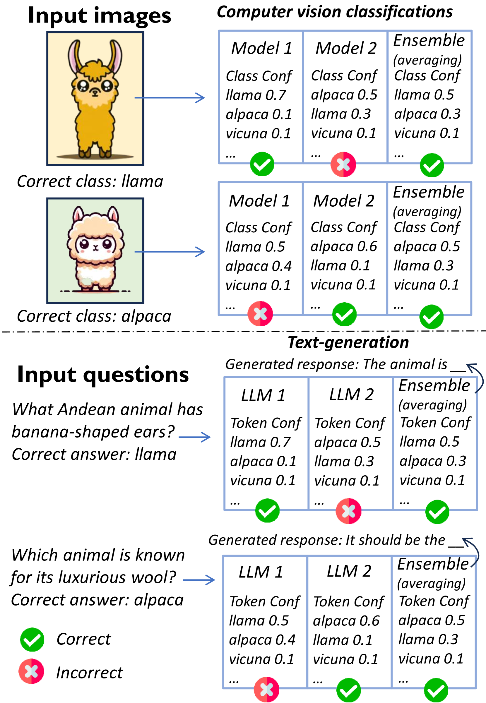
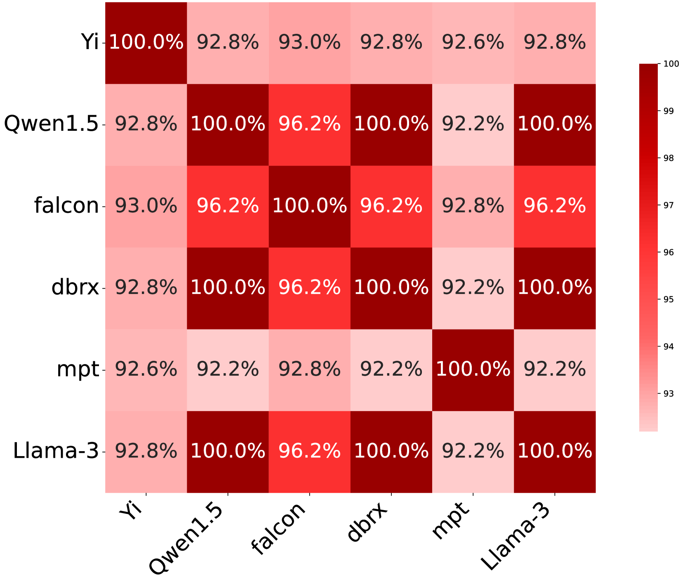
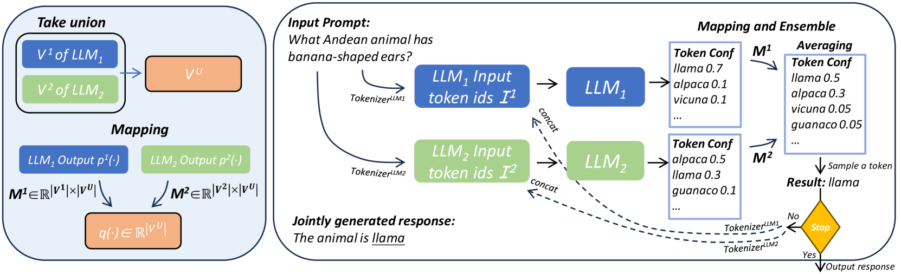
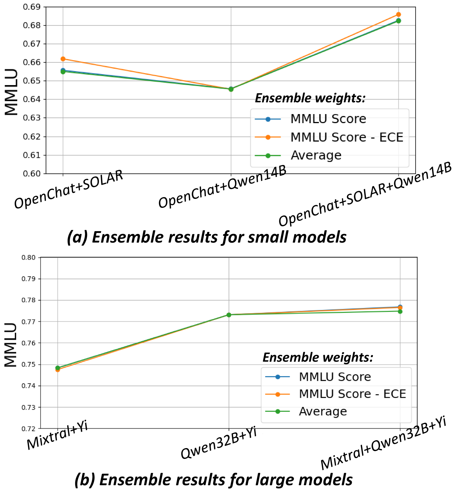
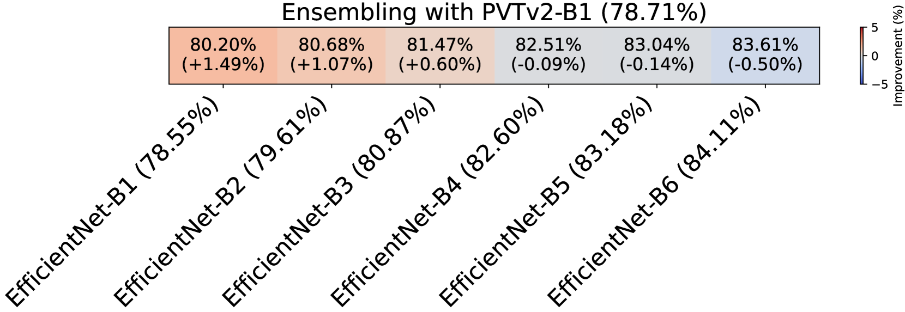

# 通过将令牌生成作为分类任务进行集成，我们打破了大型语言模型社区的性能上限。

发布时间：2024年06月18日

`LLM应用

这篇论文探讨了在大型语言模型（LLM）中集成多个模型的方法，以提高分类任务的准确性。它特别关注了如何利用令牌级概率信息来减少生成过程中的错误传播。这种方法在多个基准测试中显示出了性能的提升，尤其是在需要高度准确性的任务如考试、数学和推理任务上。此外，论文还探讨了仅集成关键令牌的策略，以在保持性能的同时减少延迟。这些内容与LLM的应用紧密相关，因此归类为LLM应用。` `机器学习`

> Breaking the Ceiling of the LLM Community by Treating Token Generation as a Classification for Ensembling

# 摘要

> 集成多个模型是提升分类任务准确性的常用策略，通过平均多个分类器的概率向量来实现。但在开源大型语言模型（LLM）社区中，集成技术并不常见，通常局限于选择最佳输出的全文集成，未能充分利用令牌级概率信息。本文提出将LLM生成的每个令牌视为分类任务进行集成，有效利用了生成过程中的概率信息，减少了早期错误令牌引发的连锁错误。实验结果显示，我们的方法在多个基准测试中超越了现有性能极限，尤其是在考试、数学和推理任务上。此外，我们发现答案中的多数令牌对正确性影响不大，因此尝试仅集成关键令牌，结果表明这种方法在保持性能的同时显著降低了延迟。

> Ensembling multiple models has always been an effective approach to push the limits of existing performance and is widely used in classification tasks by simply averaging the classification probability vectors from multiple classifiers to achieve better accuracy. However, in the thriving open-source Large Language Model (LLM) community, ensembling methods are rare and typically limited to ensembling the full-text outputs of LLMs, such as selecting the best output using a ranker, which leads to underutilization of token-level probability information. In this paper, we treat the Generation of each token by LLMs as a Classification (GaC) for ensembling. This approach fully exploits the probability information at each generation step and better prevents LLMs from producing early incorrect tokens that lead to snowballing errors. In experiments, we ensemble state-of-the-art LLMs on several benchmarks, including exams, mathematics and reasoning, and observe that our method breaks the existing community performance ceiling. Furthermore, we observed that most of the tokens in the answer are simple and do not affect the correctness of the final answer. Therefore, we also experimented with ensembling only key tokens, and the results showed better performance with lower latency across benchmarks.

[Arxiv](https://arxiv.org/abs/2406.12585)