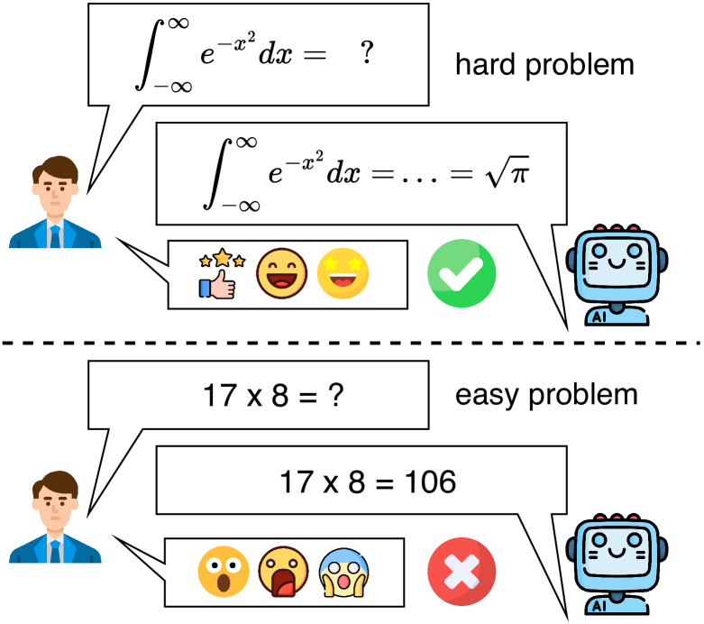
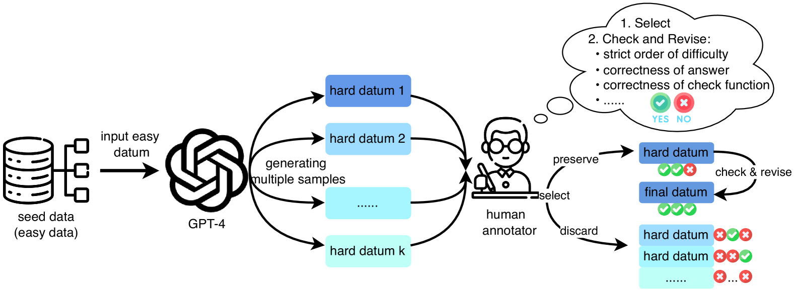
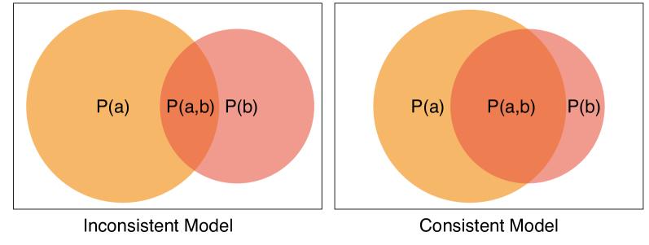
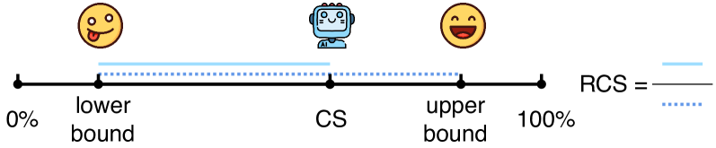
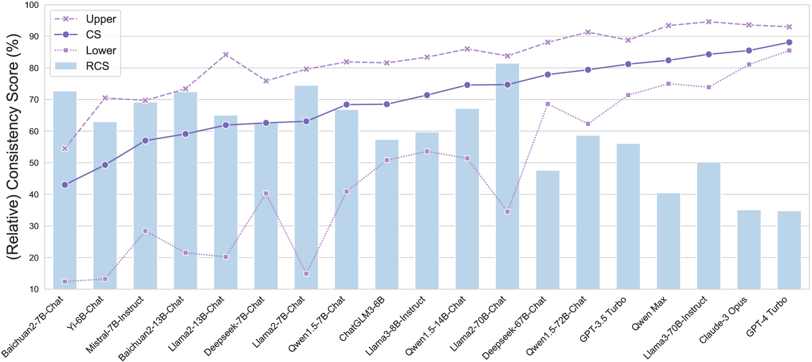
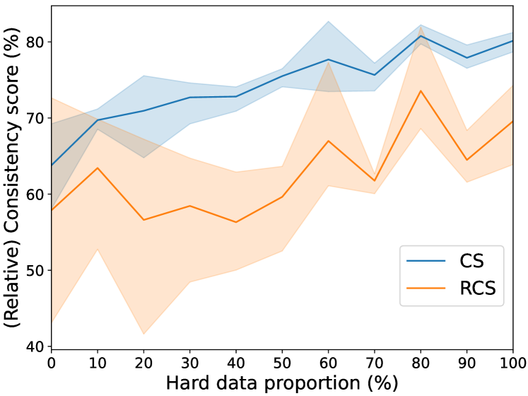
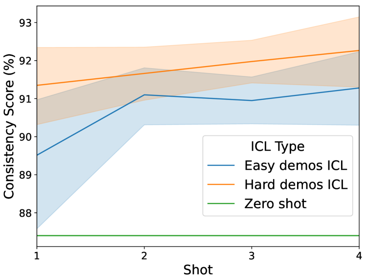
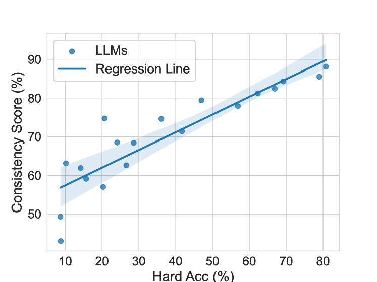
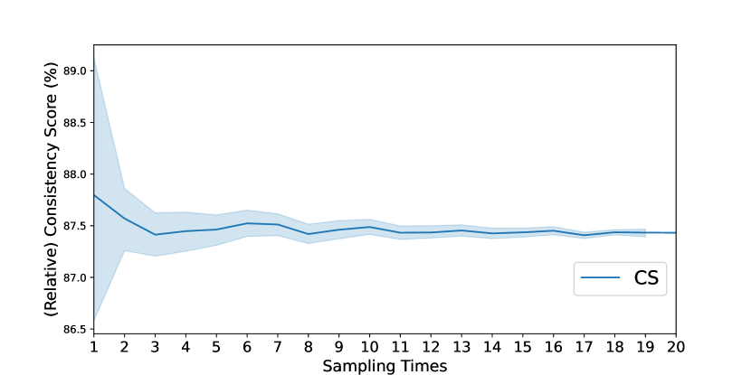
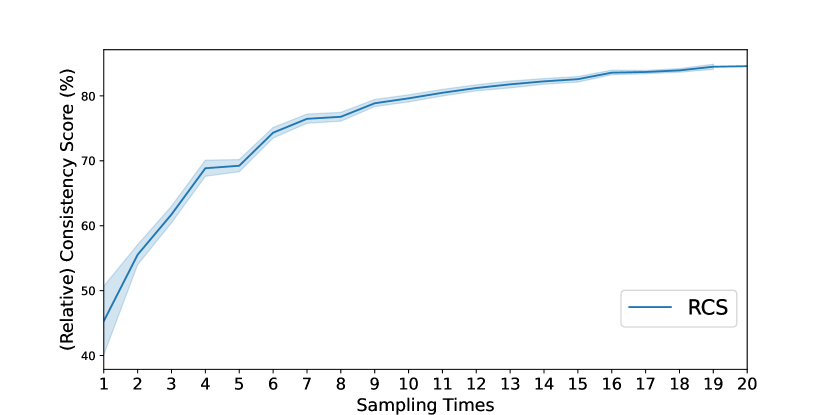

# 大型语言模型能否在解决难题的同时，也轻松应对简单问题？

发布时间：2024年06月18日

`LLM理论

这篇论文主要探讨了大型语言模型（LLMs）在处理问题时的一致性问题，并提出了一个新的评估基准ConsisEval来量化这种一致性。研究通过实验分析了不同模型的表现，并探讨了提升一致性的方法。这属于对LLMs理论性能的深入研究，因此归类为LLM理论。` `人工智能` `模型评估`

> Can Large Language Models Always Solve Easy Problems if They Can Solve Harder Ones?

# 摘要

> 大型语言模型（LLMs）虽能力出众，却常因重述或顺序微调等干扰而反应不一。更甚者，它们在解决难题时表现出色，却在简单问题上失手。为此，我们推出了ConsisEval基准，通过一对难度递增的问题来评估这种由难至易的不一致性，并引入“一致性得分”量化分析，探索提升一致性的可能。实验涵盖多款模型，结果显示：(1) GPT-4 以92.2%的一致性得分领先，但仍受多余信息或误解问题等因素影响；(2) 能力越强的模型通常一致性越高，但也有例外；(3) 难题数据对微调和情境学习的一致性提升有显著效果。相关数据和代码将在GitHub公开。

> Large language models (LLMs) have demonstrated impressive capabilities, but still suffer from inconsistency issues (e.g. LLMs can react differently to disturbances like rephrasing or inconsequential order change). In addition to these inconsistencies, we also observe that LLMs, while capable of solving hard problems, can paradoxically fail at easier ones. To evaluate this hard-to-easy inconsistency, we develop the ConsisEval benchmark, where each entry comprises a pair of questions with a strict order of difficulty. Furthermore, we introduce the concept of consistency score to quantitatively measure this inconsistency and analyze the potential for improvement in consistency by relative consistency score. Based on comprehensive experiments across a variety of existing models, we find: (1) GPT-4 achieves the highest consistency score of 92.2\% but is still inconsistent to specific questions due to distraction by redundant information, misinterpretation of questions, etc.; (2) models with stronger capabilities typically exhibit higher consistency, but exceptions also exist; (3) hard data enhances consistency for both fine-tuning and in-context learning. Our data and code will be publicly available on GitHub.

[Arxiv](https://arxiv.org/abs/2406.12809)