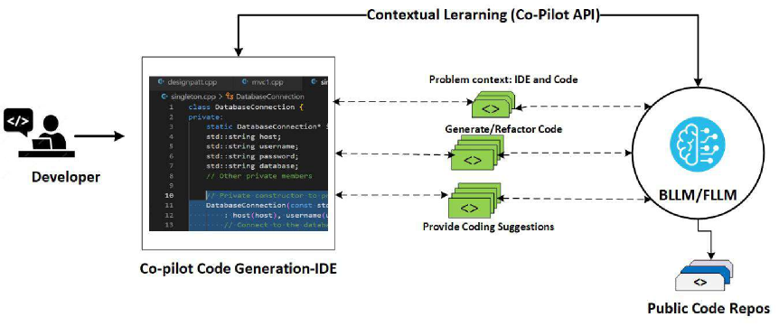

# 大型语言模型生成的代码可信吗？探索情境学习、安全模式及跨多种LLM的代码评估框架

发布时间：2024年06月18日

`LLM应用

这篇论文主要关注大型语言模型（LLMs）在软件工程中生成代码的安全性和质量问题。通过引入基于内容学习（ICL）模式的安全行为学习框架，并进行安全评估，研究旨在解决由LLMs生成代码可能带来的安全漏洞问题。这与LLM的应用场景紧密相关，特别是在软件开发领域，因此应归类为LLM应用。` `软件工程` `网络安全`

> Can We Trust Large Language Models Generated Code? A Framework for In-Context Learning, Security Patterns, and Code Evaluations Across Diverse LLMs

# 摘要

> ChatGPT和GitHub Copilot等大型语言模型（LLMs）已革新了软件工程中的代码自动化生成。但随着这些模型在软件开发中的应用日益增多，关于生成代码的安全性和质量的担忧也随之而来。这些担忧源自LLMs主要依赖公开代码库和网络文本数据进行训练，其中可能含有不安全代码，从而在生成的代码中埋下漏洞，为恶意攻击提供可乘之机。我们的研究通过引入基于内容学习（ICL）模式的安全行为学习框架，并进行严格的安全评估，旨在解决这一问题。我们选取了四种不同的LLMs进行实验，评估了它们在三种编程语言上的表现，并识别了安全漏洞和代码异味。通过ICL生成的代码，经过精心设计的问题集和严格的安全测试，以确保其质量和可信度。研究显示，ICL驱动的一次性学习和少次学习模式能有效提升代码安全性，减少编程场景中的漏洞。开发者和研究人员需意识到，LLMs对安全原则的理解有限，这可能在生产环境中引发安全漏洞。我们的研究指出，LLMs可能是软件供应链中新漏洞的潜在源头。因此，在使用LLMs生成代码时，必须对此保持警惕。本文深入探讨了提升LLM安全性的方法，并倡导积极利用LLMs以确保软件系统的安全。

> Large Language Models (LLMs) such as ChatGPT and GitHub Copilot have revolutionized automated code generation in software engineering. However, as these models are increasingly utilized for software development, concerns have arisen regarding the security and quality of the generated code. These concerns stem from LLMs being primarily trained on publicly available code repositories and internet-based textual data, which may contain insecure code. This presents a significant risk of perpetuating vulnerabilities in the generated code, creating potential attack vectors for exploitation by malicious actors. Our research aims to tackle these issues by introducing a framework for secure behavioral learning of LLMs through In-Content Learning (ICL) patterns during the code generation process, followed by rigorous security evaluations. To achieve this, we have selected four diverse LLMs for experimentation. We have evaluated these coding LLMs across three programming languages and identified security vulnerabilities and code smells. The code is generated through ICL with curated problem sets and undergoes rigorous security testing to evaluate the overall quality and trustworthiness of the generated code. Our research indicates that ICL-driven one-shot and few-shot learning patterns can enhance code security, reducing vulnerabilities in various programming scenarios. Developers and researchers should know that LLMs have a limited understanding of security principles. This may lead to security breaches when the generated code is deployed in production systems. Our research highlights LLMs are a potential source of new vulnerabilities to the software supply chain. It is important to consider this when using LLMs for code generation. This research article offers insights into improving LLM security and encourages proactive use of LLMs for code generation to ensure software system safety.

[Arxiv](https://arxiv.org/abs/2406.12513)