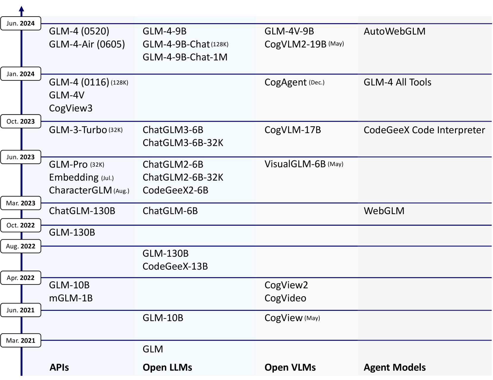
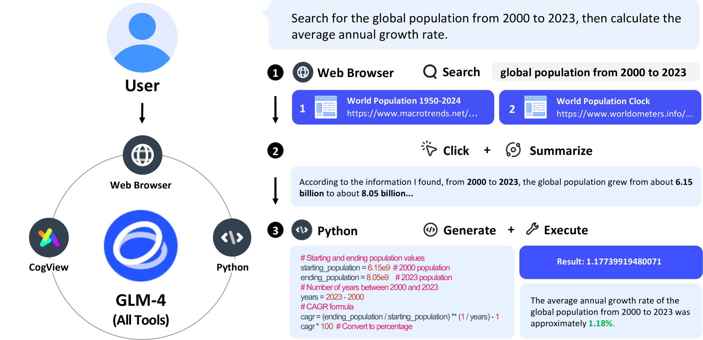
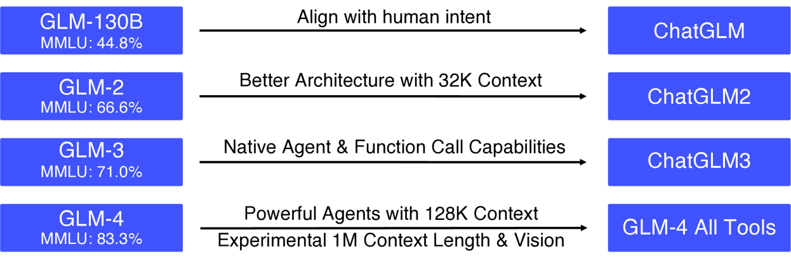
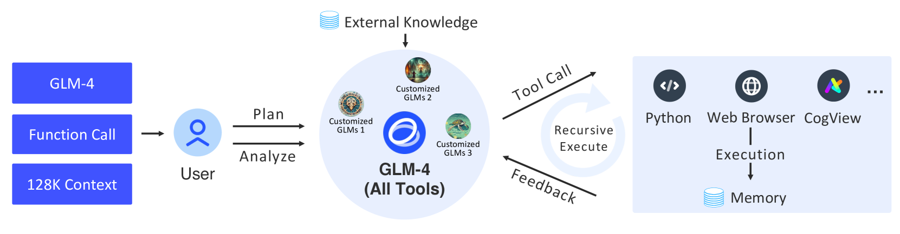

# ChatGLM：涵盖从 GLM-130B 至 GLM-4 的全系列大型语言模型工具集

发布时间：2024年06月18日

`LLM应用

这篇论文摘要介绍了ChatGLM系列大型语言模型的开发和性能，特别是在中英文处理上的优化和多语言支持。它详细说明了模型的预训练、后训练过程以及在多项评估指标上的表现，强调了模型在指令遵循和长上下文任务中的优势，以及在中文对齐方面的改进。此外，论文还提到了模型的实际应用能力和开源情况，这些都是LLM应用领域的典型特征。因此，这篇论文最适合归类为LLM应用。` `人工智能`

> ChatGLM: A Family of Large Language Models from GLM-130B to GLM-4 All Tools

# 摘要

> 我们推出了ChatGLM系列，这是一组不断进化的大型语言模型，我们一直在持续开发。本报告重点介绍GLM-4系列，包括GLM-4、GLM-4-Air和GLM-4-9B，这些模型汲取了前三代ChatGLM的经验与智慧。GLM-4系列模型已在中英文为主的十万亿个令牌上预训练，并辅以24种其他语言的语料，特别针对中英文使用进行了优化。通过多阶段后训练，包括监督微调和人类反馈学习，实现了高质量的对齐。评估结果表明，GLM-4在多项指标上与GPT-4媲美或超越，包括MMLU、GSM8K、MATH等，且在指令遵循和长上下文任务中表现出色，尤其在中文对齐方面优于GPT-4。GLM-4 All Tools模型能理解用户意图，自主选择合适的工具（如网络浏览器、Python解释器等）来完成复杂任务，在实际应用中表现甚至超越GPT-4 All Tools。此外，我们已开源多个模型，如ChatGLM-6B、GLM-4-9B等，仅2023年就在Hugging Face上获得超过1000万次下载，可通过GitHub和Hugging Face平台访问。

> We introduce ChatGLM, an evolving family of large language models that we have been developing over time. This report primarily focuses on the GLM-4 language series, which includes GLM-4, GLM-4-Air, and GLM-4-9B. They represent our most capable models that are trained with all the insights and lessons gained from the preceding three generations of ChatGLM. To date, the GLM-4 models are pre-trained on ten trillions of tokens mostly in Chinese and English, along with a small set of corpus from 24 languages, and aligned primarily for Chinese and English usage. The high-quality alignment is achieved via a multi-stage post-training process, which involves supervised fine-tuning and learning from human feedback. Evaluations show that GLM-4 1) closely rivals or outperforms GPT-4 in terms of general metrics such as MMLU, GSM8K, MATH, BBH, GPQA, and HumanEval, 2) gets close to GPT-4-Turbo in instruction following as measured by IFEval, 3) matches GPT-4 Turbo (128K) and Claude 3 for long context tasks, and 4) outperforms GPT-4 in Chinese alignments as measured by AlignBench. The GLM-4 All Tools model is further aligned to understand user intent and autonomously decide when and which tool(s) touse -- including web browser, Python interpreter, text-to-image model, and user-defined functions -- to effectively complete complex tasks. In practical applications, it matches and even surpasses GPT-4 All Tools in tasks like accessing online information via web browsing and solving math problems using Python interpreter. Over the course, we have open-sourced a series of models, including ChatGLM-6B (three generations), GLM-4-9B (128K, 1M), GLM-4V-9B, WebGLM, and CodeGeeX, attracting over 10 million downloads on Hugging face in the year 2023 alone. The open models can be accessed through https://github.com/THUDM and https://huggingface.co/THUDM.

[Arxiv](https://arxiv.org/abs/2406.12793)